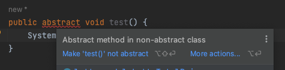
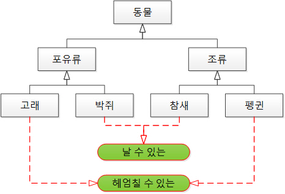

# Interface vs Abstract Class

### 상속 (Inheritance)
- 상속 = 재사용 + 확장
- 상속은 부모클래스(상위클래스)로부터 자식클래스(하위클래스)가 상속받아 부모클래스의 멤버를 그대로 쓸 수 있게하는 것
- 객체지향의 상속은 기존 상속에 더해 거기에 필요한 특성을 추가, 즉 확장의 의미가 강함 (재사용 + 확장)
- 시작하기 전에 상속에 대한 Overrding는 [해당 정리](https://github.com/InJun2/TIL/blob/main/Stack/Java/Overloading-Overriding.md) 페이지에 정리해두었음

<br>

### Abstract Class
- 클래스를 설계도에 비유하면 추상 클래스는 미완성 설계도로 클래스에 키워드인 abstract를 붙이면 됨
- 추상 클래스는 추상 메소드를 0개 이상 가지고 있는 클래스로 그 외에는 일반 클래스와 다르지 않음
- 추상 클래스는 기본적으로 일반 클래스와 비슷하므로 하위 클래스들에게 상속을 통해 사용할 수 있게하고 extends 라는 키워드로 상속받음
- 추상 클래스를 상속받을 경우 일반 클래스와 다른점은 추상 메소드뿐인데 해당 추상 메소드는 구현이 되어있지 않기때문에 다른 메소드들은 상속받아 그대로 사용할 수 있지만 추상 메서드들은 재정의(오버라이딩) 해주어야 함
- 추상 클래스는 즉, 재정의 해주어야하므로 객체를 만들 수 없는 클래스이고 추상 메소드는 하위 클래스에서 메소드의 구현을 강제함
- 추상 클래스를 상속하는 집한간에는 연관간계가 있고, 비슷한 특징을 가지고 있는 클래스들에게 사용하는 특징을 가짐 -> 자신의 기능들을 하위 클래스로 확장, 상속
- 일반 클래스와 동일하게 extends를 사용하여 다중 상속이 불가능

<br>

### Interface
- 인터페이스는 구현된 것이 없는 밑그림만 그려져 있는 기본 설계도
- 인터페이스는 모든 메소드가 추상 메소드로 구성되어 있음. 그러나 추상 클래스에서 추상 메소드와 다르게 public abstract를 생략 가능(무조건 모든 메소드는 public abstract)
- 상속으로는 inplements 라는 키워드를 사용하여 상속받고 다중상속이 가능
- 상속하는 집한간에는 연관관계가 존재하지 않을 수 있음 -> 정의된 메소드를 각 클래스의 목적에 맞게 기능을 구현하기 위해 확장, 상속
- Java 8 부터 static, default 메소드 사용이 가능해짐

<br>



<br>



<br>

### 사용 구분
- 인터페이스와 추상 클래스 모두 다형성이나 클래스 타입을 통합한다는 기능은 동일하지만 사용하는 위치가 다를 수 있다
- 공통으로 가지는 메소드가 많아 중복 멤버 통합을 위해 기존 클래스처럼 상속을 사용하여 가져오는데 하위 클래스가 오버라이드하여 재정의하는 기능들을 공유하기 위한 상속 개념을 사용할 때 주로 사용하고 인터페이스와 달리 기존 클래스를 사용하는 것처럼 제약이 없음
- 인터페이스는 대신 단 하나만 상속할 수 있는 기존 클래스와 다르게 여러 인터페이스를 상속이 가능하고 어플리케이션의 기능을 정의하되 구현 방식이나 대상에 대해 추상화하는데 사용할 수 있음. 클래스와 다르게 구현 객체가 같은 동작을 한다는 것을 보장하기 위해 사용

<br>

### Interface vs Abstract Class?
- 즉 위의 그림처럼 추상클래스는 부모와 자식간에 연관관계가 있는 상속이 필요하지만 특정 기능만을 재정의 해야할 때 사용
    - 동물-포유류, 동물-조류, 포유류-고래, 포유류-박쥐, 조류-참새, 조류-펭귄
- 인터페이스는 위처럼 연관관계는 없지만 특정 기능을 추상화하여 나타내야 할 경우 사용. 이러한 기능들을 담은 인터페이스는 다중 상속이 가능하므로 표현하고 싶은 기능들을 다수 상속받아 재정의하여 나타내는 것이 가능함
    - 날수있는-박쥐, 날수있는-참새, 헤엄칠수있는-고래, 헤엄칠수있는-펭귄
- 연관관계에 차이도 있지만 나눠서 사용하는 가장 큰 차이점은 사용 용도
    - 추상클래스의 사용 의도 : IS -A "~이다"
    - 인터페이스의 사용 의도 : HAS -A "~을 할수있는"
- 모든 기능들을 인터페이스로 사용해야 되면 기존 상속을 통해 부모클래스에서 추상 메서드가 아닌 다른 메소드들을 그대로 가져오는 것이 불가능 -> 공통으로 필요한 기능도 재정의해야하는 번거로움 존재

```java
abstract class Animal extends Creature { }
abstract class Fish extends Creature { }

interface Swimmable {
    void swimming();
}

interface Flyable {
    void flying();
}

interface Talkable {
    void talking();
}

class Tiger extends Animal { }
class Parrot extends Animal { }
class People extends Animal implements Swimmable, Talkable{ // 인터페이스를 구현함으로써 동작이 필요한 클래스에만 따로 상속에 구애받지않고 묶음
    @Override
    public void swimming() {}
}

class Whale extends Fish implements Swimmable{ 
    @Override
    public void swimming() {}
}
```

<br>

### 사용 비교

|비교|추상 클래스|인터페이스|
|:---:|:---:|:---:|
|사용 키워드|abstract|interface|
|사용 가능 변수|제한 없음|static, final, (상수)|
|사용 가능 접근 제어자|제한 없음|public|
|사용 가능 메서드|제한 없음|abstract method, default method, static method, private method|
|상속 키워드|extends|implements|
|다중 상속 가능 여부|불가능|가능|

<br>

### 로또 구현 중 사용을 하려던 이유
- Lotto 객체와 WinningLotto 객체의 유효성 검사 방식은 동일했고 다른 유효성 검사 방식이 있어 특정 클래스를 상속 받되 보너스 번호까지 있는 WinningLotto의 중복 유효성 검사를 추상화하려 하였음
    - 그러나 파라미터가 달라 추상화로 사용하지 못하였음
    - 고민을 해봤는데 만약 진행했다면 다음과 같이 쓰지 않았을까 싶음

```java
// Lotto 객체
public class Lotto extends ValidateLottoNumbers {
    private final static int NUMBERS_SIZE = 6;
    private final List<Integer> numbers;

    public Lotto(List<Integer> numbers) {
        validateSize(numbers, ErrorMessage.INVALID_LOTTO_SIZE);
        validateRange(numbers, ErrorMessage.INVALID_NUMBER_RANGE);
        validateDuplication(numbers);
    }

    @Override
    public void validateDuplication(List<Integer> numbers) {
        Set<Integer> notDuplicationNumbers = new HashSet<>(numbers);

        if (notDuplicationNumbers.size() != NUMBERS_SIZE) {
            throw new CustomIllegalArgumentException(ExceptionMessage.DUPLICATE_LOTTO_NUMBER);
        }
    }
}

// WinningLotto
public class WinningLotto extends ValidateLottoNumbers {
    private final static int WINNING_NUMBERS_SIZE = 7;
    private final List<Integer> numbers;
    private final int bonusNumber;

    public WinningLotto(List<Integer> numbers, int bonusNumber) {
        validateSize(numbers, ErrorMessage.INVALID_WINNING_NUMBERS_SIZE);
        validateRange(numbers, ErrorMessage.INVALID_WINNING_NUMBERS_RANGE);

        var validateNumbers = numbers.add(bonusNumber);
        validateDuplication(validateNumbers);
        validateBonusNumberRange(bonusNumber);
    }

    @Override
    public void validateDuplication(List<Integer> numbers) {
        Set<Integer> notDuplicationNumbers = new HashSet<>(numbers);
        notDuplicationNumbers.add(bonusNumber);

        if (notDuplicationNumbers.size() != WINNING_NUMBERS_SIZE) {
            throw new CustomIllegalArgumentException(ExceptionMessage.DUPLICATE_WINNING_NUMBER);
        }
    }

    private void validateBonusNumberRange(int bonusNumber) {
        if (bonusNumber < 1 || bonusNumber > 45) {
            throw new CustomIllegalArgumentException(ExceptionMessage.INVALID_BONUS_NUMBER_RANGE);
        }
    }
}

public abstract class ValidateLottoNumbers {
        private final static int NUMBERS_SIZE = 6;

    // 해당 클래스는 동작이 동일하므로 상속하여 직접 사용
    private void validateSize(List<Integer> numbers, ExceptionMessage exceptionMessage) {
        if (numbers.size() != NUMBERS_SIZE) {
            throw new CustomIllegalArgumentException(exceptionMessage);
        }
    }

    // // 해당 클래스는 동작이 동일하므로 상속하여 직접 사용
    private void validateRange(List<Integer> numbers, ExceptionMessage exceptionMessage) {
        for (int number : numbers) {
            if (validateNumberRange(number)) {
                throw new CustomIllegalArgumentException(exceptionMessage);
            }
        }
    }    

    public abstract void validateDuplication(List<Integer> numbers);
```

- 만약 객체 내에서 직접 구현하도록 정의하여 강제하려 했다면 인터페이스를 다음과 같이 사용했을 것 같음
    - 설계도 같은 느낌으로 사용
    - 인터페이스의 추상메서드는 접근제한자를 모두 public으로 사용해야하므로 상속받아 사용할 경우 무조건 public으로 사용하여야 함
- java 8이후에는 default 키워드를 사용하여 오버라이드하지 않고 상속받아 사용할 수 있음 ( 재정의도 가능하지만 재정의 하지 않으면 해당 메서드가 사용됨 )
```java
public interface ValidateLottoNumbers2 {
    public void validateSize(List<Integer> numbers);
    public void validateRange(List<Integer> numbers);
    public void validateDuplication(List<Integer> numbers);

    public default void testDefaultCode() {
        System.out.println("test");
    }
}

// Lotto 객체
public class Lotto implements ValidateLottoNumbers {
    public Lotto(List<Integer> numbers) {
        validateSize(numbers);
        validateRange(numbers);
        validateDuplication(numbers);

        // default 메서드는 구현없이 사용가능
        testDefaultCode();
    }

    // 상속받은 객체마다 다르게 로직 구현이 가능 (상속받은 메서드는 모두 추상메서드로 강제)
    @Override
    public void validateSize(List<Integer> numbers) {
        ...
    }

    @Override
    public void validateRange(List<Integer> numbers) {
        ...
    }

    @Override
    public void validateDuplication(List<Integer> numbers) {
        ...
    }
}

// WinningLotto
public class WinningLotto implements ValidateLottoNumbers {
    public WinningLotto(List<Integer> numbers, int bonusNumber) {
        validateSize(numbers);
        validateRange(numbers);
        var validateNumbers = numbers.add(bonusNumber);
        validateDuplication(validateNumbers);
        validateBonusNumberRange(bonusNumber);

        // default 메서드는 추상화된 것이 아니므로 사용하지 않아도 무방
    }

    // 상속받은 객체마다 다르게 로직 구현이 가능 (상속받은 메서드는 모두 추상메서드로 강제)
    @Override
    public void validateSize(List<Integer> numbers) {
        ...
    }

    @Override
    public void validateRange(List<Integer> numbers) {
        ...
    }

    @Override
    public void validateDuplication(List<Integer> numbers) {
        ...
    }

    // 추상되지 않은 객체 내부 메서드
    private void validateBonusNumberRange(int bonusNumber) {
        ...
    }
}

```

<br>

<div style="text-align: right">23-11-09</div>

-------

## Reference
- https://devlog-wjdrbs96.tistory.com/370
- https://myjamong.tistory.com/150
- https://inpa.tistory.com/entry/JAVA-☕-인터페이스-vs-추상클래스-차이점-완벽-이해하기