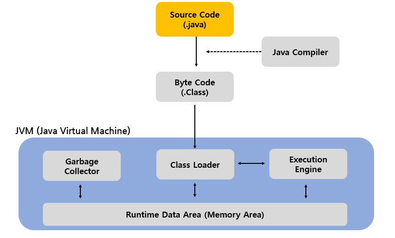
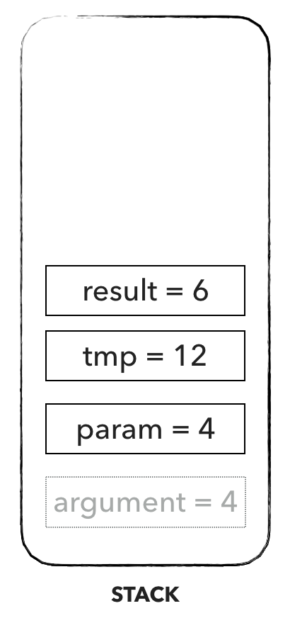

# Java Memory Structure


### JVM ( Java Virtual Machine )
- 우선 자바의 메모리 구조는 JVM 안의 메모리 영역임 ( Runtime Data Area )
- 자바 프로그램은 프로그램과 운영체제 사이에 JVM(Java Virtual Machine)을 실행하여 어떤 운영체제에서도 동일한 결과를 갖게 한다
- 한단계 더 거치기 때문에 실행 속도 면에서 뒤쳐질수도 있음
- JVM의 구조는 위의 사진과 같음. JVM이 실행된 후 어떤 운영체제이든지 실행이 가능 
> JVM 구조
>- Source Code(.java) 파일을 Java Compiler를 통해서 Byte Code(.class)파일로 변환 (컴퓨터가 이해할 수 있는 코드로 변환)
>- Byte Code로 변환된 파일을 JVM의 Class Loader로 보냄
>- Class Loader는 Class 파일을 불러와서 메모리에 저장하는 역할
>- Execution Engine는 Class Loader에 저장된 Byte Code를 명령어 단위로 분류하여 하나씩 실행하게 하는 엔진
>- Garbage Collector는 사용하지 않거나 필요없는 객체들을 메모리에서 소멸시키는 역할
>- Runtime Data Area(Memory Area)는 JVM이 프로그램을 수행하기위해 운영체제로부터 할당받은 메모리 공간

<br>


### Memory Area 구조
#### 1. Method Area
- JVM이 실행되면서 생기는 공간
- Class 정보, 전역변수, Static 변수 정보가 저장되는 공간
- Runtime Constant Pool 에는 말 그대로 '상수' 정보가 저장되는 공간
- 모든 스레드가 공유하는 메모리 영역
#### 2. Heap
- new 연산자로 생성된 객체, Array와 같은 동적으로 생성된 데이터가 저장되는 공간
- Heap에 저장된 데이터는 Garbage Collector가 처리하지 않는한 소멸되지 않음
- Reference Type의 데이터가 저장되는 공간
- 모든 스레드가 공유하는 메모리 영역
#### 3. Stack
- 지역 변수, 메소드의 매개변수와 같이 잠시 사용되고 필요가 없어지는 데이터가 저장되는 공간
- Last In First Out, 나중에 들어온 데이터가 먼저 나감
- 만약 지역변수이지만 Reference Type일 경우에는 Heap에 저장된 데이터 주소값을 Stack에 저장해서 사용하게 됨
- 스레드마다 하나씩 존재
#### 4. PC Register
- 스레드가 생성되면서 생기는 공간
- 스레드가 어느 명령어를 처리하고 있는지 그 주소를 등록
- JVM이 실행하고 있는 현재 위치를 저장하는 역할
#### 5. Native Method Stack
- Java가 아닌 다른 언어(C, C++)로 구성된 메소드를 실행이 필요할 때 사용되는 공간

<br>

### Stack-Heap ?

<br>

<p>




</p>

#### Stack
- Heap 영역에 생성된 Object 타입의 데이터 참조값이 할당됨
- 원시타입의 데이터가 값과 함께 할당됨
- 지역변수들은 scope에 따른 visibility를 가짐
- 각 Thread는 자신만의 stack을 가짐
- 사진 예시 코드
>```java
>public class Main {
>    public static void main(String[] args) {
>        int argument = 4;
>        argument = someOperation(argument);
>    }
>
>    private static int someOperation(int param){
>        int tmp = param * 3;
>        int result = tmp / 2;
>        return result;
>    }
>}
>```

<br>

#### Stack


<br>

<div style="text-align: right">22-07-10</div>

-------

## Reference
- https://velog.io/@shin_stealer/자바의-메모리-구조
- https://steady-coding.tistory.com/305
- https://yaboong.github.io/java/2018/05/26/java-memory-management/