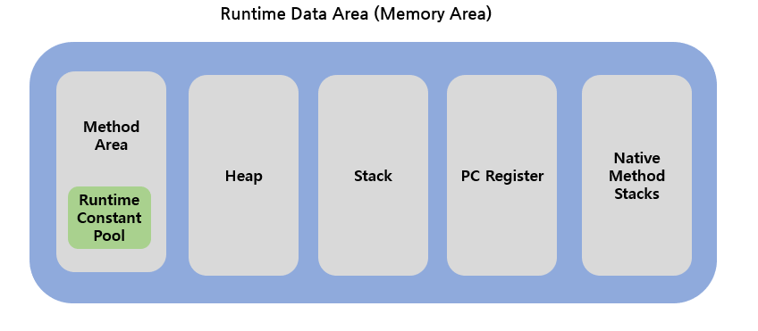

# Java Memory Structure


### JVM ( Java Virtual Machine )
- 우선 자바의 메모리 구조는 JVM 안의 메모리 영역임 ( Runtime Data Area )
- 자바 프로그램은 프로그램과 운영체제 사이에 JVM(Java Virtual Machine)을 실행하여 어떤 운영체제에서도 동일한 결과를 갖게 한다
- 한단계 더 거치기 때문에 실행 속도 면에서 뒤쳐질수도 있음
- JVM의 구조는 위의 사진과 같음. JVM이 실행된 후 어떤 운영체제이든지 실행이 가능 
#### JVM 구조
>- Source Code(.java) 파일을 Java Compiler를 통해서 Byte Code(.class)파일로 변환 (컴퓨터가 이해할 수 있는 코드로 변환)
>- Byte Code로 변환된 파일을 JVM의 Class Loader로 보냄
>- Class Loader는 Class 파일을 불러와서 메모리에 저장하는 역할
>- Execution Engine는 Class Loader에 저장된 Byte Code를 명령어 단위로 분류하여 하나씩 실행하게 하는 엔진
>- Garbage Collector는 사용하지 않거나 필요없는 객체들을 메모리에서 소멸시키는 역할
>- Runtime Data Area(Memory Area)는 JVM이 프로그램을 수행하기위해 운영체제로부터 할당받은 메모리 공간

<br>



### Memory Area 구조
#### 1. Method Area (MetaSpace)
- 모든 스레드가 공유하는 메모리 영역
- 클래스 로더에 의해 로드된 모든 클래스 정보를 저장
    - 클래스 명, 인터페이스 등 클래스 타입 정보
    - 메서드 시그니처 정보
    - 필드 정보
    - 상수 풀
    - 정적 변수 (const)
    - 메서드의 JIT(Just-In-Time) 컴파일 코드 등
    - JVM이 시작될 때 할당되며, JVM이 종료될 떄 까지 유지
- JVM이 실행되면서 생기는 공간
- Class 정보, 전역변수, Static 변수 정보가 저장되는 공간
- Runtime Constant Pool 에는 말 그대로 '상수' 정보가 저장되는 공간
#### 2. Heap
- new 연산자로 생성된 객체, Array와 같은 동적으로 생성된 데이터가 저장되는 공간
- Heap에 저장된 데이터는 Garbage Collector가 처리하지 않는한 소멸되지 않음
- Reference Type의 데이터가 저장되는 공간
- 모든 스레드가 공유하는 메모리 영역
#### 3. Stack
- 지역 변수, 메소드의 매개변수와 같이 잠시 사용되고 필요가 없어지는 데이터가 저장되는 공간
- Last In First Out, 나중에 들어온 데이터가 먼저 나감
- 만약 지역변수이지만 Reference Type일 경우에는 Heap에 저장된 데이터 주소값을 Stack에 저장해서 사용하게 됨
- 스레드마다 하나씩 존재
#### 4. PC Register
- 스레드가 생성되면서 생기는 공간으로 스레드마다 개별 존재
- JVM이 현재 실행 중인 JVM 명령의 주소(현재 위치)를 저장하는 역할
    - CPU Instruction을 수행하는 동안 필요한 정보를 CPU 내 기억장치인 레지스터에 저장
    - 스레드가 어느 명령어를 처리하고 있는지 그 주소를 등록
- Context Switching 시 중요한 역할을 수행
#### 5. Native Method Stack
- Stack Area와 PC Register와 마찬가지로 각 스레드 별로 생성됨
- Java가 아닌 다른 언어(C, C++)로 구성된 메소드를 실행이 필요할 때 사용되는 공간
    - native 메서드의 매개변수, 지연 변수 등을 바이트 코드로 저장
    - JNI를 통해 호출된 메서드의 실행에 사용되는 메모리를 저장


<br>

### Stack-Heap ?

<br>

<p>


</p>

#### Stack
- 기본 자료형(원시타입)의 데이터가 값과 함께 할당됨
- Thread마다 개별 존재하여 자신만의 Stack Memory를 가짐
- 각 스레드 호출 시마다 스택 프레임이 생성됨. 스택 프레임에는 로컬 변수, 중간연산 결과 등이 저장됨.
- 지역변수들은 scope에 따른 visibility를 가짐
    - 지역 변수는 선언된 블록 내에서만 유효하며 블록이 끝나면 스택에서 제거됨

<br>

### 메서드 호출 스택
- 각각의 메서드 호출 시 마다 메서드 동작을 위한 메모리 상자를 하나씩 할당
    - 상자 내부에 메서드를 위한 파라미터 변수 등 로컬 변수 구성
- A 메서드에서 새로운 메서드 B 호출 시 B 실행을 위한 메모리 상자를 쌓음
    - 언제나 맨 위에 있는 메모리 상자(B)만 활성화
    - 이때 A 메서드 동작이 끝나지 않고 잠시 정지된 상태
    - B가 리턴하게 되면 B를 위한 상자가 제거되며 메모리 반납
    - 다시 A가 최상위가 되어 다시 동작 재개

<br>

```java
public class Main {
    public static void main(String[] args) {
        int argument = 4; // 'argument'는 스택에 저장
        MyObject obj = new MyObject(); // 'obj'는 스택에 저장되지만, 실제 객체는 힙에 저장
        argument = someOperation(argument);
    }

    private static int someOperation(int param){
        int tmp = param * 3; // 'param'과 'tmp'는 스택에 저장
        int result = tmp / 2; // 'result'는 스택에 저장
        return result;
    }
}

class MyObject {
    // 필드와 메서드는 힙에 저장
}
```

<br>
<br>


#### Heap
- 모든 스레드가 공유하는 영역
- Heap 영역에는 주로 긴 생명주기를 가지는 데이터들이 저장됨
    - 동적으로 생성된 객체와 배열을 저장
    - 대부분의 오브젝트는 크기가 크고 서로 다른 코드블럭에서 공유되는 경유가 많음
- 어플리케이션의 모든 메모리 중 stack에 있는 데이터를 제외한 나머지 부분이 힙 영역
- 모든 객체의 실제 데이터는 Heap에 저장되며 이에 대한 참조형 변수(포인터)는 Stack에 저장
    - 배열 역시 객체로 힙에 저장되고, 배열을 참조하는 변수는 스택에 저장됨
- 몇개의 스레드가 존재하든 상관없이 단 하나의 heap 영역만 존재
    - 모든 스레드가 같은 힙을 공유
    - 여러 스레드가 힙에 저장된 객체에 접근할 수 있으므로 동시성 문제를 관리해야 함
- 메모리가 가비지 컬렉션에 의해 관리됨
- String Pool
    - Heap 메모리 중 특별한 메모리 영역으로, 문자열 리터럴을 재사용하여 메모리 효율성을 높이는 데 사용
    - 'intern()' 메소드로 문자열을 String Pool에 등록할 수 있으나, 권장되지 않음(성능)
- 가비지 컬렉션의 대상.
    - Young Generation :  새로 생성된 객체가 저장되는 영역. 자주 가비지 컬렉션이 발생하여, 생명 주기가 짧은 객체를 빠르게 정리함
    - Old Generation : Young Generation에서 살아남은 객체가 이동되는 영역. 비교적 큰 메모리 영역을 차지하며, 가비지 컬렉션이 덜 빈번하게 발생함

<br>

### static 변수
- JVM은 Java 프로그램을 실행하기 위해 클래스를 로드하는데 클래스가 로드될 때 해당 클래스의 코드, 상수, static 변수 등은 모두 메모리에 로딩됨
    - 메모리에 로딩될 때 static 변수는 메서드 영역에 할당됨
- static 변수는 이 과정에서 클래스가 처음 로드될 때 메모리에 할당되며 프로그램의 실행 동안 변하지 않는 데이터를 저장하는 용도로 사용됨
    - 이러한 특성에 있어 지나친 static 변수 사용은 메모리 사용에 있어 필요 이상으로 긴 생명주기를 가져 메모리 낭비를 초래할 수 있음
- static 변수는 클래스의 모든 인스턴스가 공휴나느 데이터로 static 변수는 객체가 생성되기 전에도 접근할 수 있으며 모든 객체가 동일한 값을 참조함

<br>

## Ssafy Wizards CS Study

### JVM
- 그럼, 자바 말고 다른 언어는 JVM 위에 올릴 수 없나요?
- 반대로 JVM 계열 언어를 일반적으로 컴파일해서 사용할 순 없나요?
- VM을 사용함으로써 얻을 수 있는 장점과 단점에 대해 설명해 주세요.
- JVM과 내부에서 실행되고 있는 프로그램은 부모 프로세스 - 자식 프로세스 관계를 갖고 있다고 봐도 무방한가요?

<details>
<summary>정답</summary>

#### 그럼, 자바 말고 다른 언어는 JVM 위에 올릴 수 없나요?
- 올릴 수 있음. JVM은 바이너리 코드를 통해 프로그램과 운영체제 사이에서 동작하기 때문
- 네이티브 메서드 스택 (Native Method Stack)이라는 자바 코드가 컴파일되어 생성되는 바이트 코드가 아닌 실제 실행할 수 있는 기계어로 작성된 프로그램을 실행시키는 영역이 존재
    - 자바 이외의 언어(C, C++, 어셈블리 등)로 작성된 네이티브 코드를 실행하기 위한 공간
- JNI, 네이티브 메소드 인터페이스 (Native Medthod Interface)를 통해 자바가 다른 언어로 만들어진 어플리케이션과 상호 작용할 수 있는 인터페이스를 제공하는 프로그램이 있음

<br>

#### 반대로 JVM 계열 언어를 일반적으로 컴파일해서 사용할 순 없나요?
- JVM 기반으로 설계 된 언어는 바이트 코드로 변환되고 이후 JVM에 의해 해석되거나 JIT 컴파일러에 의해 런타임 시 기계어로 컴파일되어 실행됨
- 이러한 바이트 코드를 기계어로 변환하는 것은 가능하지만 효율적이지 못하며 불필요한 일
    - JVM이 이미 효율적으로 바이트코드를 실행하고, JIT 컴파일러를 통해 런타임 최적화를 수행하기 때문
- 일부 언어는 네이티브 코드로 컴파일 하는 옵션이 존재하기는 함

<br>

#### VM을 사용함으로써 얻을 수 있는 장점과 단점에 대해 설명해 주세요.
- 장점
    - JVM 위에서 동작하는 프로그램은 어떤 운영체제에서도 동일하게 동작함
    - JVM은 프로그램 실행 시 메모리 접근 등을 제어하여 안정성을 높임
    - Garbage Collection을 통해 자동으로 메모리 관리
    - JVM은 실행 중인 프로그램을 격리하고, 실행 전에 바이트코드를 검증하여 보안을 강화
- 단점
    - JVM은 추가적인 추상화 계층이기 때문에 네이티브 코드보다 성능이 떨어질 수 있음
    - JIT 컴파일링으로 인해 초기 실행 속도가 느릴 수 있음
    - JVM 자체가 메모리를 소비하며, 가비지 컬렉션이 실행될 때 일시적인 성능 저하가 발생할 수 있음

<br>

#### JVM과 내부에서 실행되고 있는 프로그램은 부모 프로세스 - 자식 프로세스 관계를 갖고 있다고 봐도 무방한가요?
- 그렇지 않음. JVM은 하나의 프로세스로 실행되며 내부에서 여러 스레드를 생성하여 프로그램을 생성하는데 스레드란 하나의 프로세스 내에서 동작하는 독립적인 실행 흐름이기 때문
- 운영체제 관점에서 JVM은 단일 프로세스로 인식됨. JVM 내부의 스레드는 운영체제에서 관리되는 별도의 프로세스가 아님
    - JVM 프로세스는 자바 프로그램을 실행하기 위한 가상 머신 역할을 하며, 프로그램 실행 환경을 제공함
    - 즉, 자바 프로그램 내에서는 여러 스레드를 관리하며 실행되는 스레드는 JVM 프로세스의 일부로 독립적으로 실행됨

</details>

<br>


<div style="text-align: right">22-07-10</div>
<div style="text-align: right">+ 내용 추가 24-07-16</div>

-------

## Reference
- https://velog.io/@shin_stealer/자바의-메모리-구조
- https://steady-coding.tistory.com/305
- https://yaboong.github.io/java/2018/05/26/java-memory-management/
- https://inpa.tistory.com/entry/JAVA-☕-JVM-내부-구조-메모리-영역-심화편#자바_가상_머신jvm의_구조