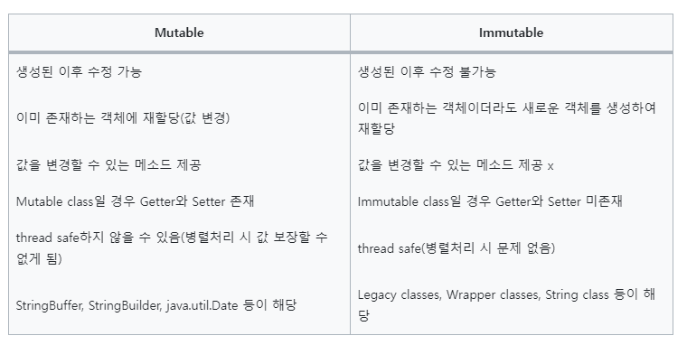

# Mutable vs Immutable

### Object
- 자바의 객체는 기본적으로 힙 영역에 할당되고 스택 영역에 참조값을 갖는 참조 변수 타입을 통해 데이터에 접근
- 이러한 객체는 Mutable(가변) 객체와 Immutable(불변) 객체로 나눌 수 있음

 

### Mutable Object (가변 객체)
- 힙 영역에 생성된 객체를 변경할 수 있음
- 우리가 자바에서 사용하는 대부분의 객체는 가변 객체
- 가변 객체는 멀티 스레드 환경에서 사용하기 위해서 별도의 동기화 처리가 필요
- 가변 객체의 종류로는 ArrayList, HashMap, StringBuilder, StringButffer 등이 존재

 

### Immutable Object (불변 객체)
- 데이터의 변경이 불가능한 객체
- final 키워드 처럼 이후에 값을 변경할 수 없는 것이 아닌 불변 객체는 데이터 수정이 아예 불가능한 것이 아니라 힙 영역에 저장된 값을 수정할 수 없는 것을 뜻함
- 힙 영역에 불변객체의 수정을 우리가 코드에서 보면 수정이 된 것 처럼 보이지만 힙 영역에 새로운 객체가 생성되고 값이 들어간 것
- 이후 새롭게 힙 영역에 새롭게 생성하고 이전 객체는 GC(Garbage Collection)에 의해 사라지게 됨
- 불변 객체는 멀티 스레드 환경에서도 안전하게 사용할 수 있다는 신뢰성을 보장
- 그러나 불변 객체는 객체의 값이 할당될 때마다 새로운 객체가 필요하여 메모리 누수와 성능 저하가 발생할 수 있음
- 불변 객체의 종류로는 String, Boolean, Integer, Float, Long, Double 등이 있음

#### 불변 객체의 장점
- Thread-safe하여 병렬 프로그래밍에 유용하며, 동기화를 고려하지 않아도 된다
- 실패 원자적인(Failure Atomic) 메소드를 만들 수 있다
- Cache, Map, Set 등의 요소로 활용하기에 적합하다
- 부수 효과(Side Effect)를 피해 오류 가능성을 최소화할 수 있다
- 다른 사람이 작성한 함수를 예측 가능하며 안전하게 사용이 가능하다
- GC의 성능을 높일 수 있다

 

### final 키워드?
- 불변 객체가 정해져 있다면 final은 무엇일까 -> 자바에서 불변성을 확보 할 수 있도록 final 키워드를 붙이면 참조값의 변경을 못하도록 함
- final 키워드는 객체의 상태를 변경하지 못하도록 막는 것은 아님

 

### Mutable -vs Immutable
- Mutable은 객체의 수정을 허용하나, Immutable인 경우 객체의 수정을 허용하지 않음
- 수정이 필요할 경우 Mutable 객체는 기존의 객체에 수정사항을 곧바로 반영하지만 Immutable 객체의 경우 기존의 객체는 그대로 두고 수정사항을 반영한 새로운 객체를 생성한다는 점에서 차이가 있음

 

22-09-02

-------

## Reference
- https://velog.io/@guswlsapdlf/Java의-Mutable과-Immutable
- https://choiblack.tistory.com/47