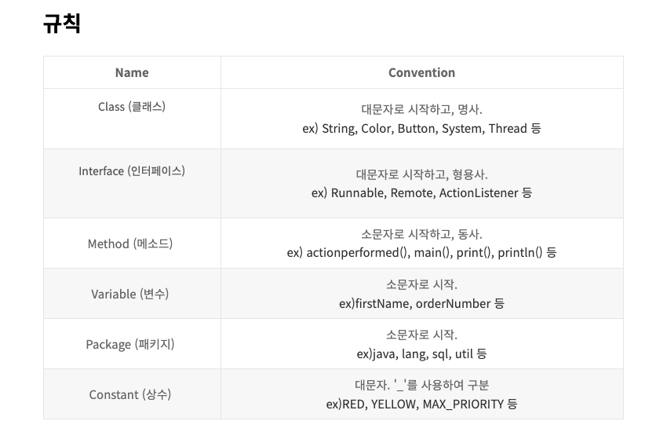

# Notation

### 표기법(Notation)
- 주 표기법으로는 snake case, pascal case, camel case 존재
- 자바에서 패키지의 경우에는 모두 소문자로 작성하고 구분자는 마침표(.)로 둠
- 이러한 표준적인 명명 규칙을 사용함으로써 자신과 다른 프로그래머들이 읽기 더 쉽게 만들 수 있음
- 코드가 무슨 기능을하는지 빠르게 파악이 가능

<br>

### 스네이크 케이스(snake case)
- 언더바(_)가 들어 있는 표현 방식을 뱀처럼 생겼다고 하여 스네이크 케이스라고 함
- 단어가 합성될 때 마다 각 단어의 사이에 언더바(_)를 사용하는 방법
- 주로 데이터베이스 쪽이나 자바스크립트 쪽에서 지역 변수, 자바에서 상수를 사용할 경우에 사용
- 자바에서 상수를 사용할 때 명명하는 경우 모두 대문자로 사용하는 것이 좋음
```java
static final int MAX_PARTICIPANTS = 10;
```

<br>

### 파스칼 케이스(pascal case)
- 첫 글자와 중간 글자들이 대문자인 경우 파스칼 언어의 표기법과 유사하다고 하여 파스칼 케이스라고 함
- 첫 글자를 대문자로 구성하며 단어가 합성될 때 마다 각 단어의 첫 글자를 대문자로 표기하는 방법
- 주로 자바에서 클래스명을 명명할 때 사용
```java
class MainTitle()
```

<br>

### 카멜 케이스(camel case)
- 중간 글자들은 대문자로 시작하지만 첫 글자가 소문자인 경우에는 낙타와 모양이 비슷하다 하여 카멜 케이스라고 함
- 두 단어 이상의 변수명을 표현할 때 두 번째 단어부터 첫 글짜를 대문자로 표기하는 방법
- 주로 자바에서 변수명이나 메소드명을 명명할 때 사용
```java
String contentName;

public String getContentName(){...}
```

<br>

### 헝가리언 케이스(hungarian case)
- Microsoft 사의 Charles Simonyi 라는 특정 프로그래머가 만든 방식으로 코딩할 때 습관적으로 즐겨쓰던 접두어 변수 명명 방식이 빌게이츠의 눈에 뜨어 표준화 된 것
- 변수를 표기할 때 앞에 접두어로 쉽게 알아볼 수 있도록 표기함. 맨 앞의 단어가 자료형을 나타내는 접두어
- 협업에 있어 쓰지 않는 것이 좋음. 최대한 지양
```java
int nNum;
String strName;
```

<br>

### 케밥 케이스(kebab-case)
- 하이픈(-)으로 단어를 연결하는 표기법
- 많은 언어에서 하이픈을 지원하지 않기 때문에 사용하는 예는 상당히 제한됨
- 주로 HTML id, class, CSS, properties 에서 사용됨
```css
#main-content{...}
.sub-text{...}
```

<br>


### 자바 규칙 정리
- 위의 표기법을 기반으로 사용하는 것이 일반적이고 좋음
- 축약형, 두문자어형을 사용할 경우 전부 대문자를 사용하지 않는다
    ```java
        String exportHtmlSource; //(o)
        String exportHTMLSource; //(x)
    ```
- 일반적인 변수의 이름은 타입과 동일하도록 정의
    ```java
        void getTest(Event event){...}    // (o)
        void getTest(Event valie){...}    // (x)
    ```
- 컬렉션의 이름은 반드시 복수형으로 사용
    ```java
        List<Event> events; //(o)
        List<Event> event; //(x)

        Set<Color> colors; //(o)
        Set<Color> color; //(x)
    ```
- Boolean 변수이름은 절대로 부정적인 이름을 사용하지 않는다
    ```java
        boolean isError; // (o)
        boolean isNotError; // (x)

        boolean isFound; // (o)
        boolean isNotFound; // (x)
    ```
- 관련있는 상수(final 변수)들은 공통 타입의 이름을 접두사로 사용하여 그룹핑한다
    ```java
        final int COLOR_RED = 1;
        final int COLOR_GREEN = 2;
        final int COLOR_BLUE = 3;
    ```

<br>

<div style="text-align: right">22-08-29</div>

-------

## Reference
- https://velog.io/@leyuri/표기법-스네이크-케이스-파스칼-케이스-카멜-케이스
- https://simuing.tistory.com/entry/JAVA-note4-자바에서-사용되는-표기법-정리
- https://java119.tistory.com/7