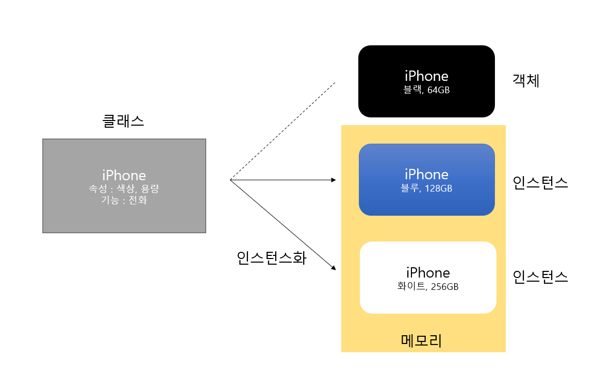
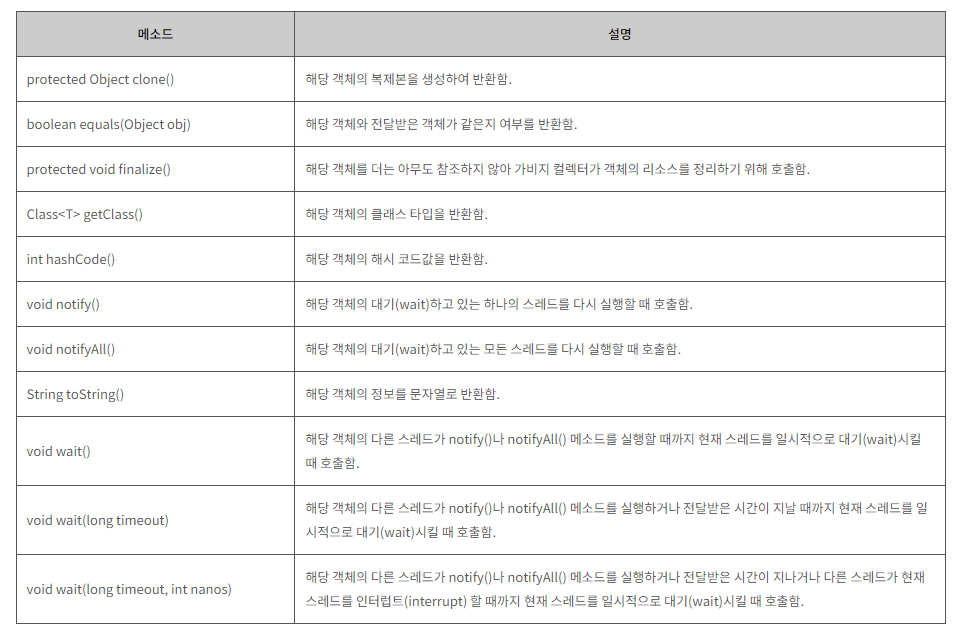

# Object

<br>



### Class와 Object 간의 관계
#### Class?
- 클래스(Class)는 객체를 정의, 객체를 생성하는데 사용되는 제품 설계도 같은 역할이다.
- 객체의 상태를 나타내는 필드와 객체의 행동을 나타내는 메소드로 구성되어 있음
- 클래스를 선언할 때는 생성자(Constructor)와 메소드(Method)를 필수적으로 만들어야 함
#### Object?
- 객체는 실제로 존재하는 것(소프트웨어 세계에 구현할 대상).
- 자바에서 객체는 생성자로 하여금 생성되어 메모리에 올라가는 실체(=인스턴스)를 의미
    - 기본 자료형의 값은 바로 메모리에 올라가므로 Object를 상속받지 않음
- 인스턴스란 자세히 말하면 설계도를 바탕으로 소프트웨어 세계의 구현된 구체적인 실체로 객체는 모든 인스턴스를 대표하는 포괄적인 의미임
- 자세히말하면 객체는 소프트웨어 세계에 구현할 대상이고, Class에 따라 소프트웨어 세계에 구현된 실체가 인스턴스임. 그렇기 떄문에 객체안의 인스턴스가 포함된다고 볼 수 있음
```
Book book1 = new Book("책이름","작성자","출판사","가격");
예시로 들자면 new Book이 Book클래스에서 생성자를 호출, 해당 생성자에
("책이름","작성자","출판사","가격")를 매개변수로 생성자 호출
book1은 생성자로 생성된 인스턴스.
```

### java.lang.Object
- java.lang.Object는 java.lang 패키지 중에서도 가장 많이 사용되는 클래스
- java.lang 패키지는 자바에서 가장 기본적인 동작을 수행하는 클래스들의 집합으로 import문 사용없이 클래스 이름만으로 바로 사용 가능
- Object 클래스는 모든 자바 클래스의 최고 조상 클래스가 됨. 따라서 자바의 모든 클래스는 Object 클래스의 모든 메소드를 바로 사용 가능
    - 별도의 extends 선언이 없는 클래스들은 extends Object가 생략됨
- 따라서 자바의 모든 클래스는 Object 클래스의 모든 메소드를 바로 사용할 수 있고 Object 클래스는 필드를 가지지 않으며 11개의 메소드로 구성

<br>

### 객체가 출력되는 과정
- 객체 toString으로 출력하면 객체의 해시코드를 16진수로 표현한 값이 나온다

<br>

```java
Object obj = new Object("test");
System.out.print(obj);

// PrintStream의 print 메서드
public void print(Object obj) {
    write(String.valueOf(obj))
}

// String의 valueOf
public static String valueOf(Object obj) {
    return (obj == null) ? "null" : obj.toString();
}

// Object의 toString
public String toString() {
    return getClass.getName() + "@" + Integer.toHexString(hashCode());
}

// 출력 : 
```

<br>

### Object에 기본 자료형 캐스팅
- java 기본형은 Object를 상속받지 않음
- 그런데 기본형을 Object에 담는게 가능한 이유는 AutoBoxing이 일어나기 때문

```java
Object obj = 1;
int number = 0;
		
obj = number;
// 기본 자료형 값을 그에 대응하는 wrapper 클래스 객체로 자동 변환
// int -> Integer 로 변환되어 Object 에 할당됨

System.out.println(obj.getClass() + " : " + obj);
// 출력 : class java.lang.Integer : 1
```

<br>



<br>

#### Object 주 사용 메소드 
>1. toString() 메소드
>       - 해당 인스턴스에 대한 정보를 문자열로 반환 
>       - 이떄 반환되는 문자열은 클래스이름과 함께 구분자 '@'가 사용되며 그 뒤로 16진수 해시 코드가 추가됨 
>       - 16진수 해시코드 값은 인스턴스의 주소를 가르키는 값으로 인스턴스마다 다르게 반환
>       - 자바에서 toString() 메소드는 기본적으로 API 클래스마다 자체적으로 오버라이딩을 통해 재정의되어 있음
>       - 오버라이드 목적은 객체의 정보를 문자열 형태로 표현하기 위해
>```java
>@Override
>    public String toString() {
>        return "Book{" +
>                "title='" + title + '\'' +
>                ", author='" + author + '\'' +
>                '}';
>    }
>```
>2. equals() 메소드
>       - equals() 메소드는 해당 인스턴스를 매개변수로 전달받는 참조 변수와 비교하여 그 결과를 반환
>       - 자바에서 toString() 메소드는 기본적으로 API 클래스마다 자체적으로 오버라이딩을 통해 재정의되어 있음
>       - 오버라이드 목적은 물리적으로 다른 메모리에 위치하는 객체여도 논리적으로 동일함을 구현하기 위해
>```java
>@Override
>    public boolean equals(Object obj) {
>        if (obj instanceof User) {
>            return this.getId() == ((User)obj).getId();
>        } else {
>            return false;
>        }
>    }
>```
>3. hashCode() 메소드
>       - 해시코드란 JVM이 부여한 코드값으로 해당 메소드는 인스턴스가 저장된 가상머신의 주소를 10진수로 변환함
>       - 자바의 Integer 클래스도 Object의 hashCode()를 override 하고있음 (Integer i1 = 100 -> i1.hashCode() == 100 )
>       - 자바에서 hashCode() 메소드는 기본적으로 API 클래스마다 자체적으로 오버라이딩을 통해 재정의되어 있음
>       - 오버라이드 목적은 두 개의 서로 다른 메모리에 위치한 객체가 동일성을 갖기 위해
>```java
>public static void main(String[] args) {
>
>        User user1 = new User(1001, "홍길동");
>        User user2 = new User(1001, "홍길동");
>
>        System.out.println("user1.equals(user2): " + user1.equals(user2)); // true 로 나오지만 hashCode는 주소값이므로 아래 해쉬코드값은 다름
>        System.out.println("user1.hashCode(): " + user1.hashCode());
>        System.out.println("user2.hashCode(): " + user2.hashCode());
>    }
>```
>4. clone() 메소드
>       - 객체의 복사본을 만듦
>       - Prototype으로부터 같은 속성값을 가진 복사본을 생성
>       - 객체지향 프로그래밍의 정보 은닉에 위배될 가능성이 있으므로 복제할 객체는 Cloneable 인터페이스를 명시해야함 -> 하지 않으면 CloneNotSupportedException이 발생
>```java
>public class Book implements Cloneable{
>   ...
>   ...
> @Override
>    protected Object clone() throws CloneNotSupportedException {
>        return super.clone();
>    }
>
> public static void main(String[] args) throws CloneNotSupportedException {
>        Book book1 = new Book("깊은 밤 부엌에서", "모리스 샌닥");
>        Book book2 = (Book) book1.clone();
>        System.out.println(book2);
>    }
>```
<br>

<div style="text-align: right">22-07-05</div>

-------

## Reference
- https://joy-baek.tistory.com/7
- http://www.tcpschool.com/java/java_api_object
- https://atoz-develop.tistory.com/entry/자바-Object-클래스-정리-toString-equals-hashCode-clone