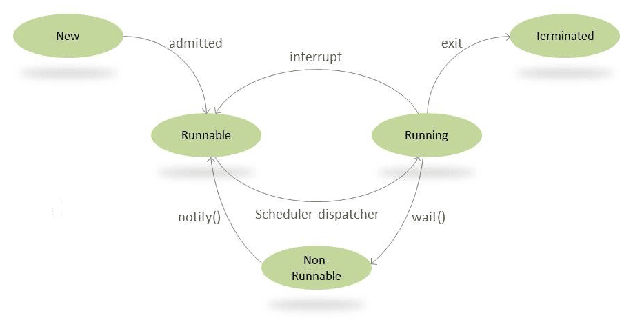

# Synchronized

### 자바 Synchronzied
- 자바에서 스레드 간의 동기화를 달성하기 위해 사용
- 메서드 레벨 혹은 블록레벨으로 동작하며 한번에 하나의 스레드만 모니터를 얻어 동기화

<br>

```java
public synchronized void synchronizedMethod() {
    // 동기화된 메서드 본문
}

public void testMethod() {
    synchronized (lockObject) { // lockObject의 모니터를 잠그는 동기화 블록. 해당 블록만 동기화를 진행
        ...
    }

    ... // 동기화가 적용되지 않는 메서드 본문
}
```

<br>

### 스레드 한정(Thread Confinement)
- 다중 스레드 환경에서 데이터나 객체를 특정 스레드에만 제한하여 접근하도록 하는 디자인 패턴이나 기법

<br>

### 모니터 패턴(Monitor Pattern)
- 모니터 패턴은 다중 스레드 환경에서 동기화를 위한 디자인 패턴 중 하나
- 이 패턴은 상호 배제(mutual exclusion)와 조건 변수(condition variable)를 사용하여 공유 자원에 대한 안전한 접근을 보장
    - 조건 변수란 스레드가 특정 조건을 충족할 때까지 기다리도록 하는 메커니즘
- 자바 모니터 패턴의 핵심 메서드들은 synchronized 키워드와 wait(), notify(), notifyAll() 메서드

<br>

### synchronized
- 객체에 대한 참조를 계산하고 해당 개체의 모니터에서 잠금 작업을 수행하려고 시도하고 잠금 작업이 성공적으로 완료될 때까지 더 이상 진행하지 않음 ( 모니터를 얻을 때까지 차단됨 )
- 잠금 작업이 수행된 후 문의 본문이 synchronized 실행 후 정상적으로 또는 갑자기 본문 실행이 완료되면 동일한 모니터에서 잠금 해제 작업이 자동으로 수행됨
- 스레드 t는 특정 모니터를 여러 번 잠글 수 있고 각 잠금 해제는 한 번의 잠금 작업 효과를 반전함
    - 모니터의 잠금 횟수가 증가하는 것을 해제할 때 반전시킨다는 의미로 모니터를 해제할 때마다 잠금 횟수가 1씩 감소하고, 잠금 횟수가 0이 되면 해당 모니터는 완전히 해제되어 다른 스레드가 해당 모니터를 사용할 수 있게함
- synchronized 메서드의 경우는 메소드가 인스턴스 메소드인 경우 해당 메소드가 호출된 인스턴스(즉, this메소드 본문 실행 중에 알려지는 객체)와 연관된 모니터를 잠금, 메서드가 정적인 경우 메서드가 정의된 클래스를 나타내는 Class 개체와 연관된 모니터를 잠금. 메서드 본문의 실행이 정상적으로 또는 갑자기 완료되면 동일한 모니터에서 잠금 해제 작업이 자동으로 수행함

<br>

### wait set(대기 집합)
- 연관된 모니터를 갖는 것 외에도 모든 객체에는 연관된 wait set이 있고 자바에서 객체의 대기 집합은 해당 객체에 대해 대기 중인 스레드들의 집합
- 대기 집합(wait set)은 각 객체마다 별도로 존재하며, 해당 객체에 대해 대기 중인 스레드들의 집합을 나타냅니다. 이 대기 집합은 객체가 생성될 때 빈 상태로 시작
- 스레드가 Object 클래스의 wait() 메서드를 호출하여 대기 상태에 들어갈 때, 해당 스레드는 대기하는 스레드들의 집합인 wait set에 추가됨
- 대기 집합에 스레드를 추가하거나 제거하는 기본 동작은 원자적이고 대기 집합은 오로지 Object.wait(), Object.notify(), Object.notifyAll() 메서드를 통해 조작함
    - 원자적(atomic) : 한 번에 완전히 실행되거나 실행되지 않는 작업을 나타냄. 작업이 분할되거나 중간에 중단되지 않고 전체가 한꺼번에 실행됨을 의미
- 또한 대기 집합의 조작은 스레드의 인터럽트 상태(interruption status) 및 인터럽트와 관련된 Thread 클래스의 메서드에 의해 영향을 받을 수 있다고 함
    - sleep() 메서드는 스레드를 일시정지시키고 다른 스레드의 알림이나 신호를 기다리지 않고 실행되므로 대기 집합에 추가되지 않아 영향을 끼치지 않음. 즉 해당 잠든 스레드는 여전히 모니터를 가지고 있음
    - join() 메서드는 다른 스레드가 종료될 때까지 대기하고, 그 스레드가 종료되면 실행을 재개하므로 대기 집합(wait set)에 스레드가 추가됨
    - sleep(), join()는 Thread 객체의 메서드이고 이후 설명하는 wait(), notify() 등의 메서드는 Object의 메서드
- 즉, 요약하자면 객체의 스레드는 모니터를 얻지 못했다면 대기 집합에 추가 되어 모니터를 해제하는 알림(Notification)을 기다기다가 해당 알림을 통해 대기되어 있던 스레드가 모니터를 획득할 수 있으며 해당 방식으로 동기화가 이루어진다.
- 대기 집합에 들어가는 스레드는 스레드 생명주기의 대기 상태가 되는 것

<br>

```java
public class MyClass {
    public synchronized void synchronizedMethod() {
        // synchronizedMethod 내용
    }
}
// 인스턴스 메서드에서 사용하면 MyClass 객체의 대기 집합에 들어감

public class MyClass {
    private final Object lock = new Object();

    public void someMethod() {
        synchronized (lock) {
            // 동기화가 필요한 코드
        }
    }
}

// someMethod() 안의 블록이 있으며 lock 객체의 대기 집합에 들어감
```

<br>

### 자바 모니터 동기화를 위한 메서드

####  wait()
- 다른 스레드가 동일한 객체에 대해 notify() 또는 notifyAll()을 호출할 때까지 현재 스레드가 강제로 무기한 대기

#### notify(), notifyAll()
- 특정 객체의 모니터에 대한 액세스를 기다리고 있는 스레드를 깨우기 위해 notify(), notifyAll() 메서드를 사용
- notify() : 이 객체의 모니터에서 대기 중인 모든 스레드에 대해, notify() 메서드는 임의로 하나를 깨웁니다. 깨울 스레드를 정확히 선택하는 것은 비결정적이며, 구현에 따라 달라짐
- notifyAll() : 이 객체의 모니터에서 대기 중인 모든 스레드를 깨우고 깨어난 스레드들은 이 객체를 동기화하려는 다른 스레드와 마찬가지로 일반적인 방식으로 경쟁함
- 차이점은 notify()는 임의의 스레드 하나만을 깨우고 그 외 대기 상태의 스레드들은 그대로 대기하고 있음, notifyAll()은 대기중인 스레드를 모두 깨우고 모니터를 얻기 위해 경쟁하고 한 스레드가 모니터를 얻으면 나머지 스레드들은 대기 상태가 됨

<br>



<br>

### Reference

- [자바 모니터 패턴 참조 링크](https://docs.oracle.com/javase/specs/jls/se8/html/jls-17.html#jls-17.1)
- [스레드 라이프사이클 참조 링크](https://www.baeldung.com/java-wait-notify)