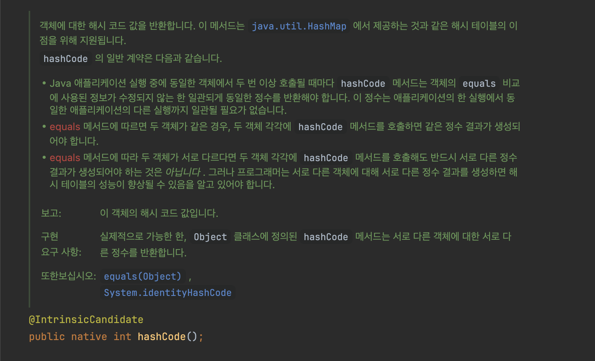

# Equals And HashCode

### Equals()와 HashCode()
- 자바 최상위 객체인 java.lang.Object 객체의 주요 메서드
- 두 메서드는 객체의 동등성 비교와 해시 기반 컬렉션에서의 객체 관리를 위해 사용됨
- 해당 클래스를 상속받아 재정의 하여 사용

- equals() 메소드
    - equals() 메소드는 해당 인스턴스를 매개변수로 전달받는 참조 변수와 비교하여 그 결과를 반환
    - 자바에서 toString() 메소드는 기본적으로 API 클래스마다 자체적으로 오버라이딩을 통해 재정의되어 있음
    - 오버라이드 목적은 물리적으로 다른 메모리에 위치하는 객체여도 논리적으로 동일함을 구현하기 위해
>```java
>@Override
>    public boolean equals(Object obj) {
>        if (obj instanceof User) {
>            return this.getId() == ((User)obj).getId();
>        } else {
>            return false;
>        }
>    }
>

<br>


<br>

2. hashCode() 메소드
    - 해시코드란 JVM이 부여한 코드값으로 해당 메소드는 인스턴스가 저장된 가상머신의 주소를 10진수로 변환함
    - 자바의 Integer 클래스도 Object의 hashCode()를 override 하고있음 (Integer i1 = 100 -> i1.hashCode() == 100 )
    - 자바에서 hashCode() 메소드는 기본적으로 API 클래스마다 자체적으로 오버라이딩을 통해 재정의되어 있음
    - 오버라이드 목적은 두 개의 서로 다른 메모리에 위치한 객체가 동일성을 갖기 위해
>```java
>public static void main(String[] args) {
>
>        User user1 = new User(1001, "홍길동");
>        User user2 = new User(1001, "홍길동");
>
>        System.out.println("user1.equals(user2): " + user1.equals(user2)); // true 로 나오지만 hashCode는 주소값이므로 아래 해쉬코드값은 다름
>        System.out.println("user1.hashCode(): " + user1.hashCode());
>        System.out.println("user2.hashCode(): " + user2.hashCode());
>    }
>```

<br>



<br>

## 문제

### 1. hashcode()를 재정의 한다면 염두에 두어야 하는 부분
- equals() 와의 일관성 유지
    - equals() 메서스가 true를 반환하는 두 객체는 반드시 동일한 해시 코드를 반환해야 함
    - equals() 메서스가 true를 반환하는 두 객체는 다른 해시코드를 반환하는 것이 바람직
- 변경 불가능한 필드 사용
    - hashcode() 메서드를 재정의할 때는 가능하면 변경 불가능한(immutable) 필드를 사용하여 해시코드를 계산하는 것이 좋음
- 해시 코드 계산 효율성
    - 복잡한 계산은 성능을 저하시킬 수 있어 객체의 중요한 필드 몇 개를 선택하여 해시코드를 계산하는 것이 좋음
- 고유성과 분포
    - 해시 코드가 고르게 분포되도록 계산되어야 함. 이를 통해 해시 충돌을 줄이고 해시 기반 컬렉션을 향상시킬 수 있음

<br>

### 2. equals()를 재정의 한다면 염두에 두어야 하는 부분
- 보통 equals를 재정의하는 이유는 동일성이 아닌 동등성을 비교하고 싶어서 이므로 이에 대한 비교를 진행하도록 함
- 일치하는 hashCode() 재정의 : equals() 재정의시 hashCode()도 일관되게 재정의해야함. 해시 기반 컬렉션에서 정확한 동작을 보장하기 위해 필요
- 객체 상테 변경에 따른 영향 : 필드값이 변경되면 해시코드도 변경 될 수 있으므로 해시 기나 컬렉션에서의 예츨 불가능한 동작 초래
- instanceof 를 사용한 유연한 비교 가능 : 이는 상속 구조에서 대칭성 문제를 초래할 수 있으므로 주의 필요

```java
@Override
public boolean equals(Object o) {
    if (this == o) return ture;
    if(!(o instaneof Person)) {
        return false;
    }

    Person person = (Person) o;
    return age == person.age && Objects.equals(name, person.name);
}
```