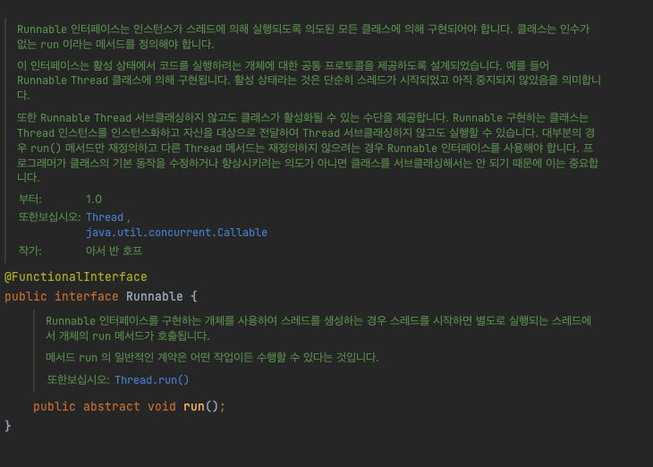
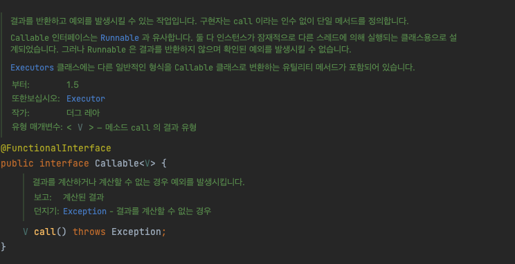
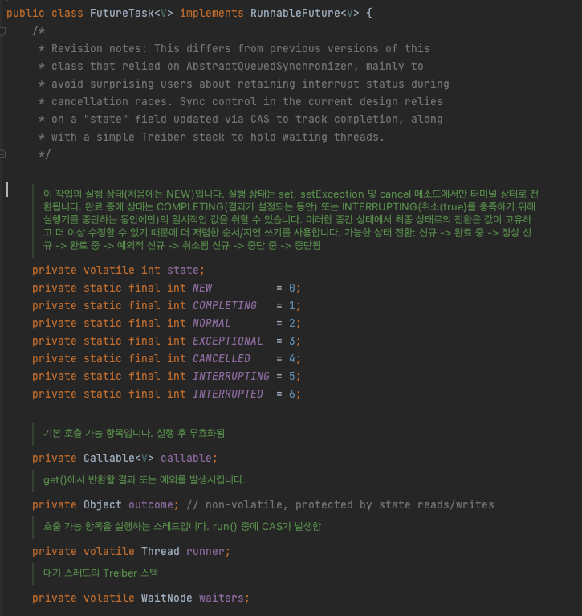
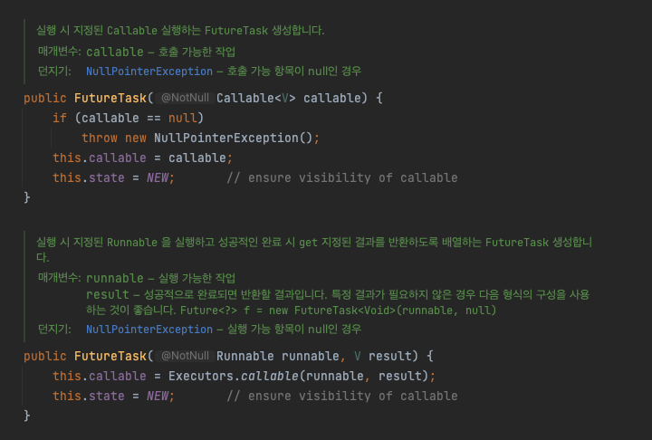

# Runnable, Callable, Future Interface

### concurrent 패키지
- Java에서 다중 스레드 환경에서의 프로그래밍을 지원하기 위한 유틸리티 클래스와 인터페이스를 제공
    - Executor 및 ExecutorService 인터페이스
    - ScheduledExecutorService 인터페이스
    - Future 및 FutureTask 클래스
    - ConcurrentMap 인터페이스 및 ConcurrentHashMap 클래스
    - BlockingQueue 인터페이스 및 해당 구현체들
    - Semaphore, CyclicBarrier, CountDownLatch 클래스

<br>

### Runnable
- 반환 타입이 없이 run() 메서드를 사용하여 스레드를 실행하기 위해 사용하는 인터페이스
    - [참조](https://docs.oracle.com/javase/8/docs/api/java/lang/Runnable.html)
- 자바 8이후로 함수형 인터페이스 사용가능
- 하위 인터페이스
    - RunnableFuture
    - RunnableScheduledFuture
- 구현 클래스
    - FutureTask 
    - Thread
    - TimerTask



<br>

### Callable
- 결과를 반환하고 예외를 발생시킬 수 있는 스레드를 실행할 수 있는 인터페이스
    - [참조](https://docs.oracle.com/javase/8/docs/api/java/util/concurrent/Callable.html)
- 람다식 또는 메서드 참조로 스레드를 실행할 수 있음
- 예외를 발생시키는 call() 메서드만을 가지고 있음

<br>



<br>

### Future
- 비동기에서 계산의 결과를 나타내는 인터페이스
    - [참조](https://docs.oracle.com/javase/8/docs/api/java/util/concurrent/Future.html)
- 계산이 완료되었는지 확인하고, 완료될 때까지 기다리고 계산결과를 검색하는 메서드가 제공됨
- 결과는 get 계산이 완료된 경우에만 메서드를 사용하여 검색할 수 있으며 필요한 경우 준비될때까지 차단되며 계산이 완료되었다면 계산을 취소할 수 없음

<br>

```java
// 이 작업의 실행을 취소하려고 시도
boolean cancel(boolean mayInterruptIfRunning);

// 작업이 정상적으로 완료되기 전에 취소된 경우 true 반환
boolean isCancelled();

// 작업이 완료되면 true 반환
boolean isDone();

// 필요한 경우 계산이 완료될 때까지 기다린 다음 결과를 검색
/*
    발생 예외
    CancellationException – 계산이 취소된 경우
    ExecutionException - 계산에서 예외가 발생한 경우
    InterruptedException – 현재 스레드가 대기하는 동안 중단된 경우
*/
V get() throws InterruptedException, ExecutionException;

// 위와 동일하나 최대 주어진 시간 동안 기다린다음 결과를 검색
/*
    발생 예외, 위의 예외는 모두 여전히 발생
    TimeoutException - 대기 시간이 초과된 경우
*/
V get(long timeout, TimeUnit unit)
        throws InterruptedException, ExecutionException, TimeoutException;
```

<br>

### FutureTask
- Runnable과 Future을 상속받은 RuuableFuture 인터페이스를 상속받은 구현체 클래스로 비동기적으로 스레드를 실행하며 작업의 결과를 제공하고 작업 상태를 추적할 수 있음
    - Runnable과 Future은 서로 관련이 없음
    - [참조](https://docs.oracle.com/javase/8/docs/api/java/util/concurrent/FutureTask.html)
- 생성자로 Callable 이나 혹은 Runnable과 초기 결과값을 가진 변수를 입력으로 받음
    - 반환 값이 필요없다면 입력 result에 null을 입력할 수 있음
- 이후 작업이 완료됬다면 result를 반환할 수 있음

<br>

```java
// 해당 클래스는 Runnable, Future 메서드를 모두 상속받아 해당 기능 구현
boolean cancel(boolean mayInterruptIfRunning);
boolean isCancelled();
boolean isDone();
V get() throws InterruptedException, ExecutionException;
V get(long timeout, TimeUnit unit)
        throws InterruptedException, ExecutionException, TimeoutException;
void run();
```

<br>



<br>



<br>