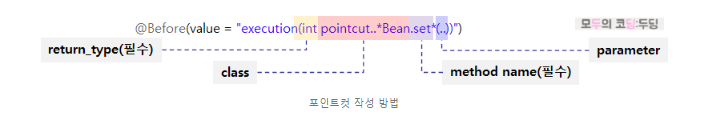
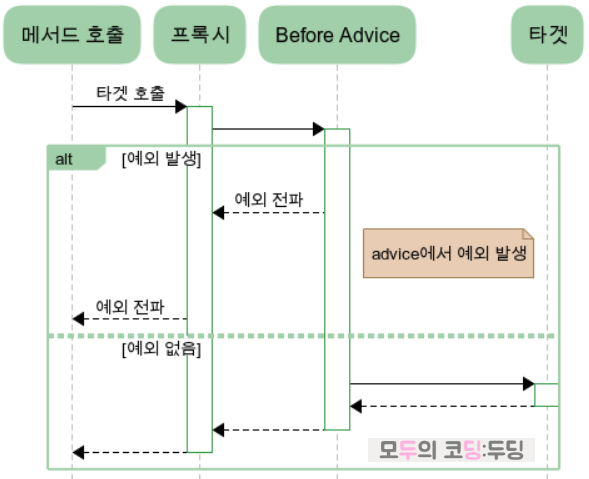
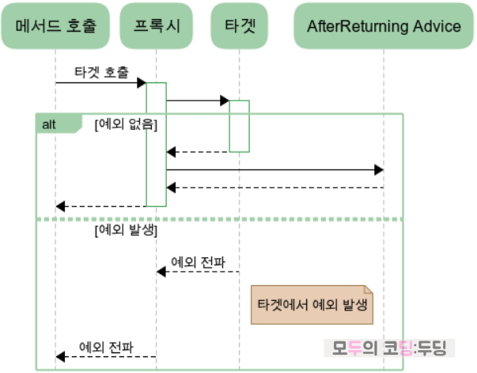
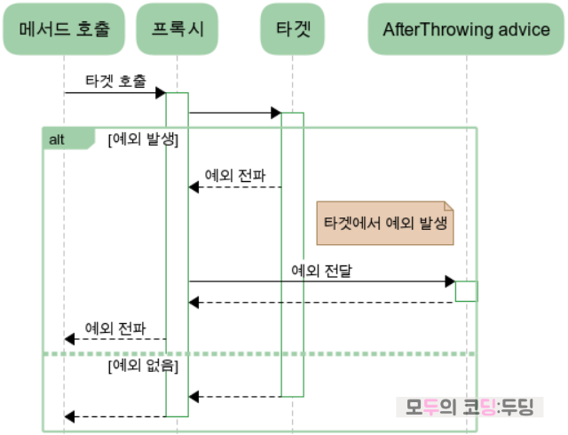
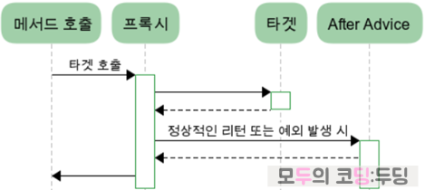
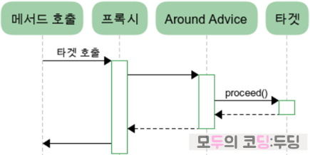

# AOP

## 해당 정리 내용은 모두 강사님의 블로그를 통해 정리하였음
### -  [참조한 강사님 블로그](https://goodteacher.tistory.com/240)

<br>

## AOP (Aspect Oriented Programming, 관점 지향 프로그래밍)
- 관점을 기반으로 하는 프로그래밍의 의미로 비즈니스 로직이 아닌 부가 기능에 대한 공통 처리
- 비즈니스 로직을 실행하기 위해 빈번하게 사용되는 공통 로직들을 처리하기 위해 이러한 공통 로직마다 해당 관점으로 접근 후 처리 하는 개념
    - 프로젝트 메서드는 비즈니스 로직(핵심 관심:core concern) 과 부가 기능(횡단 관심:cross cutting concern) 으로 구성
    - 비즈니스 로직이 위에서 아래로 내려간다고 가정했을 때 이러한 부가 기능은 해당 로직마다 횡단으로 가로질러 존재
- AOP 를 통해 횡단 관심사를 모듈 형태로 개발하고 일반 개발자는 이러한 횡단 관심 코드를 필요한 곳에 개발된 모듈을 적용 시키기만 하면 됨
- 이를 통해 비즈니스 로직에만 집중할 수 있어 개발 속도가 빨라지고 불필요한 코드가 사라져서 코드의 가독성 및 유지보수성이 향상됨

<br>

### 주로 사용되는 횡단 관심사
- 로깅
- 보안을 위한 인증 및 메서드 호출 권한 검사
- 안정적인 데이터 처리를 위한 트랜잭션 처리
- 성능을 위한 데이터 캐싱과 모니터링
- 데이터 보호를 위한 암호화 처리

<br>

### AOP 용어

|**용어**|**설명** |
|---------------|-------------------------------------------------------------------------|
| **target**| 핵심 관심사(Core Concern)를 가지고 있는 실제 빈 |
| **advice**| 횡단 관심사(Cross Cutting Concern) 처리 코드 <br> 스프링에서는 동작 시점에 따라 **@Before, @After, @Around, @AfterThrowing, @AfterReturning** 5가지 타입을 지원 |
| **join point**| advice가 끼어드는 지점으로 target의 비즈니스 로직 메서드나 필드를 의미 <br> 하지만 **스프링에서는 메서드**만 지원 |
| **pointcut**  | target의 **어떤 메서드**에서 advice를 적용할지 결정하는 표현식으로 **필터 역할**을 수행 |
| **aspect**    | 횡단 관심사를 구현하는 객체로, **하나 이상의 advice와 pointcut을 결합**해 구성되는 모듈화된 관점|
| **weaving**   | aspect를 **join point에 적용**하는 행위|

<br>

### Pointcut
- Advice를 적용할 Target의 메서드를 결정하는 메서드 선정 알고리즘으로 @Before 등 어노테이션의 value 값
- pointcut은 반환 타입을 작성해도 되고 작성하지 않아도 됨
    - 만약 작성한다면 접근제한자 + " " + 반환 타입 + " " ... 식으로 작성
    - ex) @Before("execution(public String com..MyService.regist(..))")
- Pointout을 작성할 때는 execution, within, bean 등 지정자와 함께 사용
- 여러 pointcut이 같은 메서드에 매칭될 경우 예상치 못한 동작이 발생할 수 있어 pointcut을 설계할 때는 중복되지 않게 하고 어쩔 수 없이 중복되는 경우 @Order 을 이용해서 순서를 명시할 수 있음
- Spring의 AOP는 상속을 기반으로 동적 프록시를 생성하여 final 클래스/메서드나 private 메서드는 AOP를 적용할 수 없음
    - 스프링은 프록시 객체로 AOP가 동작하는데 프록시 객체가 해당 클래스나 메서드에 접근하지 못하므로 AOP 적용 불가



#### execution : 메서드의 signature 기반으로 한 정교한 포인트컷 작성법으로 가장 많이 사용됨
- @Before("execution(String *..SimpleBean.getName())")

#### within : 빈 클래스 기반으로 포인트컷을 작성
- @Before("within(com..SimpleBeanImpl)")

#### bean : 빈의 이름 기반으로 포인트컷을 작성
- @Before("bean(pointcutTestBean)")

```java
    // pointcut에서 value 하나만 작성시 'value' 키워드 제거 가능
	@Before("execution(* com.ssafy..CalculatorBean.*(..))")
	public void logging(JoinPoint jp) {
		log.debug("method call: {}", jp.getSignature());
	}
	
    // 자료구조나 객체의 경우 패키지 명까지 기재 필요
	@Before("execution(* com.ssafy.aop.bean.PointcutBean.*(java.util.List))")
	public void pointcutTest(JoinPoint jp) {
		log.debug("pointcut 확인 : {} ", jp.getSignature());
	}
	
    // 포인트컷 메서드를 등록해서 재사용 가능
	@Pointcut(value = "execution(* com..MyService.regist(..))")
	public void userRegist() {}
	
    // Before은 && args(user) 로 target 메서드의 파라미터를 받아올 수 있음
	@Before(value = "userRegist() && args(user)")
    public void before(JoinPoint jp, User user) {
        user.setPass("Pass");
        log.debug("signature: {}, arg: {}", jp.getSignature(), user);
    }

    // within 은 해당 클래스의 모든 메서드에 적용
    @Before("within(com.ssafy.aop.service.MyService)")
    public void logBeforeMethod(JoinPoint jp) {
        log.debug("Method called: {}", jp.getSignature());
    }

    // bean은 스프링 컨테이너에 등록된 특정 빈 이름을 기준으로 포인트컷을 정의
    @Before("bean(myServiceBean)")
    public void logBeforeBeanMethod(JoinPoint jp) {
        log.debug("Method called in bean: {}", jp.getSignature());
    }
```

<br>

### pointcut execution을 이용한 메서드 패턴 기호
- 만약 return_type 이나 parameter에 객체형을 사용할 때는 패키지 이름까지 명시해주는 것이 좋음
    - 클래스 이름만 썼을 경우 중복되는 클래스를 구분하지 못함

|**구분**|**설명**|
|--------|--------|
|**return_type**|메서드의 리턴 타입을 나타내며 필수 입력사항|
|**package + class**|패키지를 포함하는 클래스 이름으로, 메서드가 선언된 클래스 또는 상위 타입. 선택사항으로 생략 가능|
|**method_name**|메서드의 이름을 나타내며 필수 입력사항|
|**parameter**|메서드의 파라미터를 이름 없이 타입만 입력하며 선택사항|

<br>

|**구분**|**기호**|**설명**|
|--------|--------|--------|
|**return_type**|`*`|타입에 무관|
| |`!`|타입에 대한 부정 (예: `!String`, `!void`)|
|**package + class**|`..`|0개 이상의 하위 패키지 대체 (맨 처음에는 등장할 수 없음)|
| |`*`|0개 이상의 문자열 대체|
|**method_name**|`*`|0개 이상의 문자열 대체|
|**parameter**|`*`|파라미터의 타입에 무관하게 1개의 파라미터 대체|
| |`..`|파라미터의 타입에 무관하게 0개 이상의 파라미터 대체|

<br>

### Advice 타입
- Advice는 AOP가 어떤 시점에 실행할 것인지를 결정
- Spring 에서는 아래 5가지 어노테이션으로 시점을 설정할 수 있음
    - @Before : 타겟 메서드 호출 전 advice 실행
    - @AfterReturning : 타겟 메서드가 정상 종료(return) 후 advice 실행
    - @AfterThrowing : 타겟 메서드에서 예외가 던져졌을 때(throws XXException) advice 실행\
    - @After : 타겟 메서드 성공 여부(return or throws XXException)와 무관하게 언제나 advice 실행
    - @Around : advice 내부에서 타겟 메서드 호출 (타겟 메서드의 모든 것을 제어 가능)

<br>

#### Before
- target 메서드가 실행되기 전에 호출됨
- advice에서 예외가 발생하면 아예 target이 호출되지 못함
- 타겟 호출 전에 전달되는 argument에 대한 조작이 가능
    - 완전히 대체할 수는 없으며 객체의 경우 그 속성의 변경은 가능
- pointcut에 args(변수명)을 사용하면 바로 파라미터로 처리할 수 있음
    - @Before(value = "userRegist() && args(user)")



<br>

#### AfterReturning
- 타겟 메서드가 정상적으로 종료(return)된 경우에 동작
- target에서 예외가 발생하는 경우는 동작하지 않고, target이 정상 실행된 경우 해당
    - try-catch-finally 중 try 와 유사
- @AfterReturning에서는 리턴 받은 값을 수정할 수 있지만 @Before에서의 파리미터와 마찬가지로 전달받은 객체의 내용을 수정할 수 있으나 완전히 새로운 값을 할당할 수는 없음
- @AfterReturning은 속성으로 pointcut을 받는 value와 return 값을 받을 변수 명을 의미하는 returning 속성을 갖음
    - advice 작성 시는 returning을 메서드의 파라미터로 선언해주어야함
    - ex) @AfterReturning(value ="userRegist()", returning = "user")



<br>

#### @AfterThrowing
- 타겟의 메서드가 예외를 던졌을 때에만 동작하며 정상적으로 값을 반환했을 때에는 동작하지 않음
    - try-catch-finally 중 catch 와 유사
- @AfterThrowing은 속성으로 pointcut을 받는 value와 전달받은 예외 객체의 이름을 의미하는 throwing 속성을 갖음
    - 연결되는 메서드는 동일한 이름의 파라미터가 선언되어야 하며 파라미터의 타입은 타겟에서 전달되는 예외와 같거나 부모 타입으로 선언되어야함
    - ex) @AfterThrowing(value = "userRegist()", throwing = "ex")




<br>

#### @After
- 타겟의 예외 상황과 상관없이 언제나 실행됨
    - try-catch-finally 중 finally 와 유사
- @After는 별도의 속성이 존재하지 않음
    - ex) @After(value = "userRegist()")



<br>

#### @Around
- 다른 advice들과 달리 타겟 메서드의 호출을 advice 내부에서 직접 수행함
- 이전 advice들과 달리 파라미터, 리턴 값에 대한 완전한 대체 및 예외 처리가 가능
- @Around 역시 파라미터로 pointcut을 받는 value 속성만 사용하지만 파라미터인 <code>ProceedingJoinPoint</code> 객체에서 파라미터를 받아올 수 있고, 반환 값을 변경할 수도 있음
    - JoinPoint를 상속받은 ProceedingJoinPoint를 파라미터로 갖으며 getArgs()를 통해 타겟에 전달되는 파라미터들에 접근, 파라미터 조작이 가능함
    - advice 메서드의 리턴 타입은 타겟 메서드의 리턴 타입과 같아야함
    - 호출 결과를 내부적으로 리턴해주므로 필요에 따라 결과의 조작도 가능

```java
// factorial 값을 저장할 cache 생성
private final Map<Integer, Long> cache = new HashMap<>();

@Around("execution(long com.doding..MyService.getFactorial(int)) && args(n)")
public long getFactorialUseCache(ProceedingJoinPoint pjp, int n) throws Throwable{
    // 만약 캐싱되어 있다면 타겟을 호출하지 않고 결과 반환
    if(cache.containsKey(n)){
        log.debug("cache 활용, target 호출 안함");
        return cache.get(n);
    }

    // Advice target을 실행하여 long 타입으로 반환
    long result = (long)pjp.proceed(new Object[]{n});
    cache.put(n, result);

    // target이 실행된 값을 조작하고 반환 가능
    return result;
}
```



<br>

#### Advice 속성 설명

|**속성**|**설명**|**필수 여부**|**사용 예시**|
|--------|--------------|------|-----------------------|
|**value**|포인트컷을 지정하는 속성. 포인트컷 표현식을 정의함.|필수|`@Before("execution(* com.ssafy..*(..))")`|
|**args**|메서드의 실제 매개변수 값을 어드바이스 메서드로 전달함.|아님|`@Before("execution(* com.ssafy..*(..)) && args(user)") public void logBefore(User user)`|
|**argNames**|어드바이스 메서드의 매개변수 이름을 명시하여 정확한 매핑을 가능하게 함.|아님|`@AfterReturning(pointcut="execution(* com.ssafy..*(..))", returning="result", argNames="result")`|
|**returning**|메서드의 반환값을 어드바이스 메서드로 전달함.|아님|`@AfterReturning(pointcut="execution(* com.ssafy..*(..))", returning="result") public void logReturn(Object result)`|
|**throwing**|발생한 예외 객체를 어드바이스 메서드로 전달함.|아님|`@AfterThrowing(pointcut="execution(* com.ssafy..*(..))", throwing="ex") public void logException(Exception ex)`|


<br>

### AOP 사용 예시

```java
// Aspect 관점 작성 Class
@Component
@Aspect
@Slf4j
public class ParamLoggingAspect {
    @Before("execution(* com.ssafy..CalculatorBean.*(..))")
	public void logging(JoinPoint jp) {
		log.debug("method call: {}", jp.getSignature());
	}
}

// ApplicationContext(스프링 컨테이너)에 빈으로 등록된 목표 객체 (target) 
@Component
public class CalculatorBean {	
	public int add(int... nums) {
		return Arrays.stream(nums).sum();
	}
}

// 특정 패키지 위치의 빈 읽어오는 설정 클래스
// SpringBoot가 아닌 레거시 스프링의 경우 @EnableAspectJAutoProxy 필요
@Configuration
@ComponentScan({"com.ssafy"})
@EnableAspectJAutoProxy
public class BeanConfig {
}

// AOP 객체 테스트 환경
// Spring과 Junit 연결
@ExtendWith(SpringExtension.class)
// ApplicationContext 를 사용하기 위한 Bean이 등록되어 있는 설정 클래스 연결
@ContextConfiguration(classes = BeanConfig.class)
@Slf4j
public class CalculatorTest {

    // BeanConfig 에 포함된 Bean 객체 의존성 주입
	@Autowired
	private CalculatorBean bean;

	@Test
	public void addTest() {
		int result = bean.add(1, 2, 3);
		Assertions.assertEquals(6, result);
	}

    // 해당 경우 Test 통과 실패
    // 이유는 AOP은 Proxy 객체를 생성하므로 bean.getClass()는 프록시 객체 클래스 타입인 lang 클래스를 받아옴
	@Test
	public void typeTest() {
		Class<?> clazz = bean.getClass();
		Assertions.assertEquals(CalculatorBean.class, clazz);
		log.debug("class : {}", clazz.getClass());
	}
}


```

<br>

## Reference
- https://goodteacher.tistory.com/240
- https://goodteacher.tistory.com/243?category=824125
- https://goodteacher.tistory.com/244?category=824125
- https://goodteacher.tistory.com/415?category=824125