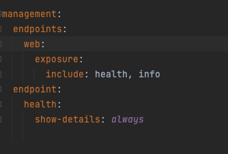
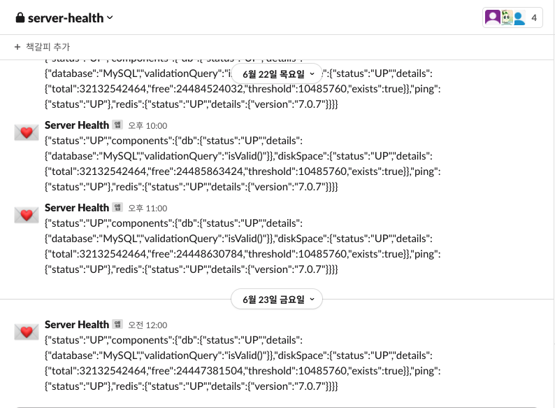

# Spring Actuator

### 사용이유
- 스터디를 통한 Glass-Bottle 프로젝트를 진행하면서 API의 상태를 지속적으로 모니터링하는 방법을 고민하였고 저희 스터디는 Spring Actuator을 사용하기로 하였습니다.
    - 사용 프로젝트 : [glass-bottle](https://github.com/selab-hs/glass-bottle)
    - 해당 프로젝트는 상태정보를 Slack WebHook 주소를 Submodule yml에 저장해두고 스프링 스케줄링을 통해 한시간마다 RestTemplate를 이용하여 Slack으로 전달하였습니다.
- Spring Actuator는 다양한 endpoint를 통해 동작이 가능합니다
- Spring Actuator는 어플리케이션을 관리하고 제반 정보를 제공하는 공통 기능을 쉽게 적용합니다.
- Actuator의 Metric기능은 Micrometer라는 오픈소스를 사용하여 해당 오픈소스는 각 모니터링 제품별로 메트릭을 수집하는 클라이언트(에이젼트)를 위한 표준 Facade(인터페이스)를 제공하여 Micrometer가 표준형식으로 Metric을 제공하면, 각 모니터링 제품 클라이언트가 자기 format대로 metric형식을 변화할 수 있어 특정 벤더에 종속되지 않고, 필요에 따라 적절한 모니터링 제품으로 쉽게 바꿀 수 있습니다.

 

### endpoint
- auditevents : 어플리케이션의 인증 등을 이벤트로  감지해서 표시합니다.
- beans : 빈 정보들을 표시합니다.
- caches : 사용 가능한 캐시를 표시합니다.
- conditions : 구성 및 자동 클래스에서 평가된 조건과 일치하지 않거나 일치하는 이유를 표시합니다.
- configprops : 프로퍼티의 빈이 어떻게 주입되어 있는지 표시합니다.
- env : 환경 프로퍼티를 표시합니다.
- flyway : flyway의 마이그레이션 정보를 표시합니다.
- health : 어플리케이션의 상태 정보를 표시합니다.
- httptrace : HTTP 추적 정보(기본적으로 마지막 100개의 HTTP 요청-응답-교환)를 표시합니다. HttpTraceRepository가 필요합니다.
- info : 어플리케이션의 정보를 표시합니다.
- integrationgraph : 스프링 통합 그래프를 표시합니다. 스프링 통합 코어에 대한 의존성이 필요합니다.
- loggers : 어플리케이션의 로그 설정 정보를 표시합니다.
- liquibase : liquibase의 마이그레이션 정보를 표시합니다.
- metrics : 메모리, 클래스 로더, http 요청 횟수, 마지막 요청의 걸린 시간 등의 매트릭 정보를 표시합니다.
- mappings : URI 경로와 해당 경로를 포함한 컨트롤러의 매핑 정보를 표시합니다.
- scheduledtasks : 프로그램에서 스케줄링 된 작업을 표시합니다.
- sessions : Spring 세션 저장소에서 사용자 세션을 검색하고 삭제할 수 있습니다. Spring Session을 사용하는 서블릿 기반 웹 애플리케이션이 필요합니다.
- shutdown : 어플리케이션을 종료합니다.(켜놓으면 위험하니 권한을 admin으로 하길 권장한다.)
- startup : 응용 프로그램 시작에서 수집한 시작 단계 데이터를 표시합니다. 버퍼링 응용 프로그램 시작을 사용하여 Spring 응용 프로그램을 구성해야 합니다.
- threaddump : 스레드 덤프를 수행합니다.

#### + Spring MVC, SPring WebFlux에서 추가로 사용할 수 있는 endpoint
- heapdump : hprof 힙 덤프 파일을 반환합니다.
- jolokia : HTTP를 통해 JMX bean을 노출합니다. (Jolokia가 클래스 경로에 있을 때, WebFlux에서는 사용할 수 없습니다. jolokia 코어에 대한 의존성이 필요합니다.
- logfile : 로그 파일의 내용을 반환합니다. (logging.file.name 또는 logging.file.path 속성된 경우). HTTP 범위 헤더를 사용하여 로그 파일 내용의 일부를 검색합니다.
- prometheus : Prometheus 서버가 스크랩할 수 있는 형식으로 메트릭을 표시합니다. micrometer-registry-prometheus을 의존해야 합니다.

 

### 사용
- implementation 'org.springframework.boot:spring-boot-starter-actuator' 의존성 추가
- application yml 설정
    - 간단하게 상태정보와 정보를 표시해주는 info와 health 사용
- 적용 과정에서 Swagger 3.0와 endpoint를 가져오는 과정에서 에러 발생. 문제 해결은 [해당 방법](https://github.com/InJun2/TIL/blob/main/Stack/Error/Swagger3.0-SpringActuator-Error.md) 을 통해 해결하였음

 

 

### 주의 사항
- management.endpoints.web.exposure.include="*"로 설정하면  모든 정보를 노출하게 되어 외부 접근이 가능해서 중요한 정보를 노출할 수 있습니다. 이를 위해 보안 적용을 해야합니다.
1. actuator는 endpoint가 '/actuator'이며 이를 management.endpoints.web.base-path를 이용하여 임의의 경로로 변경
2. health check시 사용하는 /health endpoint를 사용하기 위해 endpoint.health.show-details=always를 설정
3. management.server.port나 management.server.address 값을 수정
4. spring-security를 이용하여 management.endpoints.web.base-path(/actuator)의 권한 확인
- 기존 security와 사용할 경우 @Order로 순서를 지정해주어야 합니다.
- 해당 주의사항과 위의 endpoint는 [해당 블로그](https://otrodevym.tistory.com/entry/spring-boot-설정하기-11-actuator-설정-및-테스트-소스)의 정보를 가져왔습니다.

 

### 적용 모습

 

23-06-25

-------

## Reference
- https://happycloud-lee.tistory.com/217
- https://techblog.woowahan.com/9232/
- https://otrodevym.tistory.com/entry/spring-boot-설정하기-11-actuator-설정-및-테스트-소스
- https://docs.spring.io/spring-boot/docs/current-SNAPSHOT/reference/htmlsingle/#features.security.actuator