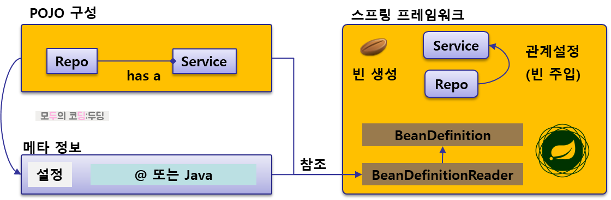
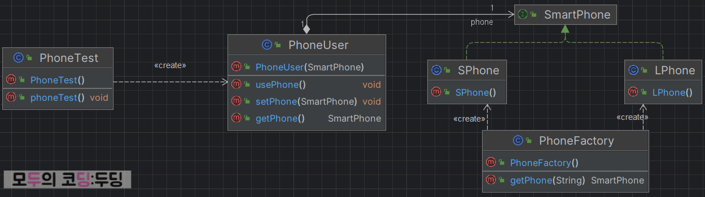

# DI

### 정리 참조

- 해당 정리는 아래 Reference 의 블로그를 참조하여 작성하였음

<br>

### 프레임워크(Framework)란?

- 시작하기전에 애플리케이션 프레임워크란 소프트웨어 개발자가 응용 소프트웨어의 표준 구조를 구현하기 위해 사용하는 것
- 프로그래밍에서 특정 운영 체제를 위한 응용 프로그램 표준 구조를 구현하는 클래스와 라이브러리의 모임으로 프레임워크라고 부름
- 즉, 프레임워크란 재사용할 수 있는 수많은 코드를 통합한 것
  - 기본적인 구조와 기능을 직접 구현할 필요 없이 프레임워크가 제공하는 기능을 활용해 개발 시간을 단축하고 생산성을 높일 수 있도록 도움
  - 이렇게 표준화된 구조를 통해 유지보수가 용이해지고, 팀 간 협업 시 코드의 일관성을 유지할 수 있음
- Spring의 구성요소는 POJO + 메타정보 + 스프링 프레임워크(IoC Container) 등으로 구성됨

<br>

### 스프링 구성 방법

- 개발자는 POJO를 작성하고 어떻게 구성할 것인지에 대한 메타 정보를 작성
- 해당 정보를 스프링 프레임워크에 넘겨주면 스프링은 이 정보를 참조하여 필요한 빈 객체를 생성하고 관계를 설정해서 애플리케이션이 동작하도록 함
  - POJO : 복잡한 프레임워크나 기술에 종속되지 않는 순수한 자바 객체
  - 빈(Bean) : 스프링 IoC 컨테이너가 관리하는 객체. 애플리케이션이 실행되는 동안 스프링이 빈을 생성하고 필요에 따라 서로 간의 관계(의존성)를 주입하며 싱글톤 범위로 관리됨
  - 의존성 주입(Dependency Injection) : 객체 간의 관계 설정을 개발자가 직접 하는 것이 아니라, 스프링이 자동으로 필요한 객체를 주입해주는 방식



<br>

### Spring 메타정보

- Spring 메타정보는 애플리케이션의 구성을 위한 다양한 정보로 구성됨
  - Spring IoC 컨테이너에게 어플리케이션에 필요한 객체들의 인스턴스화 및 관리를 위한 정보를 제공
- POJO를 어떻게 빈으로 구성할 것인가에 대한 정보로 빈들의 생성이나 관계 설정도 베타 정보의 한 부분
- 메타 정보를 작성할 때는 xml config, annotation, java config 3가지 방식을 사용할 수 있음
  - 최근에는 java config + annotation 방식이 사용됨
  - SpringBoot 에서는 application.yml 파일에도 일부 설정이 추가됨

```xml
<!-- BoardRepoDevImpl 타입의 빈 boardRepo 생성 -->
<bean id="boardRepo" class="com.example.core.repo.BoardRepoDevImpl">
</bean>

<!-- BoardServiceImpl 타입의 빈 boardService를 만들고 boardRepo를 주입 -->
<bean id="boardService" class="com.example.core.service.BoardServiceImpl">
  <property name="boardRepo" ref="boardRepo" />
</bean>
```

<br>

```java
@Configuration
public class BoardConfig {
  @Bean
  public BoardRepo boardRepo() {
    return new BoardRepoDevImpl();
  }

  @Bean
  public BoardService boardService(BoardRepo brepo) {
    return new BoardServiceImpl(brepo);
  }
}
```

<br>

### ApplicationContext?

- 스프링 컨테이너의 구현체 중 하나인 ApplicationContext 는 가장 널리 사용되는 컨테이너로 스프링에서 빈(Bean)을 관리하는 스프링의 핵심 IoC 컨테이너
  - 개발자가 설정한 빈을 즉시 초기화하고 애플리케이션 실행 중 빈의 생명주기를 관리함
  - BeanFactory : 가장 단순한 형태의 IoC 컨테이너로 지연 초기화를 통해 빈을 필요할 때 생성하지만 현재는 거의 사용되지 않고 주로 ApplicationContext 기반 인터페이스로 남아 있음
  - ApplicationContext : BeanFactory를 확장한 인터페이스로 즉시 초기화를 지원하며 더 많은 기능(트랜잭션, AOP, 이벤트 처리 등)을 제공하여 웹 애플리케이션을 포함한 대부분의 스프링 애플리케이션에서 사용됨
- 기본적인 IoC 기능 외에도 여러 부가 기능을 제공
  - 트랜잭션 관리 : 선언적 트랜잭션을 통해 어플리케이션의 트랜잭션 관리
  - AOP : 애플리케이션의 관점 지향 프로그래밍 기능을 추가하여 부가 기능을 쉽게 적용할 수 있음
  - 이벤트 처리 : 애플리케이션에서 발생하는 이벤트를 처리하는 기능을 제공
  - 메시지 국제화 : 다국어 지원을 위해 메시지 소스를 관리하고 로케일에 따라 메시지를 출력하는 기능 제공
  - 환경 변수 및 속성 파일 관리 : 애플리케이션의 설정 값을 프로퍼티 파일 또는 환경 변수로부터 읽어오고 관리할 수 있음
- [이전 Spring Container 정리 링크](https://github.com/InJun2/TIL/blob/main/Stack/Spring/Spring_Container.md)

```java
// ApplicationConext 의 구현체

// XML 설정 파일을 클래스 경로에서 로드해서 객체를 관리하는 방법
ApplicationContext context = new ClassPathXmlApplicationContext("applicationContext.xml");


// Java 설정 파일에서 빈을 등록하고 주입하는 방법
ApplicationContext context = new AnnotationConfigApplicationContext(AppConfig.class);

/*
WebApplicationContext : 웹 애플리케이션에서 사용되는 컨테이너로, 서블릿 컨텍스트와 통합됨

*/
```

<br>

### 의존 관계 (Dependency)

- 빈의 컨테이너로써 스프링은 빈의 생성, 관계 설정, 객체 관리 등 빈의 라이프사이클을 담당
- 그 중 의존관계란 어떤 객체가 비지니스로직 처리를 위해 다른 객체에 의존하는 관계로 쉽게 말하자면 객체 간의 has-a 관계를 의미
  - 특정 객체에서 다른 객체를 필요로 한다면 해당 객체에게 의존하고 있음을 의미
- 의존성이 변경될 때마다 의존하는 객체가 변경되어야 한다면 프로젝트 유지 보수에 심각한 문제를 야기할 수 있음
  - 만약 의존하는 객체가 변경될 경우, 해당 객체를 사용하는 코드도 함께 수정해야 하므로 유지 보수가 어려워짐
- 이를 해결하기 위해 interface를 사용하여 해당 관계를 느슨한 결합(loose coupling) 하도록 만들어 줄 수 있음
  - 인터페이스를 사용하면 특정 구현체에 의존하지 않고 인터페이스에 의존하게 되어, 나중에 다른 구현체로 바꿔도 코드 수정 없이 쉽게 대체할 수 있음
- 하지만 여전히 구현체 객체가 변경되었을 때 코드를 직접 수정해야함
- 해당 경우 Factory Pattern을 적용하여 원하는 객체를 찍어내서 공급할 수 있음
  - 의존 관계인 객체를 직접 수정하지 않고 설정을 담아 객체를 생성하는 Factory 객체를 변경하면 되므로 비지니스 로직은 영향을 받지 않게 됨
  - 하지만 스프링에서의 Bean 관리와 주입을 더 편리하게 해주는 방법으로 DI 가 존재

<br>



<br>

```java
// 기존 코드, PhoneUser는 LPhone 에 의존하는데 SPhone으로 변경된다면 주입에서 객체가 변경되어야 함
public class PhoneUser {
    LPhone phone;
    public PhoneUser(){
        phone = new LPhone(); // 생성되는 객체 변경 필요
    }
}

// 인터페이스를 사용한 코드
public class PhoneUser {
    SmartPhone phone;            // has a 대상을 interface로 변경
    public PhoneUser(){
        phone = new SPhone();
        // phone = new Lphone();
    }
}

// Factory Pattern 사용
public class PhoneFactory {
  public static SmartPhone getPhone(String maker) {
    if(maker.equalsIgnoreCase("s")){
      return new SPhone();
    }else{
      return new LPhone();
    }
  }
}

// 의존 객체
@Data
@AllArgsConstructor
public class PhoneUser {
  private SmartPhone phone; // has a 관계

  public void usePhone() {
    System.out.printf("스마트폰 통화 : %s", phone);
  }
}
```

<br>

### DI(Dipendency Injection, 의존성 주입)

- 이러한 의존성 관리를 스프링에서는 주로 의존성 주입(DI)을 통해 더 간단하고 효율적으로 객체 간의 의존성을 관리함
  - Factory Pattern에서는 객체 생성을 위해 별도의 팩토리 클래스를 작성해야 하며, 팩토리 메서드가 객체 생성의 책임을 가지지만 여전히 객체를 생성하는 책임은 코드 안에 존재하며, 객체가 필요할 때마다 팩토리 메서드를 호출해야함
  - DI는 스프링이 의존 객체를 자동으로 주입해주므로, 개발자가 직접 객체를 생성하거나 관리할 필요가 없음
- 개발자는 객체의 생성 로직을 신경쓸 필요 없이 주입된 객체를 사용만 하면 됨
  - 스프링 DI에서는 객체의 생성과 관리를 스프링 IoC 컨테이너가 모두 담당하기 때문
- 의존성 주입 시점은 스프링 컨테이너가 빈을 초기할 때 이루어짐
  - 스프링은 애플리케이션이 실행되면서 빈을 생성하고, 각 빈이 필요로 하는 의존성(다른 빈)을 생성자나 메서드에 자동으로 주입
  - 이를 통해 개발자가 수동으로 객체를 생성할 필요 없이 스프링이 빈의 생명 주기를 관리하며 객체 간의 의존성을 설정하고 관리함
- 즉, 의존성 빈을 직접 객체에서 만들지 않고 외부에서 넣어주는 것이 의존성 주입이며 메타 설정에 의해 스프링 프레임워크가 해주는 것
  - 객체의 의존 관계를 외부에서 설정해주며 일반적으로 생성자 기반, 혹은 setter 주입 으로 처리하거나 setter 메서드를 이용해 처리
  - 주로 생성자 기반 주입이 더 권장되며 선택적 의존성이나 상태 변경이 필요한 경우 setter 주입을 사용
  - 일반적으로 필수 의존성은 생성자 주입, 선택적 의존성은 setter 주입을 사용하여 혼합해서 처리할 수 있음

<br>

```java
// 인터페이스 정의
public interface OrderRepository {
}

// 기본 구현체
@Repository
public class OrderRepositoryImpl implements OrderRepository {
}

// 기본 구현체 주입
@Service
public class OrderService {
    private final OrderRepository orderRepository;

    @Autowired
    public OrderService(OrderRepository orderRepository) {
        this.orderRepository = orderRepository;
    }
}

// 구현체가 변경된 경우에도 기존 OrderService는 변경하지 않아도 됨
// 기존 구현체가 더이상 필요하지 않다면 기존 구현체 클래스 삭제/@Component 상속 어노테이션 제거 혹은 Repository 에서 @Primary, 혹은 Service 파라미터에서 @Qualifier 사용
@Repository
public class NewOrderRepositoryImpl implements OrderRepository {
}
```

<br>

### 명시적 DI

- 빈을 생성하고 의존성을 주입하는 코드를 별도의 파일에 명시적으로 작성해주는 것을 명시적 DI라고 함
- 이런 명시적인 DI 방법으로는 XML을 이용할 수도 있고 Java 파일을 이용할 수도 있음
- 명시적 DI를 위해서는 @Configuration과 @Bean이라는 Annotation이 사용됨

<br>

```java
@Configuration // 여기는 설정 정보가 담겨있습니다.
@Slf4j
public class PhoneConfig {
  @Bean // 빈 생성 선언
  public SPhone sPhone() { // SPhone 타입의 빈 생성, 빈 이름은 sPhone
    log.debug("sphone 빈 생성");
    return new SPhone(); // 실제로 사용될 빈 객체 반환
  }

  @Bean(name = "mylPhone") // 빈 생성 선언: 빈의 이름은 mylPhone
  public LPhone lPhone() {
    log.debug("lphone 빈 생성");
    return new LPhone();
  }

  @Bean
  public PhoneUser phoneUser() {
    log.debug("phoneuser 빈 생성");
    SmartPhone phone = sPhone();
    return new PhoneUser(phone); // 생성자를 통해 의존성인 phone 주입(sPhone)
  }
}
```

<br>

#### @Configuration

- Java Config를 이용해서 메타 정보를 설정하기 위해서는 클래스에 @Configuration 애너테이션을 선언해주어야 함
- @Configuration은 @Target 정보가 ElementType.TYPE이기 때문에 class 선언부에 사용할 수 있는 애너테이션

```java
@Target(ElementType.TYPE)
@Retention(RetentionPolicy.RUNTIME)
@Documented
@Component
public @interface Configuration {}
```

<br>

#### @Bean

- @Configuration클래스에 빈을 선언하기 위해서는 @Bean 애너테이션을 사용
- @Bean은 메서드 레벨에서 사용되는 애너테이션으로 메서드의 이름은 생성되는 빈의 이름이 됨
- 메서드 이름과 빈의 이름을 달리하는 경우 @Bean의 name(==value) 속성을 이용할 수 있음

```java
@Target({ElementType.METHOD, ElementType.ANNOTATION_TYPE})
@Retention(RetentionPolicy.RUNTIME)
@Documented
public @interface Bean {
  @AliasFor("name")
  String[] value() default {};
}
```

<br>

### @SpringBootApplication

- 위의 @Configuration이 들어간 클래스를 만들고 작업하지 않고도 main 메서드를 가지고 생성된 시작 클래스를 살펴보면 @SpringBootApplication이 설정되어 있는데 해당 Annotation은 내부적으로 @SpringBootConfiguration을 가지고 있고 이것이 다시 @Configuration을 가지고 있음
- 따라서 이 클래스에 직접 @Bean을 설정해도 무방하지만 많은 설정들이 해당 클래스에 작성되면 복잡도가 높아지므로 전문적인 설정파일을 만들고 분산하는 것이 좋음

<br>

### 묵시적 DI

- 위의 명시적 DI는 빈 클래스 외부 즉 @Configuration 클래스에 존재하는 형태로 비지니스 로직과 빈 관리 로직이 잘 분리되어 관심사의 분리의 장점이 있지만 빈을 만들 때 마다 설정 파일에 명시적으로 빈을 선언해주어야 함
- 묵시적인 빈 설정 방식은 빈으로 사용할 클래스에 @Component 라고 선언
  - 빈에 대한 설정이 빈 클래스 내부에 존재하기 때문에 관심 사항의 분리라는 부분에서 일보 후퇴하는 복합적인 관심사를 다루게 됨
- @Component 라고 선언된 클래스를 빈으로 등록하기 위해서는 @ComponentScan 을 통해 @Component를 선언한 클래스를 읽어 빈으로 등록해야 함

<br>

#### Component

- 빈으로 사용될 클래스에 선언하는 애너테이션
- 스프링은 기본적으로 타입 기반으로 빈을 관리하는데 동일한 타입의 빈이 2개 이상인 경우 이름이 중요한 구분자 역할을 하므로 @Component 로 지정할 때도 이름에 대한 지정이 필요
- @Componenet를 이용해 만들어진 빈의 이름은 클래스가 Pascal case인 경우 camel case로 변경해서 사용하고 그렇지 않은 경우 클래스 이름을 그대로 사용함
  - pascal case 인 경우: IronMan -> ironMan
  - pascal case가 아닌경우: SPhone -> SPhone

<br>

```java
@Target(ElementType.TYPE)
@Retention(RetentionPolicy.RUNTIME)
public @interface Component {
  String value() default "";     // 생성되는 빈의 이름을 재정의 하려는 경우 사용
}
```

<br>

### Spring Container 빈 요청

- Spring Container에 빈을 요청할 때에는 getBean 메서드를 사용 하는데 getBean 메서드는 타입 기반으로 관리하는 빈을 반환
  - 이 방식이 Spring Container의 기본적인 빈 관리 방식
  - Spring Container는 빈을 타입 기반으로 관리하는데 여러 객체가 같은 타입일 경우 타입 외에도 name 으로 빈을 구분할 수 있음
- 빈으로 만든 대상이 주로 무상태(stateless)한 객체라는 점. Spring Container는 이런 빈들을 위해 별도로 Singleton Design Pattern을 적용하지 않아도 자동으로 하나의 객체를 만들어 재사용함(기본값은 싱글톤 스코프)

```java

@SpringBootTest
public class BootPhoneTest {

    @Autowired
    ApplicationContext ctx;

    public void usePhoneTest() {
    SPhone phone1 = ctx.getBean(SPhone.class);
    SPhone phone2 = ctx.getBean(SPhone.class);

    // 스프링 기본 빈 스코프가 싱글톤이므로 "true" 출력
    System.out.print(phone1 == phone2);
    }
}
```

<br>

## Reference

- https://goodteacher.tistory.com/235
- https://skku-overflow.tistory.com/6
- https://skku-overflow.tistory.com/7
