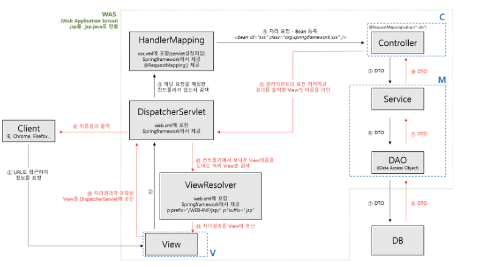

# DispatcherServlet

### Servlet
- 자바를 이용하여 동적인 웹 페이지를 사용하기 위한 서버 측 프로그램
- 클라이언트가 서버에 요청을 보낼 때와 응답을 받을 때 필요한 HTTP 작업을 도와주는 역할
    - 개발자가 HTTP를 직접 파싱할 필요를 없게 만들어 줌
    - HttpServeltRequest, HttpServletResponse를 통해 HTTP 통신에서 필요한 여러가지 작업을 하게됨

<br>

### 서블릿 컨테이너와 서블릿이 호출되는 과정
1. 클라이언트로부터 요청
2. Servlet Request / Servlet Response 객체 생성
3. 설정 파일을 참고하여 매핑할 Servlet을 확인
4. 해당 서블릿 인스턴스 존재의 유무를 확인하여 없으면 생성(init())
5. Servlet Container에 스레드를 생성하고, res와 req 를 인자로 service 실행
6. 해당 결과를 웹 서버에게 네트워크를 통해 전달
-> 서블릿 컨테이너는 결국 서블릿의 생명주기를 관리하는 객체

<br>

### 스프링 이전의 배경
- 모든 서블릿을 URL 매핑을 위해 web.xml에 모두 등록해주어야 했음
- HTTPServlet을 사용하기 위해 직접 HttpServlet을 상속받아서 사용해야만 했음
- 공통 작업을 개발자가 직접 처리해주어야 했음

<br>

### DispatcherServlet
- Spring MVC 프로젝트의 핵심으로 Front Controller 역할을 수행하여 모든 요청을 받아 해당 요청들의 공통처리 작업을 처리하고 세부 컨트롤러로 위임
    - FrontController : 서블릿 컨테이너 제일 앞단에서 서버로 오는 모든 요청을 받아 처리하는 컨트롤러
- Controller, ViewResolver, HandlerMapping 과 같은 스프링 빈(Beans)을 구성
- DispatcherServlet은 HttpServlet을 상속받아 사용하고 있음
    - DispatcherServlet -> FrameworkServlet -> HttpServletBean -> HttpServlet 상속 구조
- DispatcherServlet만 정의하면, DispatcherServlet에서 모든 요청을 받아 처리할 수 있음
- 모든 요청에 대해 공통 로직 처리로 중복 코드량 감소
- 웹 요청 처리 관련 구현체들을 사용할 수 있고, 우리가 개발할 때 집중해야되는 요청처리 로직에만 신경을 쓸 수 있도록 도와줌
- 스프링 컨테이너, 스프링 IoC를 이용하여 개발을 진행할 수 있게 해줌

<br>


### Spring MVC의 동작방식
1. 클라이언트의 요청을 디스패처 서블릿이 받음
2. 요청 정보를 통해 요청을 위임할 컨트롤러를 찾음
3. 요청을 컨트롤러로 위임할 핸들러 어댑터를 찾아서 전달함
4. 핸들러 어댑터가 컨트롤러로 요청을 위임함
5. 비지니스 로직을 처리함
6. 컨트롤러가 반환값을 반환함
7. HandlerAdapter가 반환값을 처리함
8. 서버의 응답을 클라이언트로 반환함

<br>

### Spring MVC구조에서의 역할
1. Dispatcher Servlet
- Front Controller를 담당
- 애플리케이션으로 들어오는 모든 Request를 받는 부분. Request 를 실제로 처리할 Controller에게 전달하고 그 결과 값을 받아서 View에 전달하여 적절한 응답을 생성할 수 있도록 흐름을 제어
2. HandlerMapping
- Request URI에 따라 각각 어떤 Handler(Controller method)가 실제로 처리할 것인지 찾아주는 역할
3. HandlerAdaptor
- 결정된 Controller의 메소드 중 요청에 맞는 적합한 핸들러 매칭
4. Controller
- Request를 직접 처리한 후 그 결과를 다시 DispatcherServlet에 돌려주는 역할
5. ModelAndView
- Controller가 처리한 결과와 그 결과를 보여줄 View에 관한 정보를 담고 있는 객체
6. ViewResolver
- View 관련 정보를 갖고 실제 View를 찾아주는 역할
7. View
- Controller가 처리한 결과값을 보여줄 View를 생성
```
스프링 MVC는 웹 요청을 실제로 처리하는 객체를 핸들러(Handler)라고 표현하고 있음
- @Controller 적용 객체나 Controller 인터페이스를 구현한 객체 모두 스프링 MVC입장에서는 핸들러가됨
- 특정 요청 경로를 처리해주는 핸들러를 찾아주는 객체를 HandlerMapping이라 부름
```

<br>

## 질문

### 1. 여러 요청이 들어온다고 가정할 때 DispatcherServlet은 한번에 여러 요청을 모두 받을 수 있는지
- DispatcherServlet은 서블릿 컨테이너(Tomcat, Jetty 등)에 의해 관리
    - 서블릿 컨테이너는 HTTP 요청을 처리할 때 스레드 풀을 사용
- 서블릿 컨테이너는 다중 스레드 환경에서 작동하며, 각 요청을 별도의 스레드로 처리하므로 DispatcherServlet이 여러 요청을 동시에 받을 수 있음을 의미
    - 클라이언트로부터 HTTP 요청이 들어오면 서블릿 컨테이너는 스레드 풀에서 사용 가능한 스레드를 할당
    - 할당된 스레드는 DispatcherServlet의 service() 메서드를 호출하여 요청을 처리

- 동작 과정
    1. 요청 수신 : 클라이언트가 HTTP 요청을 보낼 때, 이 요청은 서블릿 컨테이너에 도달
    2. 스레드 할당 : 서블릿 컨테이너는 요청을 처리할 새로운 스레드를 생성하거나, 스레드 풀에서 사용 가능한 스레드를 할당
    3. DispatcherServlet 호출 : 서블릿 컨테이너는 할당된 스레드 내에서 DispatcherServlet의 service() 메서드를 호출하여 요청을 처리
    4. 요청 처리 : DispatcherServlet은 요청을 분석하고 적절한 핸들러(컨트롤러 메서드)를 찾아 호출, 핸들러가 요청을 처리하고, 결과를 DispatcherServlet에 반환
    5. 응답 반환 : DispatcherServlet은 핸들러의 결과를 HTTP 응답으로 변환하여 클라이언트에 반환

```properties
<!-- Spring Boot를 사용하는 경우, application.properties 파일에서 스레드 풀 설정, 이는 내장된 톰캣에 적용됨 -->
server.tomcat.max-threads=200
server.tomcat.min-spare-threads=50
server.tomcat.accept-count=100
```

<br>

### 2. 수많은 @Controller를 DispatcherServlet은 어떻게 구분하는지
- 컨트롤러의 적절한 메서드로 라우팅하는 방식은 핸들러 매핑(Handler Mapping)과 핸들러 어댑터(Handler Adapter)라는 두 가지 주요 컴포넌트를 통해 이루어짐
- 핸들러 매핑 (HandlerMapping)
    - Spring MVC에서 가장 흔히 사용되는 핸들러 매핑은 RequestMappingHandlerMapping
    - '@RequestMapping', '@GetMapping', '@PostMapping' 등으로 어노테이션된 메서드와 요청 URL을 매핑
        - URL을 해당 메서드와 매핑
- 핸들러 어댑터 (Handler Adapter)
    - 핸들러 매핑에 의해 선택된 컨트롤러 메서드를 실제로 호출하는 역할
    - 적절한 컨트롤러와 메서드를 찾은 후, DispatcherServlet은 해당 메서드를 호출하여 요청을 처리하기 위해 HandlerAdapter 인터페이스를 사용
    - Spring MVC에서 가장 흔히 사용되는 핸들러 어댑터는 RequestMappingHandlerAdapter
    - '@RequestMapping'으로 어노테이션된 메서드를 호출할 수 있는데 메서드 인자처리 담당의 ArgumentResolver와 반환 값 처리를 담당하는 ReturnValueHandler도 함께 사용됨

<br>

```java
// 요청 수신시 핸들러 매핑 검색 : 'DispatcherServlet'은 등록된 'HandlerMapping' 빈들을 사용하여 요청 URL에 매핑되는 핸들러를 찾음
HandlerExecutionChain handler = getHandler(processedRequest);

// 핸들러 어댑터 선택 : 핸들러가 결정되면 이를 실행할 수 있는 적절한 'HandlerAdepater'를 찾음
HandlerAdapter ha = getHandlerAdapter(handler.getHandler());

// 핸들러 메서드 호출 : 'HandlerAdapter'는 'ArgumentResolver'를 사용하여 메서드 인자를 설정하고 핸들러 메서드를 호출함
ModelAndView mv = ha.handle(processedRequest, response, handler.getHandler());

// 결과 처리 및 응답 반환: 핸들러 메서드의 실행 결과를 DispatcherServlet이 받아 적절한 뷰로 변환하고 클라이언트에게 응답을 반환함
processDispatchResult(processedRequest, response, handler, mv, dispatchException);
```

<br>

```java
public class MyHandlerAdapter implements HandlerAdapter {

    /**
     * 핸들러가 이 어댑터에서 지원되는지 여부를 판단합니다.
     * 
     * @param handler 처리할 핸들러 객체
     * @return 핸들러가 MyHandler 타입이면 true, 그렇지 않으면 false
     */
    @Override
    public boolean supports(Object handler) {
        return handler instanceof MyHandler;
    }

    /**
     * 주어진 핸들러를 사용하여 요청을 처리합니다.
     * 
     * @param request 현재의 HTTP 요청
     * @param response 현재의 HTTP 응답
     * @param handler 처리할 핸들러 객체 (MyHandler 타입이어야 함)
     * @return 처리 결과를 포함하는 ModelAndView 객체, null을 반환하면 응답 처리가 완료됨을 의미
     * @throws Exception 요청 처리 중 발생할 수 있는 예외
     */
    @Override
    public ModelAndView handle(HttpServletRequest request, HttpServletResponse response, Object handler) throws Exception {
        MyHandler myHandler = (MyHandler) handler;
        String result = myHandler.handleRequest(request, response);
        response.getWriter().write(result);
        return null; // View를 반환하지 않음
    }

    /**
     * 마지막 수정 시각을 반환합니다. 이 핸들러는 캐싱을 지원하지 않으므로 항상 -1을 반환합니다.
     * 
     * @param request 현재의 HTTP 요청
     * @param handler 처리할 핸들러 객체
     * @return 마지막 수정 시각을 나타내는 long 값, 캐싱을 지원하지 않으므로 항상 -1 반환
     */
    @Override
    public long getLastModified(HttpServletRequest request, Object handler) {
        return -1;
    }
}
```

<div style="text-align: right">22-09-18</div>

-------

## Reference
- https://velog.io/@seculoper235/2.-DispatcherServlet-이란
- [10분 테코톡-코기의 Servlet vs Spring](https://www.youtube.com/watch?v=calGCwG_B4Y)
- https://mangkyu.tistory.com/18