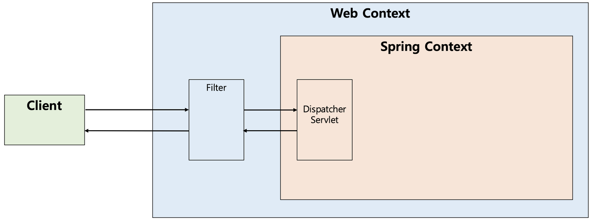
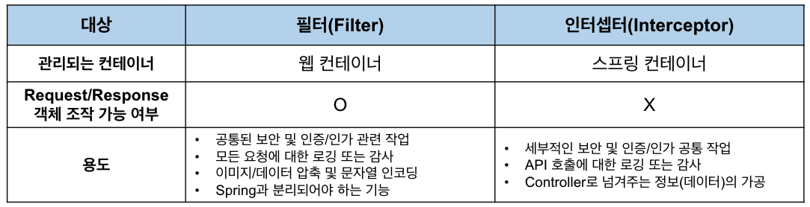
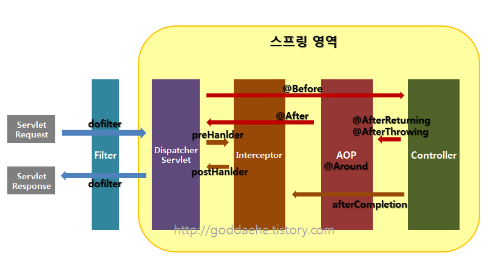
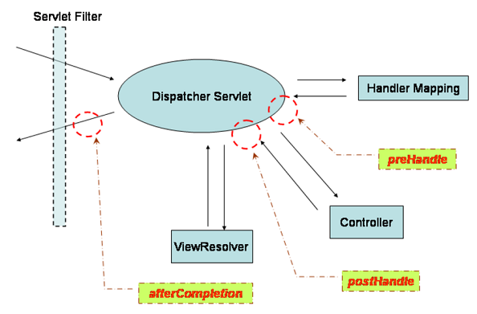

# Filter vs Interceptor vs AOP

### 공통처리
- 웹 애플리케이션을 개발하는 도중 공통적으로 처리해야하는 업무들이 많이 존재
- 공통로직을 모든 페이지에 작성해야하면 중복코드가 많아지고 프로적트 단위가 커질수록 서버에 부하를 줌 -> 공통 부분은 따로 관리하는 것이 좋음
- 공통처리를 위한 Filter, Interceptor, AOP
    - Filter(필터) : 핸들러 동작의 전 후 과정에 부가로직 처리, 웹 컨테이너에서 관리
    - Interceptor(인터셉터) : 필터와 비슷, 스프링 컨테이너에서 관리
    - AOP(관점 지향 프로그래밍) : 메서드 동작의 전 후 과정에 부가로직 처리

<br>



### Filter
- Filter는 <code>J2EE</code> 표준 스펙으로 디스패처 서블릿에 요청이 전달되기 전/후에 URL 패턴에 맞는 모든 요청에 대해 부가작업을 처리할 수 있는 기능을 제공
- 스프링 컨테이너가 아닌 톰캣과 같은 웹 컨테이너에서 관리가 되는 것이고 디스패처 서블릿 전/후에 처리하는 것임
- 지정된 자원 앞단에서 요청내용을 변경하거나 여러가지 체크 수행, 자원의 처리가 끝난 후 응답내용에 대해 인코딩 등 변경 처리
- Spring에서 빈등록이 가능
- javax.servlet의 Filter 인터페이스를 구현해야함

```
J2EE 
- 자바 기술로 기업환경의 어플리케이션을 만드는데 필요한 스펙들을 모아둔 스펙 집합
- 언어는 JAVA 이고 플랫폼은 자유로움. JVM 이 플랫폼에 상관없이 동일한 자바 소스 코드 실행 가능
- J2EE는 매우 방대한 범위를 다루는 스펙 집합으로 서블릿, JSP, EJB, JDBC 등의 구성요소로 이루어져 있음
```

<br>

#### Filter Method
- init 메소드
    - 필터 객체를 초기화하고 서비스에 추가하기 위한 메소드
    - 웹 컨테이너가 1회 init 메소드를 호출하여 필터 객체를 초기화하면 이후의 요청들은 doFilter를 통해 처리됨
- doFilter 메소드
    - URL-Pattern에 맞는 모든 HTTP 요청이 디스패처 서블릿으로 전달되기 전에 웹 컨테이너에 의해 실행되는 메소드
    - doFilter의 파라미터로는 FilterChain이 있는데, FilterChain의 doFilter 를 통해 다음 대상으로 요청을 전달하게 됨.
    - chain.doFilter() 전/후에 우리가 필요한 처리 과정을 넣어줌으로써 원하는 처리를 진행할 수 있음
- destroy 메소드
    - 필터 객체를 서비스에서 제거하고 사용하는 자원을 반환하기 위한 메소드
    - 웹 컨테이너에 의해 1번 호출되며 이후에는 이제 doFilter에 의해 처리되지 않음
```java
public interface Filter {

    public default void init(FilterConfig filterConfig) throws ServletException {}

    public void doFilter(ServletRequest request, ServletResponse response,
            FilterChain chain) throws IOException, ServletException;

    public default void destroy() {}
}

@Component
public class MethodFilter implements Filter {
    private static final Logger logger = LoggerFactory.getLogger(MethodFilter.class);

    @Override
    public void init(FilterConfig filterConfig) throws ServletException {
        logger.info("Start Method checking");
        Filter.super.init(filterConfig);
    }

    @Override
    public void doFilter(ServletRequest request, ServletResponse response, FilterChain chain) throws IOException, ServletException {

        HttpServletRequest req = (HttpServletRequest) request;
        logger.info("Request Method: {}", req.getMethod());

        chain.doFilter(request, response);

        logger.info("Return Method: {}", req.getMethod());
    }

    @Override
    public void destroy() {
        logger.info("End Method checking");
        Filter.super.destroy();
    }
}

@Configuration
public class FilterConfiguration implements WebMvcConfigurer {
    @Bean
    public FilterRegistrationBean<MethodFilter> methodFilterRegistrationBean() {
        FilterRegistrationBean<MethodFilter> registrationBean = new FilterRegistrationBean<>();
        registrationBean.setFilter(new MethodFilter());
        registrationBean.addUrlPatterns("/stations");

        return registrationBean;
    }
}
```
<br>


### Interceptor
- Interceptor는 J2EE 표준 스펙인 필터와 달리 Spring이 제공하는 기술로 디스패처 서블릿이 컨트롤러를 호출하기 전과 후에 요청과 응답을 참조하거나 가공할 수 있는 기능
- 웹 컨테이너에서 동작하는 필터와 달리 인터셉터는 스프링 컨텍스트에서 동작을 함
- 디스패처 서블릿은 핸들러 매핑을 통해 적절한 컨트롤러를 찾도록 요청하는데 그 결과로 실행체인(HandlerExecutionChain)을 돌려줌. 해당 체인은 1개이상의 인터셉터가 등록되어 있다면 순차적으로 인터셉터들을 거쳐 컨트롤러가 실행되도록 하고, 인터셉터가 없다면 바로 컨트롤러 실행
- 디스패처 서블릿이 컨트롤러 호출 전, 후로 끼어들기 때문에 스프링 컨텍스트 내부에서 controller에 관한 요청과 응답에 대해 처리 -> 스프링의 모든 빈 객체에 접근 가능
- 그림과는 다르게 실제로는 Interceptor가 컨트롤러로 요청을 위임하는 것은 아님
- org.springframework.web.servlet의 HandlerInterceptor 인터페이스를 구현해야함

<br>

#### Interceptor Method
- preHandle 메소드
    - 컨트롤러가 호출되기 전에 실행. 컨트롤러 이전에 처리해야 하는 전처리 작업이나 정보를 가공하거나 추가하는 경우 사용
    - preHandle의 반환타입은 boolean으로 반환값이 true이면 다음 단계로 진행되고 false면 작업을 중단하여 이후의 작업은 진행되지 않음
- postHandle 메소드
    - 컨트롤러가 호출된 후에 실행. 컨트롤러 이후에 처리해야하는 후처리 작업이 있을 때 사용
    - 이 메소드에는 컨트롤러가 반환하는 ModelAndView 타입의 정보가 제공되는데 최근에는 RestAPI 기반의 컨트롤러를 만들면서 자주 사용되지는 않음
- afterCompletion 메소드
    - 모든 뷰에서 최종 결과를 생성하는 일을 포함해 모든 작업이 완료된 후에 실행 -> view 렌더링 이후
    - 요청 처리 중에 사용한 리소스를 반환할 때 사용하기 적합

```java
public interface HandlerInterceptor {

    default boolean preHandle(HttpServletRequest request, HttpServletResponse response, Object handler)
        throws Exception {
        
        return true;
    }

    default void postHandle(HttpServletRequest request, HttpServletResponse response, Object handler,
        @Nullable ModelAndView modelAndView) throws Exception {
    }

    default void afterCompletion(HttpServletRequest request, HttpServletResponse response, Object handler,
        @Nullable Exception ex) throws Exception {
    }
}

@Component
public class MyInterceptor implements HandlerInterceptor {

    // 1. Controller 보내기 전
    @Override
    public boolean preHandle(HttpServletRequest request, HttpServletResponse response, Object handler) throws Exception {
        System.out.println("preHandler");
        System.out.println(handler);

        // false이면 controller로 요청 안한다
        return true;
    }

    // 2. Controller의 handler처리 후
    @Override
    public void postHandle(HttpServletRequest request, HttpServletResponse response, Object handler, ModelAndView modelAndView) throws Exception {
        System.out.println("postHandler");
        System.out.println(handler);
        System.out.println(modelAndView);
    }

    // 3. View 처리 이후
    @Override
    public void afterCompletion(HttpServletRequest request, HttpServletResponse response, Object handler, Exception ex) throws Exception {
        System.out.println("afterCompletion");
        System.out.println(handler);
    }
}

@Configuration
@RequiredArgsConstructor
public class MyWebMvcConfigurer implements WebMvcConfigurer {

    private final HandlerInterceptor handlerInterceptor;

    @Override
    public void addInterceptors(InterceptorRegistry registry) {
        registry.addInterceptor(handlerInterceptor)
                .addPathPatterns("/**");
    }
}
```
<br>



<br>

### Filter 와 Interceptor 용도
#### Filter 
- 공통된 보안 및 인증/인가 관련 작업 -> 대표적으로 SpringSecurity
- 모든 요청에 대한 로깅 또는 감사
- 이미지/데이터 압축 및 문자열 인코딩
- Spring과 분리되어야 하는 기능 -> Spring과 무관하게 전역적으로 처리해야하는 작업들. 웹 애플리케이션에 전반적으로 사용되는 기능 구현 적당
#### Interceptor
- 세부적인 보안 및 인증/인가 공통 작업
- API 호출에 대한 로깅 또는 감사
- Controller로 넘겨주는 데이터 가공

<br>

### AOP
- 객체 지향 프로그래밍 시 중복을 줄일 수 없는 부분을 줄이기 위해 관점에서 보고 처리
- 주로 로깅, 트랜잭션, 에러처리 등의 비즈니스단의 메서드에서 조금 더 세밀하게 조정하고 싶을 때 사용
- Filter와 Interceptor와는 달리 메소드 전후의 지점에 자유롭게 설정 가능 -> Interceptor나 Filter는 주소로 대상을 구분하지만 AOP는 주소, 파라미터, 어노테이션 등 다양한 방법으로 대상 지정 가능
- 프로그래머가 직면하는 가장 일반적인 문제를 해결하기 위한 Spring AOP 와 완전한 AOP 솔루션을 제공하는 AspectJ 라이브러리 존재. 
- AOP의 Advice와 HandlerInterceptor의 가장 큰 차이는 파라미터의 차이 -> advice는 JoinPoint나 ProceedingJoinPoint 등을 활용해서 호출

<br>

#### AOP annotation
- @Before : 대상 메소드 수행 전
- @After : 대상 메소드 수행 후
- @After-returning : 대상 메소드의 정상적인 수행 후
- @After-throwing : 예외발생 후
- @Around : 대상 메소드의 수행 전, 후

<br>

### Interceptor vs AOP
- 인터셉터 대신에 컨트롤러들에 적용할 부가기능을 어드바이스로 만들어 AOP 적용 가능
- Interceptor가 나은 경우
    - Spring의 컨트롤러는 타입과 실행 메소드가 모두 제각각이라 포인트 컷의 작성이 어려움
    - Spring의 컨트롤러는 파라미터나 리턴 값이 일정하지 않음

<br>



<br>



### Filter vs Interceptor vs AOP Flow
1. 서버를 실행시켜 서블릿이 올라오는 동안에 init이 실행되고 그후 doFilter가 실행됨
2. 컨트롤러에 들어가기 전 preHandler가 실행됨
3. 컨트롤러에서 나와 postHandler, after Completion, doFilter 순으로 진행됨
4. 서블릿 종료 시 destroy가 실행됨

<br>

### 차이점 정리
#### 1. 적용 시점 차이
    -  Filter -> Interceptor -> AOP -> Interceptor -> Filter
#### 2. 적용 방식 차이
    - Filter : web-context
    - Interceptor : servlet-context
#### 3. 실행 위치가 다름
    - Interceptor, Filter : Servlet 단위에서 실행
    - AOP : 메소드 앞에 Proxy 패턴의 형태로 실행

<br>

#### 스프링 MVC 구조
- [스프링 컨테이너]()

<br>

<div style="text-align: right">내용 추가 : 23-11-23</div>

-------

## Reference
- https://mangkyu.tistory.com/173
- https://baek-kim-dev.site/61
- https://livenow14.tistory.com/60