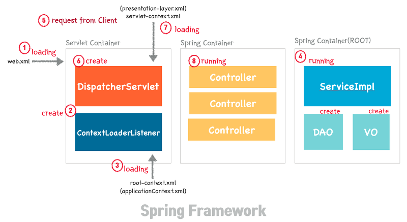
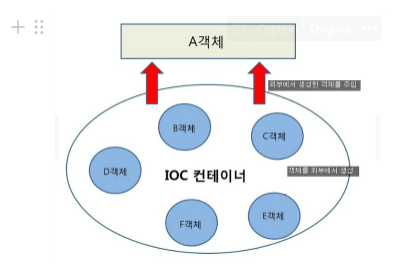

# IOC, DI, AOP

### IoC ( Inversion of Control : 제어의 반전 )
>- 객체를 직접 생성하지 않고 외부에서 구현체를 넣어줌으로써 제어권을 거꾸로 가지고 가는 현상으로 IoC는 설계의 패턴
>- 스프링 애플리케이션에서는 오브젝트(Bean)의 생성과 의존 관계 설정, 사용, 제거 등의 작업을 애플리케이션 코드 대신 스프링 컨테이너(ApplicationContext)가 담당
>- 스프링 컨테이너는 IoC 컨테이너 라고도 부름.
>
>>\* 스프링 컨테이너 ( IoC 컨테이너 ) 
>>- 스프링 애플리케이션에서는 객체(빈)의 생성과 관계설정, 사용, 제거 등의 작업(객체 생명주기 관리)을 애플리케이션 코드 대신 스프링 컨테이너가 담당하는데, 이를 IoC 컨테이너라고도 한다.
>>- 오브젝트 생성과 오브젝트 사이의 런타임 관계를 설정하는 DI 관점으로 보면, 컨테이너를 빈 팩토리 또는 DI 컨테이너라고 부름
>>- 스프링 컨테이너 종류는 BeanFactory와 이를 상속한 ApplicationContext가 존재

<br>
<br>



<br>

#### IoC 동작 순서
>1) Web Application이 실행되면 Tomcat에 의해 web.xml이 Loading 된다.
>2) web.xml에 등록되어 있는 ContextLoaderListener가 생성된다. ContextLoaderListener Class는 ServletContextListener 인터페이스를 구현하고 있으며, ApplicationContext를 생성하는 역할을 수행한다.
>3) 생성된 ContextLoaderListener는 root-context.xml을 Loading 한다.
>4) root-context.xml에 등록되어 있는 Spring Container가 구동된다. 개발자가 작성한 비즈니스 로직에 대한 부분과 DAO, VO 객체들이 생성된다.
>5) Client로부터 Web Application 요청이 온다.
>6) DispatcherServlet이 생성된다. DispatcherServlet은 FrontController의 역할을 수행한다. 클라이언트로부터 요청 온 메시지를 분석하여 알맞은 PageController에게 전달하고 응답을 받아 요청에 따른 응답을 어떻게 할지 결정한다.
>7) DispatcherServlet은 servlet-context.xml을 Loading 한다.
>8) 두 번째 Spring Container가 구동되며 응답에 맞는 PageController들이 동작한다. 이때 첫 번째 Spring Container가 구동되면서 생성된 DAO, VO, ServiceImpl 클래스들과 협업하여 알맞은 작업을 처리한다.

<br>



### DI ( Dependency Injection : 의존성 주입 )
>- 외부에서 의존성을 받는 행동으로, 외부에서 new로 생성된 객체를 받음. IoC와 연결되는 개념으로 DI는 동작 그 자체. ( DI로 하여금 IOC가 발생 )
>- IoC의 제어권이 프레임워크에게 가게되는 것은 IoC 컨테이너는 DI를 통해 주입시키는데 주입하는 방법은 생성자, 메소드의 setter, 멤버변수에 @inject, @Autowired를 통해 주입
>- 클라이언트 코드의 변경 없이 기능 확장
>- 재사용성이 높고 테스트하기 좋은 코드가 됨
>- 의존성이 줄어듬
>- 가독성이 높아짐
>> #### \* DI란? 
>>- A가 B를 의존한다라고 하면 서로 관계가 있고 토비의 스프링에서는 ‘의존 대상 B가 변하면 그것이 A에 영향을 미친다’ 라고함
>>- 밑의 코드를 보면 BurgerChef가 의존하고 있는 BurgerRecipe를 외부(사장님)에서 결정하고 주입 하고 있는데 이때 DI는 어떤 햄버거 레시피를 만들지 버거가게 사장님이 정하는 상황
>>```java
>>class BurgerChef {
>>    private BurgerRecipe burgerRecipe;
>>
>>    public BurgerChef(BurgerRecipe bugerRecipe) {
>>        this.burgerRecipe = bugerRecipe;
>>    }
>>}
>>
>>//의존관계를 외부에서 주입 -> DI
>>new BurgerChef(new HamBurgerRecipe());
>>new BurgerChef(new CheeseBurgerRecipe());
>>new BurgerChef(new ChickenBurgerRecipe());
>>
>>```

<br><br>

### 스프링에서의 DI 방법
>SOLID 원칙에서 O에 해당하는 Open Closed Principle을 지키기 위해 디자인 패턴 중 전략 패턴을 사용하게 되는데, 생성자 주입을 사용하게 되면 전략 패턴을 사용한다고 한다
>
><br><br>1) 필드 주입 ( Field Injection ) : 변수 선언부에 @Autowired Annotation을 붙임
>```java
>@Component
>public class SampleController {
>    @Autowired
>    private SampleService sampleService;
>}
>```
>
>>해당 주입의 문제점
>>- 단일 책임(SRP) 원칙 위반 : 생성자의 매개변수가 많아짐과 동시에 하나의 클래스가 많은 책임을 떠안게 됨
>>- 의존성이 숨음 : 자신의 의존성만 책임지는게 아닌 제공된 의존성 또한 책임짐
>>- DI 컨테이너의 결합성과 테스트 용이성 : 필요한 의존성을 가진 클래스를 곧바로 인스턴스화 시킬수 없음
>>- 불변성 위배 : final을 선언할 수 없어 객체가 변할 수 있음 
>
> <br><br>2) 수정자 주입 ( Setter Injection )
>- 선택적인 의존성을 사용할 때 유용
>- 상황에 따라 의존성 주입이 가능. set Method를 정의해 사용
>```java
>@Component
>public class SampleController {
>    private SampleService sampleService;
> 
>    @Autowired
>    public void setSampleService(SampleService sampleService) {
>        this.sampleService = sampleService;
>    }
>}
>```
>
>>해당 주입의 문제점
>>- 런타임시에 할 수 있도록 낮은 결합도를 가지게 구현되었으나 해당 주입을 통해서 서비스의 구현체를 주입해주지 않아도 컨트롤러 객체는 생성이 가능하고 메소드 호출이 가능한데 set을 통해 서비스의 구현체를 주입해주지 않았으니 NullPointException이 발생. 즉, 주입이 필요한 객체가 주입이 되지 않아도 얼마든지 객체를 생성할 수 있는 문제 발생
>
><br><br>3) 생성자 주입 ( Constructor Injection )
>- 생성자에 @Autowired Annotation을 붙여 의존성 주입
>```java
>@Component
>public class SampleService {
>    private SampleDAO sampleDAO;
> 
>    @Autowired
>    public SampleService(SampleDAO sampleDAO) {
>        this.sampleDAO = sampleDAO;
>    }
>}
>
>@Component
>public class SampleController {
>
>	private final SampleService sampleService = new SampleService(new SampleDAO());
>    
>	...
>}
>```
>
>>스프링 프레임워크 참조에서 권장하는 주입
>>- 필수적으로 사용해야하는 의존성 없이는 인스턴스를 만들지 못하도록 강제
>>- 클래스를 DI 프레임워크로부터 분리
>>- 단일 생성자에 한해 @Autowired를 붙이지 않아도 됨 ( 클래스의 생성자가 하나이고 그 생성자로 주입받을 객체가 Bean으로 등록되어 있다면 @Autowired 생략 가능 )
>>- null을 주입하지 않는 한 NullPointException 발생하지 않음
>>- final 사용가능
>>- 순환 의존성을 알 수 있음

<br>

>\* 강한결합
>- 객체 내부에서 다른 객체를 생성하는 것은 강한 결합도를 가지는 구조이다.
>- A 클래스 내부에서 B 라는 객체를 직접 생성하고 있다면, B 객체를 C 객체로 바꾸고 싶은 경우에 A 클래스도 수정해야 하는 방식이기 때문에 강한 결합이다.
>
><br>\* 느슨한 결합
>- 객체를 주입 받는다는 것은 외부에서 생성된 객체를 인터페이스를 통해서 넘겨받는 것이다.
>- 이렇게 하면 결합도를 낮출 수 있고, 런타임시에 의존관계가 결정되기 때문에 유연한 구조를 가진다.

<br>

### AOP ( Aspect Oriented Programming : 관점 지향 프로그래밍 )
>- 어떤 로직을 기준으로 핵심적인 관점, 부가적인 관점으로 나누어서 보고 그 관점을 기준으로 모듈화하기 위함.
>- 개발을 진행하다보면 반복되는 작업이 있고 해당 공통 작업(트랜잭션, 로깅, 보안 등)들을 분리하여 적절한 시기에 적용하는 개념
>- 따로 코드 밖에서 개발을 해두고 런타임에 프록시 객체를 생성해 메서드가 실행되기전, 실행된 직후, 실행 시점에 따라 따로 기능을 적용시키는 것.
>- 스프링에서의 AOP는 스프링 빈에만 AOP를 적용 가능하고, 모든 AOP 기능을 제공하는 것이 아닌 스프링 IoC와 연동하여 EA에서 가장 흔한 문제에 대한 해결책을 지원하는 것이 목적
>
>>AOP 주요 개념
>>- Aspect : 위에서 설명한 흩어진 관심사를 모듈화 한 것. 주로 부가기능을 모듈화함.
>>- Target : Aspect를 적용하는 곳 (클래스, 메서드 .. )
>>- Advice : 실질적으로 어떤 일을 해야할 지에 대한 것, 실질적인 부가기능을 담은 구현체
>>- JointPoint : Advice가 적용될 위치, 끼어들 수 있는 지점. 메서드 진입 지점, 생성자 호출 시점, 필드에서 값을 꺼내올 때 등 다양한 시점에 적용가능
>>- PointCut : JointPoint의 상세한 스펙을 정의한 것. 'A란 메서드의 진입 시점에 호출할 것'과 같이 더욱 구체적으로 Advice가 실행될 지점을 정할 수 있음

<br>

### 사용모듈
>- spring-core : 스프링에서 DI와 IoC를 제공
>- spring-aop : AOP 구현 기능 제공

<div style="text-align: right">22-06-17</div>

-------

## Reference
- https://platanus.me/post/513 
- https://steady-coding.tistory.com/600 
- https://aridom.tistory.com/56 
- https://velog.io/@gillog/Spring-DIDependency-Injection-세-가지-방법 
- https://engkimbs.tistory.com/746 