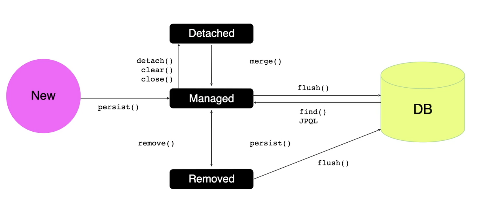

# JPA Entity Manager

### Entity Manager
- 특정 작업을 위해 데이터베이스에 엑세스하는 역할을 담당
- 엔티티를 DB에 등록/수정/삭제/조회 (CRUD) 하는 역할이며 엔티티와 관련된 일을 처리하는 엔티티 관리자임
- JPA의 기능 대부분을 Entity Manager 가 제공함
- 엔티티 매니저 팩토리는 설정 정보를 읽어와 DB 커넥션 풀도 생성하기 때문에 엔티티 매니저 팩토리를 생성하는 비용이 크기 때문에 엔티티 매니저 팩토리는 애플리케이션 전체에서 딱 한번만 생성하고 공유해서 사용해야 함
- 엔티티 매니저는 데이터베이스 커넥션과 밀접한 관계가 있으므로 스레드간에 공유하거나 재사용하면 안됨 -> Thread-Safe를 보장해야함. 동일한 EntityManger를 가지고 멀티스레드 환경에서 호출하면 데이터가 어떻게 변경될지 모름
- 스프링 환경에서는 엔티티매니저 메소드를 호출할 때마다 프록시를 통해 엔티티매니저를 생성하여 Thread-Safe 함
- 사용이 끝난 엔티티 매니저는 반드시 종료해야 함

|엔티티 매니저 팩토리|엔티티 매니저|
|:---:|:---:|
|엔티티 매니저 팩토리는 생성 비용이 크기 때문에 일반적으로 하나만 만듬(싱글톤)|앤티티 매니저 팩토리를 이용하여 생성|
|스레드 세이프하기 때문에 여러 스레드가 동시 접근해도 안전|여러 스레드가 동시에 접근하면 동시성 문제가 발생하기 때문에 공유해서는 안됨|

```java
// Use persistence.xml configuration
EntityManagerFactory emf = Persistence.createEntityManagerFactory("manager1")
EntityManager em = emf.createEntityManager(); // Retrieve an application managed entity manager
// Work with the EM
em.close();
...
emf.close(); //close at application end
```

<br>



### 영속성 컨텍스트 ( Persistence Context )
- 영구 저장 환경 ( 엔티티를 영구히 저장하는 공간 )
- 영속성 컨텍스트는 관리하고 있는 엔디티티의 변화를 추적하고 한 트랙잭션 내에서 변화가 일어나면 엔티티에 마킹하고 트랜잭션이 끝나는 시점에 마킹한 것을 DB에 반영 ([Dirty Check](./JPA%20Dirty%20Checking.md))
- 엔티티 매니저가 엔티티를 저장하거나 조회하면 매니저는 영속성 컨텍스트에 엔티티를 보관하고 관리
- 동일 트랜잭션에서 엔티티매니저를 여러번 호출에서 처리하면 같은 영속성 컨텍스트에서 처리되고 다른 트랜잭션이라면 다른 영속성컨텍스트에서 처리됨
- 엔티티 매니저가 persist() 메서드를 사용하면 엔티티를 영속성 컨텍스트에 저장함
- 하나의 엔티티 매니저가 하나의 영속성 컨텍스트를 생성 및 접근할 수 있고, 여러 엔티티 매니저가 하나의 영속성 컨텍스트를 공유 가능

#### 엔티티의 생명주기
- 비영속 (new/transient) : 영속성 컨텍스트와 관계가 없는 상태, 엔티티 인스턴스가 초기화된 상태
- 영속 (managed) : 영속성 컨텍스트에 저장된 상태
- 준영속 (datached) : 영속성 컨텍스트에 저장되어있다가 분리된 상태
- 삭제 (removed) : 영속성 컨텍스트에서 삭제된 상태

#### 영속성 컨텍스트 사용 시
- 영속성 컨텍스트는 엔티티를 식별자 값(@ID annotation)으로 구분하기 때문에 영속 상태는 식별자 값이 반드시 필요
- JPA는 보통 트랜잭션을 커밋하는 순간 영속성 컨텍스트의 엔티티를 데이터베이스에 반영. 이러한 동작을 flush라고 함
- 영속성 컨텍스트가 엔티티를 관리할 때 생기는 장점
    - 1차 캐시
    - 동일성 보장
    - 트랜잭션을 지원하는 <code>쓰기 지연</code>
    - 변경 감지
    - <code>지연 로딩</code>
    ```
    쓰기 지연
    - 영속성 컨텍스트가 중간에서 쿼리들을 모았다가 한 번에 반영해주어 리소스 감소

    지연 로딩 (Lazy Loading)
    - 지연 로딩은 자신과 관련된 엔티티를 실제로 사용할 때 연관된 엔티티를 조회
    - 엔티티가 실제로 사용되기 전까지 데이터 베이스 조회를 지연하도록 제공 
    - 반대로 즉시로딩이라하면 엔티티를 조회할 때 자신과 연관되는 엔티티를 조인을 통해 함께 조회하는 것을 의미
    - 지연 로딩을 하기위해서는 프록시가 필요 -> 실제 엔티티 객체 대신에 사용되는 객체로 실제 엔티티 클래스와 상속 관계 및 위임 관계가 있는 가짜 객체
    ```
#### flush 의 동작 과정
1. 변경 감지가 동작하여 영속성 컨텍스트에 있는 모든 엔티티를 스냅샷과 비교하여 변경이 있는 엔티티를 찾음
2. 변경이 있는 엔티티는 수정 쿼리를 만들어 쓰기 지연 SQL 저장소에 등록
3. 쓰기 지연 SQL 저장소의 쿼리를 데이터베이스에 전송
#### 영속성 컨텍스트를 flush 하는 방법
- em.flush()를 직접 호출
- 트랜잭션 커밋 시 자동 호출
- <code>JPQL</code> 쿼리 실행 시 자동 호출

```
JPQL (Java Persistence Query Language) 
- 테이블이 아닌 엔티티 객체를 대상으로 검색하는 객체지향 쿼리
- SQL을 추상화 해서 특정 데이터베이스 SQL에 의존하지 않음
- JPA는 JPQL을 분석한 후 적절한 SQL을 만들어 데이터베이스를 조회
- 방언(Dialect)만 변경하면 JPQL을 수정하지 않고 자연스럽게 DB 변경 가능
```

<br>

### Entity
- 테이블과 매칭되는 개념으로 ORM을 이루는 기반 개념 중 하나. 객체와 RDB간 연결시켜주는 존재
- 테이블과 매핑할 클래스에 필수로 사용되는 annotation으로 @Entity가 붙은 클래스는 JPA 가 관리
- name 속성을 이용하여 JPA에서 사용할 엔티티 이름을 지정. 설정하지 않으면 기본 값으로 클래스 이름이 됨
- 다른 패키지에 이름이 같은 엔티티 클래스가 있을 경우 이름을 지정하여 충돌을 피함
- 기본 생성자는 필수. 외부에서 접근가능하도록 public 이나 protected 생성자
- final 클래스, enum , interface, inner 클래스에서는 사용할 수 없음. 저장할 필드에 final을 사용하면 안됨

<br>

#### Table
- 엔티티와 매핑할 테이블을 지정. 생략할 경우 매핑한 엔티티 이름을 테이블 이름으로 사용

|속성|기능|
|:---:|:---:|
|name|매핑할 테이블 이름( 기본값은 엔티티 이름 )|
|catalog|catalog 기능이 있는 DB 에서 catalog를 매핑|
|schema|schema 기능이 있는 DB에서 schema를 매핑|

<br>

#### 필드와 컬럼 매핑

|annotation|설명|
|:---:|:---:|
|@Column|컬럼을 매핑 <br> name 속성을 이용하여 매핑할 컬럼을 지정 ( 디폴트는 개체의 필드 이름 ) <br> 프로퍼티이름과 칼럼의 이름이 같다면 생략이 가능하지만 다를경우 @Column 어노테이션 지정해야 함|
|@Enumerated| Java의 enum 타입을 매핑 <br> value속성을 이용하여 DB에 저장할 값을 지정 <br> - EnumType.ORDINAL : enum의 순서를 DB에 저장 (Default) <br> - EnumType.STRING : enum의 이름을 저장|
|@Temporal|날짜 타입을 매핑 <br> value 속성을 이용하여 DB에 값을 저장해야 함. value 속성은 필수 <br> - TemporalType.DATE : 날짜, DB의 data 타입과 매핑 <br> -TemporalType.TIME : 날짜, DB의 time 타입과 매핑 <br> - TemporalType.TIMESTAMP : 날짜와 시간, DB의 timestamp 타입과 매핑|
|@Lob|BLOB, CLOB 타입을 매핑|
|@Transient|특정 필드를 데이터 베이스에 매핑하지 않는다|


```java
    @Data
    @Entity
    @Table(name="Users")
    public class User {
        @Id
        @Column(name="id")
        @GeneratedValue(strategy = GenerationType.IDENTITY)
        private Long id;
        
        ...
        
    }
```

<br>

<div style="text-align: right">22-07-18</div>

-------

## Reference
- https://xzio.tistory.com/1865
- https://velog.io/@rainmaker007/Jpa-EntityManager-설명-영속성-컨텍스트