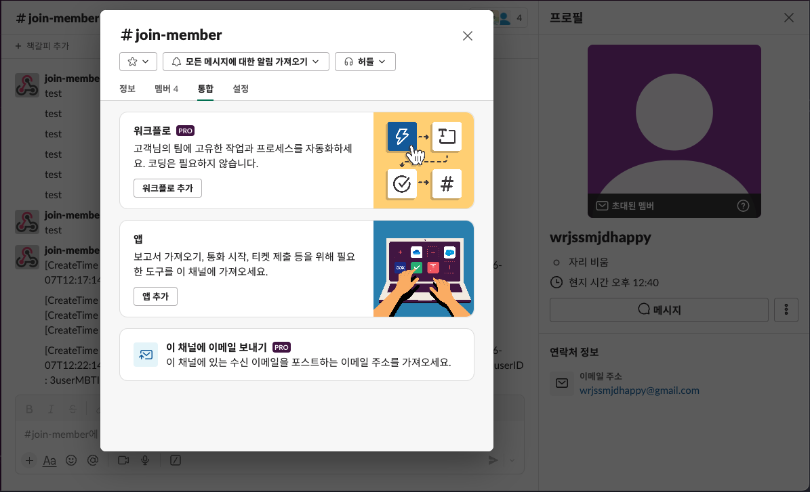
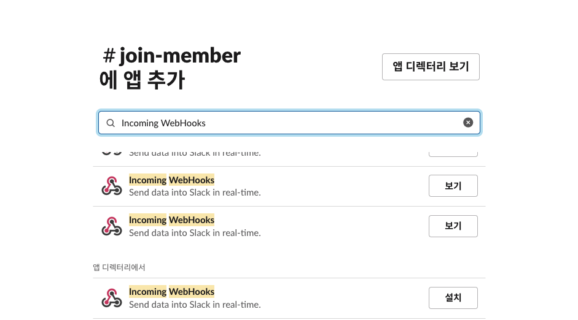
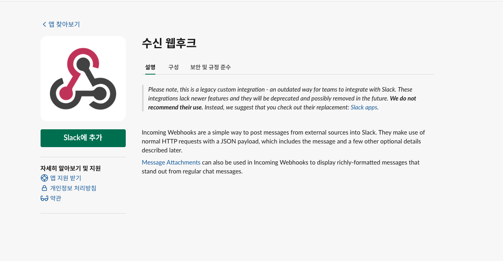
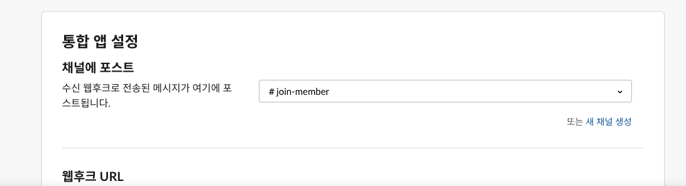
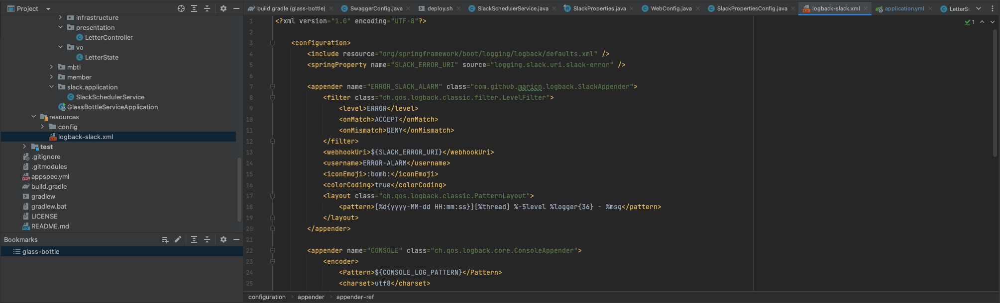
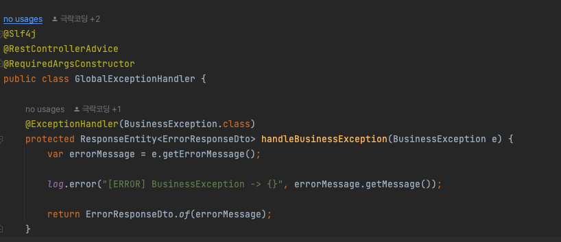

# Slack Appender

### Slack Appender?
- Logback을 이용하여 자동으로 Slack 으로 메시지를 전달하는 오픈소스 라이브러리
- Logback을 이용하여 모든 에러 로그가 중앙 집권화되어 에러를 한곳에서 확인하고 관리할 수 있음

<br>

### 사용하게된 이유
- 프로젝트를 진행하다보면 여러 가지 에러를 마주하게 됨. 처리해준 예외들에 대해서는 괜찮지만, 미처 처리하지 못한 부분에서 에러가 발생하면 그건 곧 서비스 전체의 장애로 이루어질 수 있음
- 해당 문제를 해결하기 위해 glass-bottle 프로젝트에서는 이러한 에러 로그 발생시 Slack으로 에러 로그를 남기는 방식을 사용하기로 하였음
- 협업 툴인 Slack으로 로그를 전달하여 API 상태를 실시간으로 모니터링하고 해당 사항을 조기에 조치할 수 있어 시스템 안정성과 가용성을 향상하는데도 도움이 됨

<br>

### 사용 방법
1. Slack App에서 Incoming Webhook 설치 후 webhook url 받아오기
    - Slack App -> 해당 채널에 들어가서 #채널명 클릭 -> 통합 -> 앱추가
    - Incoming Webhook 설치
    - 채널에 포스트에서 메세지를 받을 채널 선택
    - 그외 설정 기입 후 설정 저장
    - 웹 후크 url 복사. 이후 yml 파일에 넣을 예정









2. 의존성 주입
    - implementation 'com.github.maricn:logback-slack-appender:1.6.1' 추가

3. application.yml 추가
    - 현재 slack-error만 slack-appender에서 사용하는 webhook url 추가. 경로는 logging.slack 하위에 추가
    - logging 하위에 config: classpath:logback-slack.xml 추가. 사용할 logback.xml 디렉토리를 지정


4. logback.xml 생성
    - application.yml에 추가한 것 처럼 resource 하위에 logback-slack.xml 생성
    - logback-slack.xml 설정 추가
    - springProperty를 이용하여 yml로부터 데이터를 가져옴



```xml
<?xml version="1.0" encoding="UTF-8"?>

    <configuration>
        <include resource="org/springframework/boot/logging/logback/defaults.xml" />
        <springProperty name="SLACK_ERROR_URI" source="logging.slack.uri.slack-error" />

        <appender name="ERROR_SLACK_ALARM" class="com.github.maricn.logback.SlackAppender">
            <filter class="ch.qos.logback.classic.filter.LevelFilter">
                <level>ERROR</level>
                <onMatch>ACCEPT</onMatch>
                <onMismatch>DENY</onMismatch>
            </filter>
            <webhookUri>${SLACK_ERROR_URI}</webhookUri>
            <username>ERROR-ALARM</username>
            <iconEmoji>:bomb:</iconEmoji>
            <colorCoding>true</colorCoding>
            <layout class="ch.qos.logback.classic.PatternLayout">
                <pattern>[%d{yyyy-MM-dd HH:mm:ss}][%thread] %-5level %logger{36} - %msg</pattern>
            </layout>
        </appender>

        <appender name="CONSOLE" class="ch.qos.logback.core.ConsoleAppender">
            <encoder>
                <Pattern>${CONSOLE_LOG_PATTERN}</Pattern>
                <charset>utf8</charset>
            </encoder>
        </appender>

        <appender name="ASYNC_SLACK" class="ch.qos.logback.classic.AsyncAppender">
            <appender-ref ref="ERROR_SLACK_ALARM" />
            <filter class="ch.qos.logback.classic.filter.ThresholdFilter">
                <level>ERROR</level>
            </filter>
        </appender>

        <root level="INFO">
            <appender-ref ref="CONSOLE" />
        </root>

        <logger name="com.service.core" level="ALL">    
            <appender-ref ref="ASYNC_SLACK" />
        </logger>

    </configuration>
```

<br>

### + RuntimeException 로그 출력
- 스터디원과 진행했던 glass-bottle 프로젝트는 RuntimeException을 상속받은 BusinessException을 사용하여 예외처리를 진행하였고 해당 Exception Handler에서 해당 에러 메시지를 Error level log 발생으로 slack appender에 지정해놓았던 설정에 따라 Slack으로 로그가 출력되게 됨
- 해당 방법을 통해 예외처리 발생시 자동으로 Slack 로그 출력



<br>

### 후기
- 사용하기도 편하고 이후 에러로그 모니터링을 지속적으로 확인하여 프로젝트 진행에 많은 도움이 되었다고 생각함..
- 이후에도 프로젝트 진행시에 다시 사용할 것 같음

<br>

### 참조링크
- https://velog.io/@banjjoknim/Spring-Boot에서-Logback으로-slack에-에러-로그-남기는-방법
- https://rutgo-letsgo.tistory.com/125
- https://leeheefull.tistory.com/73