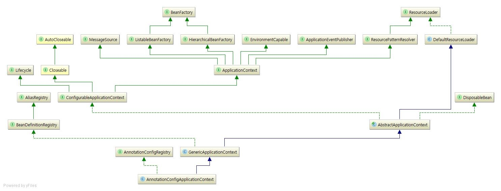
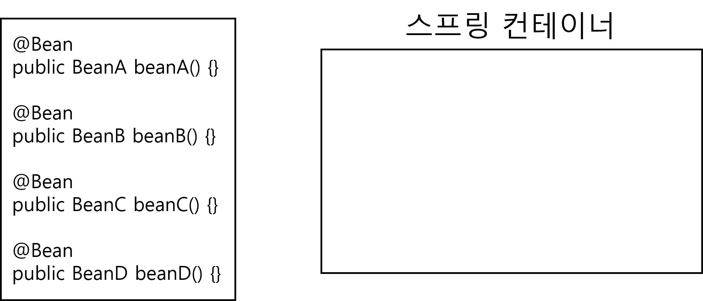
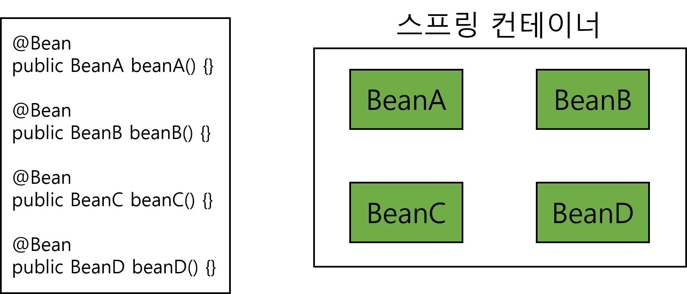
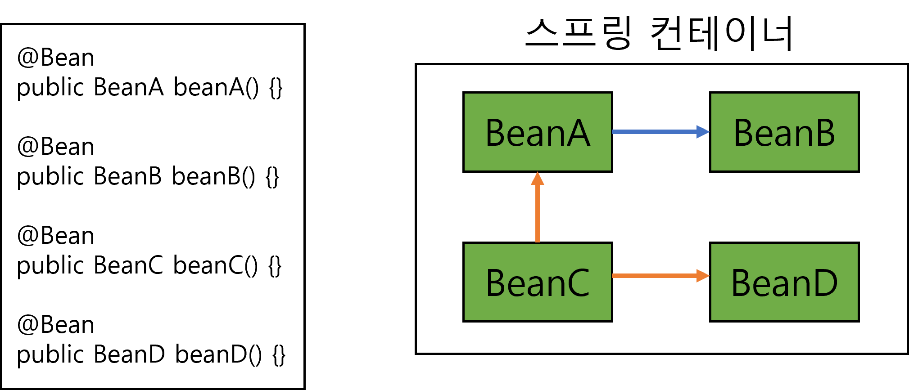
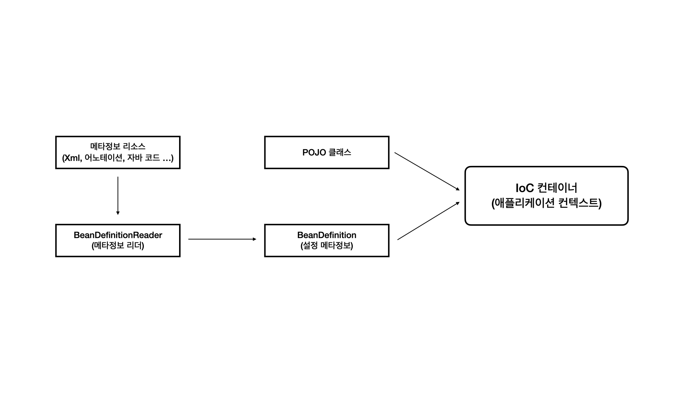

# 스프링 컨테이너

### 스프링 컨테이너란?
- 스프링에서 자바 객체들을 관리하는 공간을 말함
- 자바 객체를 스프링에선 빈이라고 하는데 스프링 컨테이너는 이 빈의 생명주기를 개발자 대신 관리 해주는 것
- 컨테이너는 크게 BeanFactory와 ApplicationContext로 나뉘어짐. 
- ApplicationContext 컨테이너가 BeanFactory의 기능을 포괄하면서 추가적인 기능을 제공하기 때문에 대부분의 경우에는 ApplicationContext를 사용함
- ApplicationContext(BeanFactory)는 빈 객체의 생성, 초기화, 보관, 제거 등을 관리하고 있어서 컨테이너(Container)라고도 부르는데 이것이 스프링 컨테이너


#### Spring Context?
- Bean의 확장 버전으로 Spring이 Bean을 다루기 좀 더 쉽게 기능들이 추가된 공간
- Bean들은 모두 Context안에서 이루어짐
- 자바에는 서블릿이라는 객체가 존재하는데 서블릿 역시 Bean이 존재하는데 서블릿은 모두 독립적인 객체로 서로 간섭이 불가능함
- 위를 해결하기 위해서 Spring Context는 ROOT-CONTEXT 와 SERVLET-CONTEXT로 분리시킴
- ROOT-CONTEXT(공통부분)는 모든 서블릿이 공유할 수 있는 Bean들이 모인 공간으로 DB에 관련된 Repository, Service 등이 있음
- SERVLET-CONTEXT(개별부분)는 서블릿 각자의 Bean들이 모인 공간으로 웹, 앱마다 하나씩 존재하고 이 Context 내에서 Bean들은 서로 공유될 수 없음. Controller가 해당

<br>

### Context 종류



#### 1. Application Context
- 스프링 Context 기능의 중심인 최상위 인터페이스
- 거의 스프링 Context는 해당 Context를 구현하며 기능에 따라 "---ApplicationContext"로 명칭함
#### 2. AbstractApplication ContextApplication Context
- 기능의 중심적인 역할을 수행하면 ApplicztionContext를 구현한 추상 클래스로 내부에 정의된 특수한 빈들을 등록할 수 있음
#### 3. GenericApplication Context
- 이름이 Generic인 것처럼 Context로서의 기능을 거의 다 가지고 있음
- 주로 수동으로 직접 Bean을 등록할 때 사용
- XmlBeanDefinitionReader를 사용하여 xml 파일을 읽어와야함
- 등록과정이 번거로움
#### 4. GenericXmlApplicationContext
- Bean을 배울 때 보통 가장 먼저 사용하는 인터페이스
- AbstractApplication Context을 확장한 인터페이스로 Context등록 과정이 간편화 되어 있음
- 1번과 달리 xml 파일을 읽어오는 과정이 내부에 있으며, 다양한 루트로 설정 파일을 불러올 수 있음
#### 5. ClassPathXmlApplicationContext
- GenericXmlApplicatoin Context과 비슷하지만, 클래스 경로로 Context를 불러오는 데 특화되어 있음
#### 6. FileSystemXmlApplicationContext
- 말 그대로 클래스 경로가 아닌 실제 파일 경로로 불러옴
#### 7. AnnotationConfigApplicationContext 
- 자바 어노테이션을 이용한 클래스로부터 객체 설정 정보를 가져옴 ( ApplicationContext의 하위 인터페이스 )

<br>

### Web Application용 Context 종류
#### 1. ServletContext
- 자바 자체의 Context를 말함
- 스프링도 자바로 만들어 졌으므로 모든 스프링 Context는 ServletContext라고 할 수 있음
#### 2. WebApplicationContext
- 웹 애플리케이션에 특화된 Context
- 위의 ROOT, Servlet Context로 사용됨
#### 3. ConfigurationWebApplicationContext
- WebApplicationContext를 설정하는데 쓰이는 Context
- WebContext를 설정해야할 때엔 Configurable 클래스로 바꿔서 설정함

<br>

```
Servlet
- Dynamic Web Page를 만들 때 사용되는 자바 기반의 웹 애플리케이션 프로그래밍 기술
- 웹은 다양한 요청(Request)와 응답(Response)가 있고 규칙이 존재
- 위의 요청과 응답의 흐름을 간단한 메소드 호출만으로 체계적으로 다룰 수 있게 해주는 기술임
```

<br>

### 스프링 컨테이너 생성 과정


#### 1. 스프링 컨테이너 생성
- 비어있는 스프링 컨테이너 생성
<br>


#### 2. 스프링 빈 등록
- 스프링 설정파일(Java, XML)을 기반으로 스프링 빈이 등록
<br>


#### 3. 스프링 빈 의존관계 설정
- 스프링 설정파일을 기반으로 스프링 빈의 의존관계를 주입 (DI) 한다.

<br>



### BeanDefinition
- 스프링은 BeanDefinition을 통해 다양한 형식의 설정 파일 지원
- 어떤 설정파일을 사용하더라도 BeanDefinition 형식의 메터정보를 생성해주고 스프링 컨테이너는 설정파일의 형식과 상관없이 BeanDefinition을 통해 빈의 정보를 알아 낼수 있음
- POJO 클래스와 BeanDefinition을 이용해 빈을 생성함

##### BeanDefinition
- beanClassName : 생성할 빈의 클래스 이름
- constructorArgumentValue : 생성자 이름과 설정값
- dependsOn : 생성 순서가 보장되어야 하는 경우를 위해 먼저 생성되어야 하는 빈 지정
- description : 빈 생성 시 작성한 설명
- destroyMethodName : 빈의 생명주기가 끝나서 소멸되기전 호출되는 메서드 이름
- factoryBeanName : 팩토리 역할의 빈을 사용할 경우 이름
- factoryMethodName : 빈을 생성할 팩토리 메서드의 이름
- initMethodName : 빈을 생성하고 의존관계 적용 후 호출되는 초기화 메서드 이름
- parentName : 빈 메타정보를 상속받을 부모 BeanDefinition 이름
- propertyValues : 빈의 새 인스턴스에 적용할 속성 값
- resourceDescription : BeanDefinition이 나온 리소스에 대한 설명
-scope : 빈 오브젝트의 생명 주기(default : 싱글톤)

<br>

#### 인프런 강좌(김영한 강사) 스프링 핵심원리 - 기본편 정리
- [스프링 컨테이너](../Inflearn/스프링핵심원리-김영한강사/SpringContainer-Bean.md)

<br>

<div style="text-align: right">22-07-15</div>

-------

## Reference
- https://velog.io/@tank3a/스프링-컨테이너와-스프링-빈
- https://workshop-6349.tistory.com/entry/Spring-Spring-Context-설명
- https://velog.io/@pruit/ApplicationContext와-AnnotationConfigApplicationContext
- https://dev-aiden.com/spring/Spring-Container/