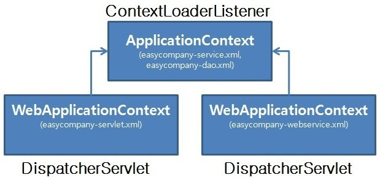

# Spring Process

### 사전지식
- 스프링은 POJO 위주로 동작
- Not POJO = Servlet의 특징
    - java.servlet, javax.servlet.http 패키지를 import 해야함
    - Servlet, Generic Servlet, HttpServlet 중 하나를 상속해야함
    - 생명주기에 해당하는 메소드를 재정의(Overriding)함
- 스프링에서는 xml과 같은 설정을 통해 Servlet 사용
- 서블릿이 복잡해서 시작한 것이 스프링이라고 함
    - 스프링으로 서블릿을 관리함

<br>


#### Not POJO Servlet 예시 
- 이전에 스프링을 사용하기 전에는 해당 각각의 요청을 처리해주는 클래스를 만들어야 했고, 모두 상속받아야 했음

<br>


### 서블릿 컨테이너
- 서블릿은 클라이언트의 요청을 처리하고 결과를 다시 전송하기 위한 Servlet 클래스로 구현해둔 객체
- 서블릿 실행
- 세션관리
- 네트워크 서비스
- 메시지 인코딩/디코딩
- 서블릿 생명주기 관리

```
Tomcat == Servlet Container?
- Tomcat은 웹 애플리케이션(WAS) 중의 하나로 Servlet Container의 기능을 제공함
- 내장 웹 서버의 부가 기능도 제공하므로 좀더 큰 개념
- 엄밀히 말하면 WAS라고 부르는 것이 좋다는게 좀더 옳지 않을까 함
```

<br>


#### 서블릿 컨테이너의 동작 방식
1. 웹 브라우저에서 웹 서버에 HTTP 요청을 보내면, 웹 서버는 받은 HTTP 요청을 WAS의 Web Server로 전달한다.
2. WAS의 웹 서버는 HTTP 요청을 서블릿 컨테이너에 전달한다.
3. 서블릿 컨테이너는 HTTP 요청 처리에 필요한 서블릿 인스턴스가 힙 메모리 영역에 있는지 확인한다. 존재하지 않는다면, 서블릿 인스턴스를 생성하고 해당 서블릿 인스턴스의 init() 메소드를 호출하여 서블릿 인스턴스를 초기화한다.
4. 서블릿 컨테이너는 서블릿 인스턴스의 service() 메소드를 호출하여 HTTP 요청을 처리하고, WAS의 웹 서버에게 처리 결과를 전달한다.
5. WAS의 웹 서버는 HTTP 응답을 앞 단에 위치한 웹 서버에게 전달하고, 앞 단의 웹 서버는 받은 HTTP 응답을 웹 브라우저에게 전달한다.


<br><br>


### 스프링 컨테이너
- 스프링 컨테이너는 Bean 생명 주기를 관리
- Bean을 관리하기 위해 IoC가 이용되며 BeanFactor 객체가 바로 IoC 컨테이너(=DI 컨테이너, 스프링 컨테이너)에 해당되며, 이 IoC 컨테이너를 상속하면서 부가 기능을 추가한 것이 ApplicationContext
- Spring MVC 역시 서블릿 컨테이너가 관리하고 있는 거대한 서블릿으로 비즈니스 로직을 스프링을 통해 처리하는 것이지 서블릿을 사용하지 않는 것이 아님
    - 스프링 컨테이너는 서블릿 컨테이너 안에 존재함
    - 서블릿 컨테이너가 스프링 빈에 접근하려면 스프링 컨테이너를 거쳐야 함

<br>

### 스프링 컨테이너의 종류
#### 1. BeanFactory
- 스프링 설정 파일에 등록된 \<bean\> 객체를 생성하고 관리
- 컨테이너가 구동될 때 객체를 생성하는 것이 아니라 클라이언트로부터의 요청에 의해서만 객체를 생성(Lazy Loading 방식)
- 일반적인 스프링 프로젝트에서는 사용할 일이 없음

<br>

#### 2. ApplicationContext
- BeanFactory를 상속받아 BeanFactory가 제공하는 \<bean\> 객체 관리 기능 외에도 트랜잭션 관리나 메시지 기반의 다국어 처리 기능 지원
    - AppicationContext의 경우 BeanFactory  뿐만 아니라 MessageSource (인터페이스), EnvironmentCapable (인터페이스), ApplicationEventPublisher (인터페이스), ResourceLoader (인터페이스) 등의 기능을 상속받음
- 컨테이너가 구동되는 시점에 \<bean\>에 등록되어 있는 클래스들을 객체화 하는 즉시로딩(Pre-Loading 방식)
- ApplicationContext의 구현 클래스는 매우 다양. 대표적인 2개는 다음과 같음
    - GenericXmlApplicationContext : 대표적으로 ApplicationContext를 구현한 클래스로 일반적인 애플리케이션 컨텍스트. 파일 시스템이나 클래스 경로에 있는 xml 설정 파일을 로딩하여 구동하는 컨테이너로 xml을 이용한 가장 일반적인 컨텍스트로 레거시 프로젝트에서 사용
    - XmlWebApplicationContext : 웹 기반의 스프링 애플리케이션을 개발할 때 사용되는 컨테이너
    - AnnotationConfigApplicationContext : @Configuration 어노테이션이 붙은 클래스를 설정 정보로 사용하여 생성된 컨테이너
- 스프링 컨테이너는 bean 저장소에 해당하는 설정 파일을 참조하여 bean 생명 주기 관리를 함. 해당 BeanFactory나 ApplicationContext를 스프링 빈을 담는 스프링 컨테이너라고 함

<br><br>


### 스프링 컨테이너의 동작 원리(xml)
1. 웹 애플리케이션이 실행되면 Tomcat(WAS)에 의해 web.xml 로딩
<br>

2. web.xml에 등록되어 있는 ContextLoaderListener(Java class)가 생성된다. ContextLoaderListener 클래스는 ServletContextListener 인터페이스를 구현하고 있으며, ApplicationContext를 생성하는 역할을 수행한다.
3. 생성된 ContextLoaderListener는 applicationContext.xml을 로딩한다.
4. applicationContext.xml에 등록되어 있는 설정에 따라 Spring Container가 구동된다. 이때 개발자가 작성한 비즈니스 로직에 대한 부분과 DAO, VO 객체들이 생성된다.
5. 클라이언트로부터 웹애플리케이션 요청이 온다.
6. DispatcherServlet(Servlet)이 생성된다. DispatcherServlet은 FrontController의 역할을 수행한다. 클라이언트로부터 요청 온 메시지를 분석하여 알맞은 PageController에게 전달하고 응답을 받아 요청에 따른 응답을 어떻게 할지 결정만 한다. 실질적인 작업은 PageControlle에서 이뤄지기 때문이다. 이러한 클래스들을 HandlerMapping, ViewResolver클래스라고 한다.
7. DispatcherServlet은 servlet-context.xml(spring-mvc.xml)을 로딩한다.
8. 두 번째 Spring Container가 구동되면 응답에 맞는 PageController들이 동작한다. 이때 첫 번째 Spring Container가 구동되면서 생성된 DAO, VO, ServiceImpl 클래스들과 협업하여 알맞은 작업을 처리하게 된다.

<br><br>

### 스프링 컨테이너의 동작 원리(annotation)
- 요즘은 대부분 어노테이션을 이용하여 많이 사용
1. 스프링 컨테이너 생성
    - 스프링 컨테이너에는 내부에 스프링 빈 저장소가 존재
    - 구성 정보를 지정. 아래 예시는 AppConfig.class를 만들어 구성 정보를 지정 
    ```java
    ApplicationContext applicationContext = new AnnotationConfigApplicationContext(AppConfig.class);
    ```
2. 스프링 빈 등록
    - 스프링 컨테이너는 파라미터로 넘어온 설정 클래스 정보를 사용
    - 위에 예시에서 스프링 컨테이너는 AppConfig.class의 정보로 스프링 컨테이너를 생성하므로 해당 AppConfig 클래스에 @Configuration 어노테이션을 추가하고 빈을 등록
    ```java
    @Configuration
    public class AppConfig {
    @Bean
    public MemberService memberService() {
        return new MemberServiceImpl(memberRepository());
    }
    ...
    ```
3. 스프링 빈 의존 관계 설정
    - 스프링 컨테이너는 설정 정보를 참고하여 의존관계 주입 진행
4. 해당 설정은 xml을 대체하고 이후 동작과정은 동일

<br><br>

## Spring MVC 동작

### 동작 과정
1. 클라이언트의 모든 요청은 DispatcherServlet이 받음
2. DispatcherServlet은 HandlerMapping을 통해 해당 URL에 매핑된 Controller를 검색
3. 주입된 @Bean 객체를 가지고 HandlerMapping에 매핑되어 있는 Controller 호출
4. Controller는 적절한 서비스 객체 호출
5. Service는 DB 처리를 위해 DAO를 이용하여 데이터를 요청
6. DAO는 Mapping을 이용한 DB 처리 실행 ( 이전 : MyBatis -> 최근 : JPA 을 주로 이용하여 매핑 ) 
7. 처리한 데이터의 결과가 Mapper -> DAO -> Service -> Controller 로 전달
8. Controller는 전달된 결과를 ViewResolver에서 prefix 경로의 viewName.suffix 형식이 있는지 확인
9. 해당하는 View가 있다면 View에 처리한 데이터의 결과를 전달
10. View는 전달받은 결과를 다시 DispatcherServlet에 전달
11. DispatcherServlet은 전달받은 결과를 클라이언트에게 전달
12. 최종 결과를 클라이언트에서 출력

> #### Controller가 아닌 RestController?
>- 위의 동작과정 7까지는 동일하나 View를 찾을 필요가 없으니 Controller -> ResponseBody(JSON, XML) -> Client 순으로 동작
>- Controller와의 차이는 ViewResolver를 통해 View를 검색하는 부분이 생략되고 단지 데이터를 전달했다는 것
>- RestController(Data 전달 목적) = Controller(화면전달이 목적) + ResponseBody(Obejct<->JSON, XML)

<br>

### Spring MVC구조에서의 역할
1. Dispatcher Servlet
- Front Controller를 담당
- 애플리케이션으로 들어오는 모든 Request를 받는 부분. Request 를 실제로 처리할 Controller에게 전달하고 그 결과 값을 받아서 View에 전달하여 적절한 응답을 생성할 수 있도록 흐름을 제어
2. HandlerMapping
- Request URI에 따라 각각 어떤 Handler(Controller method)가 실제로 처리할 것인지 찾아주는 역할
3. HandlerAdaptor
- 결정된 Controller의 메소드 중 요청에 맞는 적합한 핸들러 매칭
4. Controller
- Request를 직접 처리한 후 그 결과를 다시 DispatcherServlet에 돌려주는 역할
5. ModelAndView
- Controller가 처리한 결과와 그 결과를 보여줄 View에 관한 정보를 담고 있는 객체
6. ViewResolver
- View 관련 정보를 갖고 실제 View를 찾아주는 역할
7. View
- Controller가 처리한 결과값을 보여줄 View를 생성

<br>



<br>

### ApplicationConfig 는 언제 생성?
- web.xml에는 ContextLoaderListener와 DispatcherServlet의 2가지 설정이 있음
- WAS를 처음 동작시, web.xml(컨테이너)를 로딩하여 Servlet Container가 구동되고, Servlet Container는 ContextLoaderListener 객체를 자동으로 메모리에 생성
- ContextLoaderListener 객체는 먼저 \<context-param\>으로 등록된 설정 파일(ex)ApplicationConfig.java)을 읽어서 첫번째 Spring Container(Root Container)를 구동하고 비즈니스 객체 (Service, DAO)을 생성
- 이를 부모 컨테이너라 부르고 부모 컨테이너는 @ComponentScan으로 DAO, Service Bean을 찾고 메모리에 저장
- 이후 요청이 들어오면 Servlet Cotainer가 DispatcherServlet 객체를 생성
- DispatcherServlet이 내부적으로 init()를 호출할 때 \<init-param\>으로 등록된 Spring 설정 파일을 찾아 두번째 Spring Container를 구동
- 이를 자식 컨테이너라고 부르기로 하며 @ComponentScan으로 'Controller'Bean(+'HandlerMapping', 'ViewResolver')을 찾고 메모리에 생성
>- 자식 컨테이너는 부모 컨테이너의 것을 사용할 수 있음 (부모-자식은 상속 개념이 아님)
>- URL-Pattern을 다르게 해서 여러개의 DispathcerServlet이 있을 수 있음 (자주 있는 경우는 아님)
>- DispatcherServlet이 Controller들을 bean으로 등록하고, HandlerMapping 객체에 Controller 내의 메소드마다 붙은 @RequestMapping 정보를 담아줌
>- 원래는 모든 요청은 WAS가 제공하는 DefaultServlet이 처리하나 요청 URL에 해당하는 HandlerMapping 정보를 찾아 Controller가 비즈니스 로직을 처리. 해당 HandlerMapping 정보가 없으면 로직처리를 DefaultServlet에게 맡김. 그래도 없으면 404 Error 발생

<br>

<div style="text-align: right">22-07-02</div>
<div style="text-align: right">내용추가 : 22-09-27</div>

-------

## Reference
- https://lkhlkh23.tistory.com/94
- https://starkying.tistory.com/entry/Spring-MVC-동작원리-구성요소
- https://javannspring.tistory.com/231
- https://steady-coding.tistory.com/599