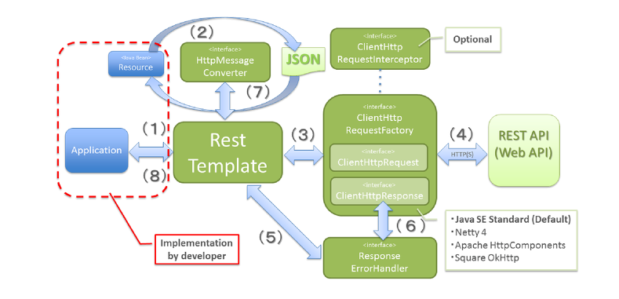

# Spring RestTemplate

### RestTemplate란?
- Spring에서 지원하는 객체로 간편하게 Rest 방식 API를 호출할 수 있는 Spring 내장 클래스로 Spring 3.0부터 지원되었고, json, xml 응답을 모두 받을 수 있음
- Rest API 서비스를 요청 후 응답받을 수 있도록 설계되어 있으며 HTTP 프로토콜의 메소드(ex. GET, POST, DELETE, PUT)들에 적합한 여러 메소드를 제공
- Spring Framework 5부터는 WebFlux 스택과 함께 Spring은 WebClient라는 새로운 HTTP 클라이언트를 도입하여 기존의 동기식 API를 제공할 뿐만 아니라 효율적인 비차단 및 비동기 접근 방식을 지원하여, Spring 5.0 이후부터는 RestTemplate는 deprecated 되었으나 AsyncRestTemplate를 통해 비동기적으로 실행이 가능함

<br>

### RestTemplate의 특징
- Spring 3.0부터 지원하는 Spring의 HTTP 통신 템플릿
- HTTP 요청 후 JSON, XML, String과 같은 응답을 받을 수 있는 템플릿
- Blocking I/O 기반의 동기방식을 사용하는 템플릿
- RESTful 형식에 맞추어진 템플릿
- Header, Content-Tpye등을 설정하여 외부 API 호출
- Server to Server 통신에 사용

<br>



### RestTemplate 동작원리
1. 애플리케이션 내부에서 REST API에 요청하기 위해 RestTemplate의 메서드를 호출
2. RestTemplate은 MessageConverter를 이용해 java object를 request body에 담을 message(JSON etc.)로 변환. 메시지 형태는 상황에 따라 다름
3. ClientHttpRequestFactory에서 ClientHttpRequest을 받아와 요청을 전달
4. 실질적으로 ClientHttpRequest가 HTTP 통신으로 요청을 수행
5. RestTemplate이 에러핸들링
6. ClientHttpResponse에서 응답 데이터를 가져와 오류가 있으면 처리
7. MessageConverter를 이용해 response body의 message를 java object로 변환
8. 결과를 애플리케이션에 반환

<br>

### 지원 메서드
|메서드|HTTP|설명|
|:------:|:---:|:------:|
|getForObject : Object|GET|GET 방식 요청으로 결과를 객체로 반환|
|getForEntity : ResponseEntity|GET|GET 방식 요청으로 결과를 ResponseEntity로 반환|
|postForLocation|POST|POST 방식 요청으로 결과를 헤더에 저장된 URI로 반환|
|postForObject : Object|POST|POST 방식 요청으로 결과를 객체로 반환|
|postForEntity : ResponseEntity|POST|POST 방식 요청으로 결과를 ResponseEntity로 반환|
|delete|DELETE|DELETE 방식 요청으로 메서드 실행|
|headForHeaders|HEADER|헤더의 정보를 얻을 수 있고, HTTP HEAD 메서드 사용|
|put|PUT|HTTP PUT 메서드를 실행|
|patchForObject|PATCH|HTTP PATCH 메서드를 실행|
|optionsForAllow|OPTIONS|지원하는 HTTP 메서드 조회|
|exchange : ResponseEntity|any|헤더 생성 및 어떤 요청이든 사용 가능|
|execute|any|Request/Response 콜백을 수정할 수 있음|

<br>

### Connection Pool 사용하기

- RestTemplate을 기본 생성자로 생성하는 경우, ClientHttpRequestFactory 구현체로 SimpleClinetHttpRequestFactory를 사용. SimpleClinetHttpRequestFactory는 REST API를 호출할 때마다, HttpURLConnection 객체를 생성
- 즉 소켓을 재사용하지 않고, 요청을 보낼때마다 새로운 소켓 연결을 시도한다. 따라서 외부 호출이 많은 서비스에서 RestTemplate을 사용한다면, 반드시 connection pooling을 해야하며 connection pooling을 위해서 아래와 같이 RestTemplate을 생성하면 된다고 함
```java
public void init() {
    HttpComponentsClientHttpRequestFactory factory = new HttpComponentsClientHttpRequestFactory();
    factory.setReadTimeout(10000);
    factory.setConnectTimeout(10000);
     
    HttpClient httpClient = HttpClientBuilder.create()
                                .setMaxConnTotal(50)
                                .setMaxConnPerRoute(20).build();
    factory.setHttpClient(httpClient);
    restTemplate = new RestTemplate(factory);
}
```

<br>

### 주의사항
- 스프링 프레임워크에서 제공하는 HTTP 클라이언트 템플릿인 RestTemplate 클래스는 객체 생성 시 내부에 무거운 Charset.availableCharsets 메서드가 실행
- 더구나 Charset.availableCharsets 메서드는 여러 스레드가 동시에 사용했을 때 스레드 간에 락 경합이 생겨서 급격한 성능 저하를 유발
- RestTemplate은 스레드 간에 공유해도 안전한 클래스이므로 싱글톤 구조로 객체를 한 개만 생성한 후 스레드 간에 공유해서 사용하도록 수정
- RestTemplate 클래스를 스프링 프레임워크의 빈으로 사용할 수도 있으나 RestTemplate 클래스를 사용하는 MobileClient 클래스 또한 프레임워크의 일부라서 빈 대신 static을 사용한 싱글톤 구조를 만드는 것을 추천

<br>

<div style="text-align: right">23-07-10</div>

-------

## Reference
- https://dejavuhyo.github.io/posts/spring-resttemplate/
- https://0zii.tistory.com/79