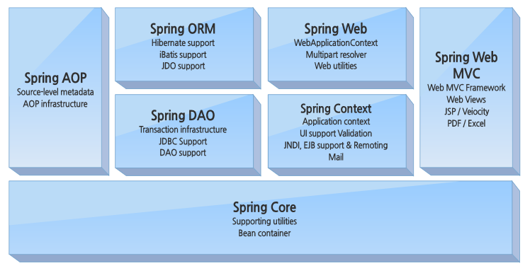
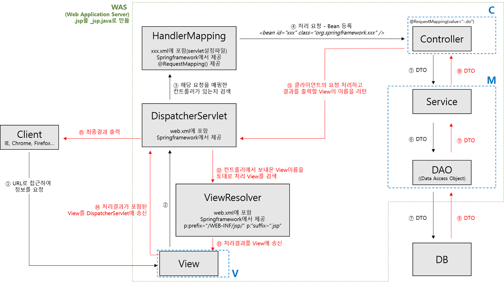

# Spring

### Spring?
- 스프링은 엔터프라이즈급 애플리케이션 개발에 필요로 하는 경량형 프레임 워크.
- 프로젝트의 규모가 커질수록 스트럿츠 보다는 스프링 프로젝트가 많이 활용이 되고 있는 추세. J2EE에서 제공하는 대부분의 기능을 지원하기 때문에 JAVA개발에 있어서 대표적인 프레임워크로 자리잡고 있으며 JDBC를 비롯하여 iBatis, 하이버네이트, JPA등 DB처리를 위해 널리 사용되는 라이브러리와 연동을 지원하고 있음. 또한 전자정부 표준프레임워크의 기반이 되는 기술이기 때문에 스프링 프레임워크의 활용도는 더욱 높아지고 있음.
- 기존 EJB(Enterprise Java Bean)는 비즈니스 객체들을 관리하는 컨테이너를 만들어서 필요할 때마다 컨테이너로부터 객체를 받는 식으로 관리하여 엔터프라이즈급 어플리케이션 개발을 단순화하기 위해 개발한 스펙이 존재하였음 -> 해당 EJB는 의존성을 해결하려 했지만 무겁고 복잡하고 비즈니스 로직에 특정 기술이 종속되는 것이 큰 문제점 존재하였음 -> 해당 접근 개념은 좋았으나 자체적 문제가 존재하였고 이러한 개념을 바탕으로 POJO를 이용한, J2EE framework인 스프링이 등장
- 애플리케이션 프레임워크로 보통 프레임워크는 애플리케이션의 특정 계층에서 동작하는 한가지 기술 분야에 집중하는데 스프링은 이와 다르게 애플리케이션 개발의 전 과정을 빠르고 편리하며 효율적으로 진행하는데 일차적인 목표를 두는 프레임 워크
- Spring의 톰캣을 포함한 다수의 웹 서버는 멀티 스레드 방식을 따름 -> 클라이언트 요청이 있을 때마다 Thread을 생성하여 요청을 처리
- 오픈소스로 구성되어 있음

>#### 주요 기술 설명 
>- 경량 컨테이너 : 스프링은 객체를 담고있는 컨테이너로써 자바 객체의 생성과 소멸과 같은 라이프사이클을 관리하고,언제든 필요한 객체를 가져다 사용할 수 있도록 해줌 // 라이프사이클은 시스템의 프로비저닝에서부터 운영 및 사용종료까지를 의미
>- DI ( Dependency Injection : 의존성 주입 ) : 별도의 설정 파일을 통해 객체들간의 의존 관계들을 설정할 수 있음, 객체들 간의 느슨한 결합을 유지하고 직접 의존하고 있는 객체를 굳이 생성하거나 검색할 필요성이 없어짐 ( 프로그래밍에서 구성요소 간의 의존 관계가 소스 코드 내부가 아닌 외부의 설정파일을 통해 정의되는 방식, 즉 유연한 확장이 가능함 ), 객체지향 원칙 중 개방 폐쇠 원칙(OCP)
>- AOP ( Aspect Oriented Programming : 측면 지향 프로그래밍 ) : 문제를 바라보는 관점을 기준으로 프로그래밍하는 기법, 문제를 해결하기 위한 핵심 관심 사항과 전체에 작용되는 공통 관심사항을 기준으로 프로그래밍 함으로써 공통 모듈을 여러 코드에 쉽게 적용 할 수 있도록 함. 스프링은 자체적으로 프록시 기반의 AOP를 지원. 적용 기법으로는 다이나믹 프록시를 같이 이용하거나 AspectJ 오픈소스 AOP 툴 사용이 존재
>- POJO ( Plain Old Java Object ) : 일반적인 자바 객체, 객체지향적이고 특정 기술과 규약, 환경에 종속적이지 않음. 
>- IoC ( Inversion of Control : 제어의 반전 ) : 스프링의 핵심. 자바의 객체 생성 및 의존관계에 있어 제어권은 개발자에게 있었으나 서블릿과 EJB가 등장하면서 기존의 제어권이 서블릿 컨테이너 및 EJB 컨테이너에게 넘어가게 됨, 스프링 프레임워크에서도 객체에 대한 생성과 생명주기를 관리할 수 있는 기능을 제공하고 있는데 이런 이유로 스프링 컨테이너 라고 부름 

 

>#### 프레임 워크란?
>- 프로그래밍에서 특정 운영 체제를 위한 응용 프로그램 표준 구조를 구현하는 클래스(유틸)의 집합 ( 정의된 API를 제공하는 Software library들의 집합 )
>- Frame(틀, 규칙) Work(일, 소프트웨어의 목적)
>- 만들어져있는 규칙에 따라 프로그래밍, 프로젝트의 맞는 프레임워크를 사용해야 함
>- 프레임워크는 특정 목적에 맞는 작업을 효율적으로 진행하기 위해 존재
>- 목적에 따라 효율적으로 구조를 짜놓는 개발 방식임
>- 하나의 애플리케이션을 구축할 때, 모든 애플리케이션의 공통적인 개발 환경을 제공 : 개발에 필요한 화면구현, DB연동, 개발환경들에 공통적인 부분을 제공
>- 설계의 기반이 되는 부분을 기술한 확장 가능한 기반 코드와 사용자가 이 코드를 수정, 확장하는데 필요한 라이브러리 이 두 가지 요소가 통합되어 제공되는 형태
>- 프레임워크는 필요한 라이브러리와 기능 구현에 필요한 설계도 틀을 함께 제공
>
>#### 라이브러리란?
>- 특정 결과를 얻기 위해 만들어둔 함수들의 집합, 공통으로 사용될 수 있는 특정한 기능들을 모듈화 해둔 것 ( 재사용하기 위한 함수들로 구성 )
>- 라이브러리는 프로그램 기능 구현에 도움을 줌
>- 프레임워크와 다른점은 개발자가 코드를 컨트롤한다 ( 개발자가 라이브러리를 호출함 !, 프레임워크는 규칙에 따라 코딩을 하니까 프레임워크가 개발자를 호출하는 느낌이라고 함! )
>
>#### SDK란?
>- SDK(Software Development Kit)으로 소프트웨어 개발 도구 모음
>- SDK 안에는 개발에 도움이 될 개발 도구 프로그램, 디버깅 프로그램, 문서, API 등이 존재
> 
> 
> 예시를 든다면 나는 일단 무인 카페 어플을 만들고 싶어 -> SDK 를 이용하여 만들었음 -> 이제 무인 카페 어플의 기능을 만들고 싶은데?? -> 프레임워크를 이용하여 정해진 규칙으로 API를 만들었어 -> 해당 API들이나 API를 만들기위해 필요한 파일, 해당 어플의 기능에 필요한 파일들을 모아놓은 소프트웨어 장소. 결국 무인 카페 어플 라이브러리가 구성되었음!

 

>>### 그외 주요 프레임워크
>>1. 스트럿츠 프레임워크 ( STRUTS Framework ) 
>>- 지바기반의 JSP만을 위한 프레임워크로, 다양한 운영체제에서 활용할 수 있으며, 오픈소스이기 때문에 개발에 필요한 부분을 수정하여 사용할 수 있음. 웹 개발은 보통 프론트엔드 영역과 백엔드 영역으로 나뉘는데, 이를 디자이너의 프론트엔드 영역과 개발자의 백엔드 영역으로 분리해서 개발을 하자는 목적으로 만들어진 기술이 MVC model2. (Model, View, Controller) 이러한 MVC기반으로 나온 프레임워크가 스트럿츠 프레임워크이며 이렇듯 MVC 모델을 이용한 웹 애플리케이션 구축을 매우 용이하기 때문에 초기에 스트럿츠 프레임워크 기반의 개발이 많이 이루어 짐
>>
>>2. 앵귤러 JS( AngularJS )
>>- 자바스크립트 기반의 프레임워크. 앵귤러 JS는 2012년에 출시되었으며, 기본적으로 MVC (Model-View-Controller) 모델 지원과 같은 다른 웹 어플리케이션 프레임워크에서도 지원하는 기능을 제공. 자바스크립트 또는 제이쿼리로 만든 코드의 길이를 더욱 단순화 할 수 있으며, 직관적으로 소스를 이해할 수 있게 함. 점점 복잡해지고 대형화 되고있는 (클라이언트 사이드 스크립트)를 (MVC 패턴)으로 규격화 함으로 해서 (프로젝트 유지보수) 비용을 최소화 할 수있기 때문에 앵귤러 JS역시 개발자 분들에게 없어서는 안 될 프레임워크
>>- 작성해야 하는 자바스크립트의 코드량을 줄여준다.
>>- 앵귤러 JS의 데이터 모델은 단순 자바스크립트 객체이다.
>>- 재사용이 쉬운 정적인 UI컴포넌트를 만들 수 있다.
>>- HTML, CSS개발자와 자바스크립트 개발자를 명확하게 분리해 준다.
>>
>>3. 장고 프레임워크 (Django Framework)
>>- 장고프레임워크란 파이썬으로 작성된 오픈 소스 웹 애플리케이션 프레임워크로 쉽고 빠르게 웹사이트를 개발할 수 있도록 돕는 구성요소로 이루어 짐. 파이썬 프로그래밍 자체가 다른 프로그래밍에 비해 배우기 쉽고 쓰기 편하게 되어 있기 때문에 개발기간을 상당히 단축시킬 수 있음. 장고프레임워크는 그에 수반되는 강력한 라이브러리들을 그대로 사용할 수 있다는 점이 가장 큰 장점.
>>- MVC 패턴 기반 MTV (기본적으로 Model-View-Controller 를 기반으로 한 프레임워크)
>>- ORM(Object-relational mapping) 기능 지원
>>- 쉬운 DB관리를 위해 프로젝트를 생성하면서 관리자기능을 제공
>>- 쉬운 URL 파싱 기능 지원
>>- 동일한 소스코드에서 다른 나라에서 용이하도록 번역, 날짜/시간/숫자 등의 포맷 타임존 지정 등의 기능을 제공

 

### 스프링 구조

#### 1. Spring Core
Spring Core는 Spring Container을 의미. core라는 말 그대로 Container는 Spring Framework의 핵심이며 그중 핵심은 Bean Factory Container. 그 이유는 바로 Bean Factory는 IOC패턴을 적용하여 객체 구성 부터 의존성 처리까지 모든 일을 처리하는 역할을 함 
 
#### 2. Spring Context
Spring context는 Spring Framework의 context 정보들을 제공하는 설정 파일. Spring Context에는 JNDI, EJB, Validation, Scheduiling, Internaliztaion 등 엔터프라이즈 서비스들을 포함
 
#### 3. Spring AOP
Spring AOP module은 Spring Framework에서 관점지향 프로그래밍을 할 수 있고 AOP를 적용 할수 있게 도와주는 Module
 
#### 4. Spring DAO
DAO란 Data Access Object의 약자로 Database Data에 접근하는 객체. Spring JDBC DAO는 추상 레이어를 지원함으로써 코딩이나 예외처리 하는 부분을 간편화 시켜 일관된 방법으로 코드를 짤 수 있게 도와줌
 
#### 5. Spring ORM
ORM이란 Object relational mapping의 약자로 간단하게 객체와의 관계 설정. Spring에서는 Ibatis, Hibernate, JDO 등 인기있는 객체 관계형 도구(OR도구)를 사용 할 수 있도록 지원
 
#### 6. Spring Web
Spirng에서 Web context module은 Application module에 내장되어 있고 Web기반의 응용프로그램에 대한 Context를 제공하여 일반적인 Web Application 개발에 필요한 기본적인 기능을 지원. 그로인해 Jakarta Structs 와의 통합을 지원
 
#### 7. Spring MVC
Spring에서는 MVC에서는 Model2 구조로 Apllication을 만들 수 있도록 지원. MVC (Model-View-Controller) 프레임 워크는 웹 응용 프로그램을 작성하기위한 완전한 기능을 갖춘 MVC를 구현. MVC 프레임 워크는 전략 인터페이스를 통해 고급 구성 가능하며 JSP, Velocity, Tiles, iText 및 POI를 포함한 수많은 뷰 기술을 지원함.

>#### 인프런 강의 정리 링크 ( 김영한 강사님의 스프링 핵심원리 - 기본편 )
>1. [스프링 컨테이너](../Inflearn/스프링핵심원리-김영한강사/SpringContainer-Bean.md)
>2. [자동 의존성 주입](../Inflearn/스프링핵심원리-김영한강사/Auto%20DI.md)
>3. [싱글톤 컨테이너](../Inflearn/스프링핵심원리-김영한강사/Singleton%20Container.md)

 

### Spring MVC 동작 순서
#### Request -> DispatcherServlet -> HandlerMapping -> Controller -> Service -> DAO -> DB -> DAO -> Service -> Controller -> DispatcherServlet -> ViewResolver -> View -> Response

>1. DispatcherServlet : 애플리케이션으로 들어오는 모든 Request를 받는 부분. Request를 실제로 처리할 Controller에게 전달하고 그 결과값을 받아서 View에 전달하여 적절한 응답을 생성할 수 있도록 흐름을 제어 ( web.xml에 설정되어 있는대로 요청을 받아옴 )
>2. HandlerMapping  : Request URL에 따라 각각 어떤 Controller가 실제로 처리할 것인지 찾아주는 역할
>3. Controller : Request를 직접 처리한 후 그 결과를 다시 DispatcherServelt에 돌려주는 역할 ( MVC 패턴은 Controller로 들어와서 Service, Dao를 거쳐 비즈니스 로직을 처리한 후 Controller에서 결과를 리턴 한다 )
>4. ModelAndView : Controller가 처리한 결과와 그 결과를 보여줄 View에 관한 정보를 담고 있는 객체
>5. ViewResolver : View 관련 정보를 갖고 실제 View를 찾아주는 역할 ( servlet-context.xml에 존재 )
>6. View : Controller가 처리한 결과값을 보여줄 View를 생성 ( 클라이언트에게 보내줌 )

 

#### Spring project 에서 사용되는 용어 혹은 파일
- src : 최근 개발 트렌드에서는 main과 test로 디렉토리 안에 존재하고 main에는 java와 resource가 존재 ( java 파일에는 패키지, 클래스 존재 resource 파일에는 정적 파일 존재 )
- build.gradle : project에서 사용되는 설정 파일
- POM ( Project Object Model ) : Maven Project의 설정 부분을 기록해 놓은 XML 형식의 파일
- project : 루트 태그, 문서의 단일한 이름을 특정하기 위해 적는 namespace
- parent : 하위프로젝트가 상위 프로젝트의 pom.xml을 상속받기 위해 사용되는 태그, 태그안의 그룹아이디, 아티팩트 아이디, 버전은 모두 상속받음
- groupId : 자바에서 패키지 이름으로 회사나 단체의 유니크한 이름을 명시. 제작자나 회사, 혹은 단체를 식별하기 위해 작성
- artifactId : 공식문서에서는 프로젝트를 부를 때 아티팩트 아이디로 부른다고 한다. 프로젝트의 이름과 같은 의미
- packaing : 프로젝트가 완성되고 소스코드를 파일로 패키징하여 배포할 때의 방법을 명시해 놓은 것, jar (Java Archive)와 war(Web Application Archive)의 두 가지 방법으로 패키징해서 배포할 수 있다. ( jar는 자바 환경 위에서 동작할 수 있는 어플리케이션, war는 웹 어플리케이션 전용의 패키징이고 웹 서버가 내장되어 있어서 웹 사이트 배포에 특화됨 )
- name : 프로그램의 이름. 일반적으로 아티팩트 아이디를 그대로 사용
- properties : pom.xml에서 사용하는 속성들에 대한 명시. 
- dependencies : 프로젝트가 참조하는 외부라이브러리들이 해당 태그로 감싸져서 명시되어 있음. 
- scope : 라이브러리가 사용되는 범위를 지정한 것. 언제 사용되는지를 명시해 놓은 것
- gradle : gradle과 관련하여 gradle을 사용하는 폴더 ( or maven )
- plugin : 빌들에서 사용할 플러그인을 명시해 놓은 것. 간단히 설명하면 추가기능으로 기본 소프트웨어를 지원해서 특수한 기능을 확장할 수 있도록 설계된 프로그램
- .idea : 프로젝트에서 사용하는 설정 파일

 

### 스프링 부트란?
- Spring framework 기반 프로젝트를 복잡한 설정 없이 쉽고 빠르게 만들어주는 라이브러리 -> 스프링을 더 쉽게 이용하기 위한 도구
- 스프링 부트는 스프링을 쉽게 사용할 수 있도록 필요한 여러가지 복잡한 설정을 대부분 미리 세팅 해놓았을 뿐만 아니라 WAS도 별도의 설절없이 바로 웹개발에 들어갈 수 있도록 만들어 둠

#### 스프링 부트의 장점
1. 라이브러리 관리 자동화 : 스프링 부트의 Starter 라이브러리를 등록해서 라이브러리 의존성을 간단히 관리
2. 라이브러리 버전 자동 관리 : 기존 스프링 라이브러리는 버전을 직접 입력해야 헀지만 스프링 부트 버전을 입력해 놓으면 spring 라이브러리 뿐만 아니라 third party 라이브러리들도 호환되는 버전으로 알아서 업데이트 및 관리해줌
3. 설정 자동화 :  @EnableAutoConfiguration 어노테이션을 선언해서 스프링에서 자주 사용했던 설정들을 알아서 등록 해줌
4. 내장 Tomcat : 스프링 부트는 WAS인 Tomcat을 내장하고 있다. @SpringBootApplication 어노테이션이 선언되어 있는 클래스의 mail()메소드를 실행하는 것만으로 서버를 구동시킬 수 있다. 내장 톰캣을 사용하기 위한 별도 설정없이 web starter 의존성만 추가해주면 됨
5. 독립적으로 실행 가능한 JAR : 웹 프로젝트는 war 파일로 패키징 해야하는데 스프링 부트는 내장 톰캣을 지원하기 때문에 jar로 패키징해서 웹 애플리케이션 실행이 가능

 

### 스프링 부트 스타터 프로젝트 종류
- spring-boot-starter-web-services : SOAP 웹 서비스 ( 다른 언어로 다른 플랫폼에서 빌드된 애플리케이션이 통신할 수 있도록 설계된 최초의 표준 프로토콜 )
- spring-boot-starter-web : Web, RESTful 응용프로그램
- spring-boot-starter-test : Unit testing, Integration Testing
- spring-boot-starter-jdbc : 기본적인 JDBC
- spring-boot-starter-hateoas : HATEOAS 기능을 서비스에 추가
- spring-boot-starter-security : 스프링 시큐리티를 이용한 인증 권한
- spring-boot-starter-data-jpa : Spring Data JPA with Hibernate
- spring-boot-starter-cache : 스프링 프레임워크에 캐싱 지원 가능
- spring-boot-starter-data-rest : Spring Data REST를 사용하여 간단한 REST 서비스 노출

 

22-07-14

-------

## Reference
- https://hoon93.tistory.com/56
- https://intro0517.tistory.com/151
- https://yoo-hyeok.tistory.com/129
- https://m.blog.naver.com/dktmrorl/222117116193
- https://12bme.tistory.com/157
- https://bamdule.tistory.com/158