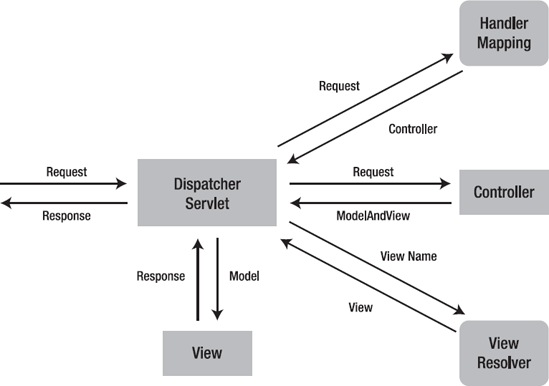

# Spring Servelt

### Servlet
- 자바를 이용하여 웹 페이지를 동적으로 생성하는 서버 측 프로그램 (자바 클래스)
- 클라이언트가 서버에 요청을 보낼 때와 응답을 받을 때 필요한 HTTP 작업을 도와주는 역할
- servlet을 사용할 때 HttpServelt을 상속받아 사용하는데 HTTP request와 response 안에 Header, Body등의 내용 입력
- 서블릿을 지원하는 WAS를 사용함으로써 개발자는 의미있는 비즈니스 로직에 중심을 두게 되고 서블릿은 HttpServeltRequest, HttpServletResponse를 통해 HTTP 통신에서 필요한 여러가지 작업을 하게됨
- HTTP 요청 시 WAS는 Request, Response 객체를 새로 만들어서 서블릿 객체를 호출하고 개발자는 Request 객체에서 HTTP 요청 정보를 편리하게 꺼내서 사용하며 Response 객체에 HTTP 응답 정보를 편리하게 입력 가능
- 정적인 웹이아닌 동적인 웹을 구현하기 위해 request와 response를 입력하고 받아오는 것이 자바코드로 작성하기위해 JSP가 등장했고, 이후 서블릿을 더 간편하고 효율적으로 활용하기 위해 스프링 MVC 프레임워크의 <code>DispatcherServlet</code>이 등장
- 서블릿 객체들을 관리하는 컨테이너를 서블릿 컨테이너(Servlet Container)이라고 하고 톰캣 처럼 서블릿을 지원하는 WAS를 서블릿 컨테이너라고 함 -> 멀티쓰레드 처리의 지원에 관한 내용이 WAS의 핵심 기능
>#### Servlet 특징
>- 서버에서 실행됨
>- 정적인 웹 프로그램을 동적으로 처리
>- 스레드 방식으로 실행
>- 자바 클래스이기에 자바의 특징을 가짐
>- 서블릿 컨테이너에서 실행됨

<br>



```
DispatcherServlet
- 프론트 컨트롤러 패턴
- DispatcherServlet이 모든 요청을 받고 DispatcherServlet에서 받은 요청을 Handler Mapping에서 요청에 맞는 컨트롤러를 찾아 반환, Handler Adaptor는 그 컨트롤러의 메서드를 호출해서 처리 로직을 실행
- 처리결과를 다시 DispatherServlet에서 받아와서 다시 DispatcherServlet은 View Resolver로 보내서 해당 응답에 맞는 뷰를 지정
- DispatcherServlet은 스프링컨테이너로부터 주입을 받아 사용하고 동작이되기 때문에 개발자가 신경써야하는 부분을 대폭 감소시킴 ( 개발자는 서블릿 컨테이너 설정만 정해주면 됨 )
- 스프링으로 웹 요청을 처리한다는 것은 스프링 MVC에서 제공하는 DispatcherServlet과 웹 요청 처리 구현체, 스프링 컨테이너로 개발하는 것임
```

#### Servlet Interface 종류
1. Servlet
    - Servlet은 서블릿 프로그램을 개발할때 반드시 구현해야 하는 메서드를 선언하고 있는 인터페이스이다. 이 표준을 구현해야 서블릿 컨테이너가 해당 서블릿을 실행할 수 있음
2. GenericServlet
    - GenericServlet은 Servlet 인터페이스를 상속하여 클라이언트-서버 환경에서 서버단의 애플리케이션으로서 필요한 기능을 구현한 추상클래스이다. service() 메서드를 제외한 모든 메서드를 재정의하여 적절한 기능으로 구현했다. GenericServlet 클래스를 상속하면 애플리케이션의 프로토콜에 따라 메서드 재정의 구문을 적용해야 함
3. HttpServlet
    - 일반적으로 서블릿이라하면 거의 대부분 HttpServlet을 상속받은 서블릿을 의미한다. HttpServlet은 GenericServlet을 상속받았으며, GenericServlet의 유일한 추상 메서드인 service를 HTTP 프로토콜 요청 메서드에 적합하게 재구현해둠
    - 이미 DELETE, GET, HEAD, OPTIONS, POST, PUT, TRACE를 처리하는 메소드가 모두 정의되어 있음

<br>

#### 기존 HTTP 작업 순서

1. 웹 브라우저 HTTP 메시지를 이용한 요청
2. 서버에서 처리
    - 서버 TCP/IP 연결 대기, 소켓 연결
    - HTTP 요청 메시지를 파싱해서 읽음
    - HTTP 요청종류(메서드) 확인 ( POST, GET )
    - Content-Type 확인
    - HTTP 메시지 바디 내용 파싱
    - 저장 프로세스 실행
    - 비즈니스 로직 실행 -> 데이터베이스에 저장 요청
    - HTTP 응답 메시지 생성
    - TCP/IP에 응답 전달, 소켓 종료
- 위의 과정을 보면 서버가 수행해야하는 일들이 매우 많은데 비즈니스 로직을 제외하고 서블릿이 처리해줌!

<br>

### 서블릿 컨테이너의 역할
#### 1. 웹 서버와의 통신 지원
- 서블릿 컨테이너는 서블릿과 웹 서버가 쉽게 통신할 수 있게 해줌
- 소켓 기능들을 API로 제공하여 복잡한 과정을 생략하고 개발자는 구현해야할 비즈니스 로직에 대해서만 초점을 맞추면 됨
#### 2. 서블릿 생명주기 관리
- 서블릿 컨테이너는 서블릿의 탄생과 죽음을 관리
- 서블릿 클래스를 로딩하여 인스턴스화하고 초기화메소드를 호출하고 요청이 들어오면 적절한 서블릿 메소드 호출
#### 3. 멀티쓰레드 지원 및 관리
- 서블릿 컨테이너는 요청이 올때마다 새로운 자바 쓰레드를 생성
- HTTP 서비스 메소드를 실행한 후 쓰레드는 자동으로 종료. 해당 관리를 컨테이너가 알아서 해줌
#### 4. 선언적인 보안 관리
- 보안관리는 XML배포 서술자에 기록하므로 보안적 문제로 인해 자바 소스를 수정할 일이 없음

<br>

#### 서블릿 동작 과정
1. 사용자가 URL을 클릭하면 HTTP Request를 Servlet Container에 보냄
2. Servlet Container는 HttpServletRequest, HttpServletResponse 두 객체를 생성
3. 사용자가 요청한 URL을 분석하여 어느 서블릿에 대한 요청인지 찾음 -> Spring 에서는 요청이 들어오면 DispatcherServlet이 생성되어 요청, 응답에 대해 어떻게 할지 결정함
4. 컨테이너는 서블릿 service() 메소드를 호출하며, POST/GET 여부에 따라 doGet() 또는 doPost()가 호출
5. doGet() 이나 doPost() 메소드는 동적인 페이지를 생성한 후 HttpServletResponse 객체에 응답을 보냄
6. 응답이 완료되면 HttpServletRequest, HttpServletResponse 두 객체를 소멸

<br>

#### 서블릿 생명 주기
1. 클라이언트 요청이 들어오면 컨테이너는 해당 서블릿이 메모리에 있는지 확인하고 없을경우 init() 메소드를 호출해 적재, init()는 최초 한번만 실행되기 때문에 서블릿의 쓰레드에서 공통적으로 사용해야 하는 것이 있다면 오버라이딩하여 구현
2. init()이 호출된 후 클라이언트의 요청에 따라서 service 메소드를 통해 대한 응답이 doGet, doPost로 분기, 이때 서블릿 컨테이너가 클라이언트의 요청이 오면 가장 먼저 처리하는 과정으로 HttpServletRequest, HttpServletResponse에 의해 request와 response 객체가 제공됨
3. 컨테이너가 서블릿에 종료 요청을 하면 destroy() 메소드 호출되는데 한번만 실행되며, 종료시에 처리해야하는 작업들은 destroy() 메소드를 오버라이딩하여 구현

<br>

#### 서블릿 컨테이너와 멀티쓰레드
- 클라이언트가 서버에 HTTP 요청 -> 요청을 서버에서 연결을 받고 WAS(서블릿컨테이너)에서 Servlet객체 호출하여 HTTP 처리
- 위의 과정에서 서블릿 객체를 호출하는 주체는 쓰레드
- 모든 요청마다 쓰레드를 생성하면 동시 요청은 처리할수 있지만 쓰레드 생성 비용이 많이 들기 때문에 컨텍스트 스위칭(Context Switching) 비용이 발생
- 지나치게 많은 요청이 들어오면 쓰레드를 무한정 생성해야 하기 때문에 CPU의 한계를 넘어서서 서버가 다운될 수 있는 상황을 초래
- 위의 경우를 방지하기 위해 WAS는 <code>쓰레드 풀(Thread Pool)</code>이라는 개념 사용

<br>


```
Thread Pool
- 처음에 일정한 수의 쓰레드를 미리 생성해놓고 클라이언트의 요청이 오면 쓰레드 풀안에 있는 쓰레드를 할당하고 쓰레드가 클라이언트의 요청을 처리하면 해당 쓰레드를 다시 반납받음
- 쓰레드를 미리 생성해 놓음으로써 쓰레드를 생성하고 종료하는 비용절약, 응답 시간이 빨라지는 장점을 얻을 수 있음
- 쓰레드가 모두 사용 중인 상황에서는 기다리는 요청에 대해 특정 숫자만큼 대기하도록 설정 가능
- WAS의 핵심은 멀티 쓰레드 지원을 통한 동시 요청 처리를 해준다는데 있음 -> 개발자가 설정을 통해 멀티쓰레드를 사용할 수 있게 해줌
```

<br>

<div style="text-align: right">22-07-19</div>

-------

## Reference
- https://kohen.tistory.com/29
- https://junroot.github.io/programming/Servlet과-Spring/
- https://kingofbackend.tistory.com/22
- https://studyandwrite.tistory.com/459
- https://12bme.tistory.com/555