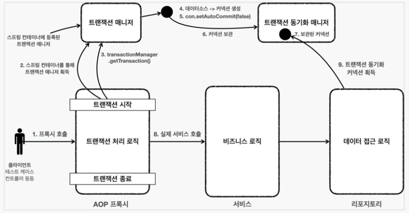

# Spring Transaction

### Transaction
- 트랜잭션은 여러 작업을 진행하다가 문제가 생겼을 경우 이전 상태로 롤백하기 위해 사용되는 것
    - commit : 작업 변경 사항 확정. 작업을 마무리 함
    - rollback : 작업을 취소하고 이전의 상태로 돌림
- 더 이상 쪼갤 수 없는 최소 작업 단위
- 트랜잭션의 성질, ACID
    - Atomicity; 원자성: 트랜잭션 내의 작업들은 모두 성공 또는 모두 실패한다.
    - Consistency; 일관성: 모든 트랜잭션은 일관성 있는 DB 상태를 유지한다. (ex: DB의 무결성 제약 조건 항상 만족)
    - Isolation; 격리성: 동시에 실행되는 트랜잭션들은 서로 영향을 미치지 않는다. (ex: 동시에 같은 데이터 수정 X)
    - Durability; 지속성: 트랜잭션이 성공적으로 끝나면 그 결과는 항상 기록되어야 한다.
- [Transaction 정리](../../CS-topic/DB/Transaction.md)

<br>

### Spring Transaction
- 스프링 이전에 특정 작업에 트랜잭션을 적용하기 위해서는 비즈니스 로직을 처리하는 Service에서 트랜잭션을 적용해야 하는데 그러면 해당 문제가 발생
    - 깔끔하던 Service 코드가 복잡해짐
    - 데이터 액세스 기술에 의존적인 코드를 작성
    - 비즈니스 로직과는 다른 관심사의 일을 수행
- 위의 문제를 해결하기 위해 스프링 트랜잭션 기술은 다음 과정을 거침
    - 트랜잭션 동기화
    - 트랜잭션 추상화
    - 선언적 트랜잭션 OR 프로그래밍 트랜잭션
- 비즈니스 로직과 트랜잭션 처리 로직이 동시에 존재하면 코드의 중복이 생길 수 있고 비즈니스 로직에만 집중하기 어려우므로 Spring은 2가지 트랜잭션 기술을 지원
    - TransactionTemplate, PlatformTransactionManager 구현체 사용 (프로그래밍적 트랜잭션)
    - @Transactional Annotation (선언적 트랜잭션)

<br>



### 스프링 트랜잭션 흐름
1. Client가 API 호출
2. 프록시 실행
3. 트랜잭션 코드 실행
4. 비즈니스 로직 실행
5. 트랜잭션 코드 실행 (commit/rollback)
- 클라이언트 -> AOP 프록시 -> 서비스 -> 레포지토리

<br>

### 트랜잭션 동기화
1. Service에서 생성한 Connection을 저장
    - DataSourceUtils를 이용해 Connection을 생성
    - TransactionSynchronizationManager에 저장
    - 해당 Connection을 저장했기 때문에 이제 Connection을 파라미터로 전송할 필요가 없어짐
2. Transaction이 존재할 경우 가져다 쓰고, 존재하지 않으면 새로 등록해서 사용
3. Transaction 동기화가 active일 경우 현재 스레드에 바인딩된 Connection을 알 수 있음
4. Transaction이 끝나면 thread에서 사용되던 connection을 종료
- 결론적으로 JDBC Template가 DataSourceUtils를 사용하여 connection을 가져오거나 생성
    - 아직 Data access 기술에 의존적으로 스프링에서 지원하는 트랜잭션 추상화를 사용해야 함

<br>

### 트랜잭션 추상화
- Transaction은 데이터 접근 기술마다 사용하는 연결방법이 다르기 떄문에 문제가 발생
    - JDBC : DataSourceUtils -> Connection
    - JPA : EntityManagerFactory -> EntityManager
    - Hibernate : SessionFactoryUtils -> Session
- 그러나 가져오는 Transaction의 형태만 다를 뿐이고, 트랜잭션을 가져오거나 생성하고 트랜잭션을 commit, 혹은 rollback하는 과정은 같기 때문에 추상화가 가능함
- 그래서 스프링은 PlatformTransactionManager 인터페이스를 이용하여 트랜잭션 가져오는 방법을 추상화함
    - PlatformTransactionManager : 스프링 트랜잭션에서 추상화를 적용하기 위한 스프링 트랜잭션 매니저의 핵심 인터페이스
- TransactionSynchronizationManager.getResource를 통해 어떤 구현체를 쓰던 트랜잭션을 가져올 수 있음
- TransactionManager의 종류는 다음과 같고 DI하여 사용한다
    - DataSourceTransactionManager : JDBC 및 MyBatis 등의 JDBC 기반 라이브러리로 데이터베이스에 접근하는 경우에 이용, 이 트랜잭션 매니저는  트랜잭션을 적용할 DataSource가 스프링의 빈으로 등록되어야 함
    - HibernateTransactionManager : 하이버네이트를 이용해 데이터베이스에 접근하는 경우에 이용
    - JpaTransactionManager : JPA로 데이터베이스에 접근하는 경우에 이용. JpaTransactionManager는 LocalContainerEntityManagerFactoryBean타입의 빈을 등록해주어야 함
    - JtaTransactionManager : 하나 이상의 DB 나 글로벌 트랜잭션을 적용하려면 JTA 이용
- 기본 트랜잭션 속성으로 트랜잭션을 생성함
```java
public interface PlatformTransactionManager extends TransactionManager {

	TransactionStatus getTransaction(@Nullable TransactionDefinition definition)
			throws TransactionException;

	void commit(TransactionStatus status) throws TransactionException;

	void rollback(TransactionStatus status) throws TransactionException;
}
```

<br>

### 선언적 트랜잭션
- 선언적 트랜잭션은 코드에는 전혀 영향을 주지 않으면서 특정 메소드 실행 전후에 트랜잭션이 시작되고 종료되거나 기존 트랜잭션에 참여하도록 만들 수 있음
- 선언적 트랜잭션은 타겟 오브젝트의 메서드부터 탐색함
    - 따라서 Service를 상속받는 모든 클래스, 메서드에 동일한 트랜잭션 속성을 부여할 수 있음
- 보통의 경우에는 트랜잭션 속성을 메소드 단위로 다르게 지정할 수 있어 매우 세밀한 트랜잭션 속성 제어가 가능하고 직관적으로 이해하기 좋아 선언적 트랜잭션을 이용한다
- @Transactional 을 이용하여 비즈니스로직이 아닌 코드를 완벽하게 분리 가능하게 됨
    - 스프링 AOP를 통해 구현되어 있음. 
    - AOP 프록시를 통해 활성화되고, 트랜잭션 관련 메타데이터를 참조하여 생성함 (@Transactional 선언하여 사용하면 트랜잭션 기능이 적용된 프록시 객체 생성)
- 최종적으로 부가기능을 분리하여 순수한 비즈니스 로직만 코드에 담을 수 있음
- 해당 어노테이션을 이용하려면 @EnableTransactionManagement을 추가해주어야함

<br>

### 프로그래밍적 트랜잭션
- 프로그래밍적 트랜잭션은 TransactionTemplate와 PlatformTransactionManager 구현체를 직접 사용하는 방법으로 두가지가 있지만 스프링팀은 프로그래밍 방식 트랜잭션 관리에 있어 TransactionTemplate 사용을 권장
- 트랜잭션 단위를 메서드 내에서 지정하고 싶거나, self invocation(자기 호출)에서 트랜잭션을 적용하고 싶을 때 주로 사용한다
- TransactionTemplate 클래스를 사용. 탬플릿 콜백 패턴을 사용하여 API를 이용가능. 람다 표현식 이용 가능
```java
    public class SimpleService implements Service {     // single TransactionTemplate shared amongst all methods in this instance

        private final TransactionTemplate transactionTemplate;     // use constructor-injection to supply the PlatformTransactionManager

        public SimpleService(PlatformTransactionManager transactionManager) {        
            Assert.notNull(transactionManager, "The 'transactionManager' argument must not be null.");
            this.transactionTemplate = new TransactionTemplate(transactionManager);    
        }     

        public Object someServiceMethod() {        
            return transactionTemplate.execute(new TransactionCallback() {            // the code in this method executes in a transactional context
                public Object doInTransaction(TransactionStatus status) {
                    updateOperation1();           
                    return resultOfUpdateOperation2();            
                }        
            });    
        }
    }
```

<br>

### 트랜잭션 속성 (Transaction Properties)
- propagation : 트랜잭션을 시작하거나 기존 트랜잭션에 참여하는 방법을 결정하는 속성 (트랜잭션 전파)
    ```
    - REQUIRED : 전파의 기본 속성, 트랜잭션이 있으면 참여하고 없으면 새로 시작
    - MANDATORY : 트랜잭션이 있으면 참여하고 없으면 예외 발생
    - REQUIRED_NEW : 항상 새로운 트랜잭션을 시작, 진행중인 트랜잭션이 있다면 트랜잭션 잠시 보류
    - SUPPORT : 이미 트랜잭션이 있으면 참여, 그렇지 않으면 트랜잭션 없이 진행
    - NESTED : 이미 진행 중인 트랜잭션이 있다면 중첩 트랜잭션 시작, 부모 트랜잭션 커밋, 롤백엔 영향을 받으나 자신의 커밋, 롤백은 부모 트랜잭션에 영향을 주지 못함
    - NEVER : 트랜잭션을 사용하지 않게 함, 트랜잭션이 존재하면 예외를 발생
    - NOT_SUPPORTED : 트랜잭션을 사용하지 않게 함, 트랜잭션이 있다면 보류함
    ```
- isolation : 여러 트랜잭션이 진행될 때에 트랜잭션의 작업 결과를 타 트랜잭션에게 어떻게 노출할지 결정 (트랜잭션 격리 수준)
    ```
    - default : 사용하는 데이터 접근 기술, DB 드라이버의 기본 설정. Oracle은 READ_COMMITED, Mysql은 REPEATABLE_READ를 기본 격리 수준으로 가짐
    - READ_UNCOMMITTED : 트랜잭션의 격리 수준으로 커밋되지 않아도 노출됨. 성능을 극대화 할 때 주로 사용
    - READ_COMMMITED : 트랜잭션의 격리 수준으로 커밋되지 않으면 노출되지 않음. 있는 시점에 따라서 데이터가 변경될 수 있음
    - REPEATABLE_READ : 읽은 Row 수정 반영 되지 않음. 트랜직션 시작 시점의 스냅샷을 저장해두고 종료시 까지 해당 스냅샷을 이용함. 그렇기 때문에 다른 트랜잭션이 값을 변경했어도 해당 트랜잭션이 끝나기 전까지는 저장해둔 스냅 샷의 정보를 확인함
    - SERIALZABLE : 트랜잭션이 끝나기 전까지는 다른 트랜잭션이 실행되지 않는다. 트랜잭션은 순차적으로 진행한다. 극단적으로 안정한 작업이 필요할 때 주로 사용
    ```
- read-only : 트랜잭션 내에서 데이터를 조작하려는 시도를 막음. 데이터 접근 기술, 사용 DB에 따라 적용 차이가 있음
- timeout : 트랜잭션을 수행하는 제한 시간을 설정할 수 있음. 기본 옵션에는 제한시간이 없음
- rollback-for : 기본적으로 RuntimeException시 롤백. 체크 예외지만 롤백 대상으로 삼고 싶다면 사용
- no-rollback-for : 롤백 대상인 RuntimeException을 커밋 대상으로 지정

<br>

### 테스트와 @Transaction
- 테스트 환경에서는 @Transactional이 약간 다르게 동작하는데 성공/실패 결과와는 다르게 테스트 메서드가 종료되면 무조건 롤백됨
- 테스트가 아닌 메인에서 확인하고 싶다면 TransactionSynchronizationManager 클래스 활용

<br>

## 질문

### 1. @Transactional(readOnly = true) 기능
- 트랜잭션이 읽기 전용임을 지정하며 성능 최적화를 위해 사용됨
    - 기존 @Transactional은 Hibernate 에서 스냅샷을 기록하여 변경 감지 매커니즘이 적용되는데 'readOnly=true'의 경우 변경되지 않으므로 스냅샷 생성 최소화하거나 생략하여 성능을 향상
- 쓰기 작업 방지 : 읽기 전용 트랜잭션에서는 데이터 수정, 삭제, 삽입 작업이 금지되어 데이터 무결성을 보장하는데 도움이 됨
- 플러시 모드 변경 : Hinbernate의 경우 'readOnly=true'로 설정된 트랜잭션은 플러시 모드를 'FlushMode.MANUAL'로 설정하여 변경 내역을 자동으로 플러시 하지 않아 성능 향상에 기여 가능
- 만약 @Transactional(readOnly = true) 블럭 안에서 엔티티가 변경되는 상황시 'readOnly=true' 트랜잭션에서 변경사항을 감지했더라도 'FlushMode.MANUAL'이 적용되므로 엔티티 매니저는 트랜잭션이 종료될 때 까지 변경된 엔티티를 플러시하지 않음
    - 영속성 컨텍스트에서는 엔티티의 변경사항을 파악해도 엔티티 매니저가 변경 엔티티를 플러시 하지 않으므로 데이터베이스에 반영되지 않음

```java

@Service
public class MyService {
    @Autowired
    private EntityManager entityManager;

    @Transactional(readOnly = true)
    public void readOnlyTransaction() {
        MyEntity entity = entityManager.find(MyEntity.class, 1L);
        entity.setName("New Name"); // 엔티티 상태 변경
        // 여기서는 flush()를 호출하지 않으므로 변경 사항이 데이터베이스에 반영되지 않음
    }

    @Transactional
    public void readWriteTransaction() {
        MyEntity entity = entityManager.find(MyEntity.class, 1L);
        entity.setName("New Name"); // 엔티티 상태 변경
        // 이 트랜잭션은 읽기 전용이 아니므로, 트랜잭션 종료 시점에 변경 사항이 자동으로 데이터베이스에 반영됨
    }
}
```

<br>

### 2. 읽기에 트랜잭션을 거는 이유 및 @Transactional을 안 붙이면 되는게 아닌지
- @Transactional 어노테이션 없이도 조회는 가능하지만 사용하는 이유는 아래와 같음
- 트랜잭션은 ACID(Atomicity, Consistency, Isolation, Durability) 속성을 보장하므로 읽기 트랜잭션을 사용하면, 다른 트랜잭션이 데이터를 변경하는 동안에도 일관된 데이터를 읽을 수 있음
- 트랜잭션은 데이터베이스의 격리 수준을 설정 가능. 이를 통해 읽기 작업이 다른 트랜잭션의 영향을 받지 않도록 할 수 있음
- 위의 설명 처럼 트랜잭션 경계 내에서는 영속성 컨텍스트가 활성화되어 1차 캐시가 사용되므로 동일한 트랜잭션 내에서 동일한 엔티티를 여러 번 조회할 때 데이터베이스에 반복적으로 접근하지 않고 1차 캐시에서 데이터를 가져올 수 있어 성능이 최적화
- 엔티티의 연관된 데이터를 지연 로딩(Lazy Loading)할 때 트랜잭션이 필요. 트랜잭션이 없으면 지연 로딩된 연관 데이터를 가져오지 못할 수 있음
- 읽기 작업 중에도 예외가 발생할 수 있으며 트랜잭션을 사용하면 예외 발생 시 자동으로 롤백하여 데이터베이스 상태를 일관되게 유지할 수 있음
- @Transactional(readOnly = true) 어노테이션을 사용하면 해당 메서드가 읽기 전용 작업임을 명확하게 표시할 수 있음

<br>

<div style="text-align: right">22-09-11</div>

-------

## Reference
- 스터디원 sonlose 발표자료 참조
- https://yeonyeon.tistory.com/223
- [10분 테코톡 - 후니의 스프링 트랜잭션](https://www.youtube.com/watch?v=cc4M-GS9DoY)
- https://yeonyeon.tistory.com/223
- https://gngsn.tistory.com/152
- https://jiwondev.tistory.com/154