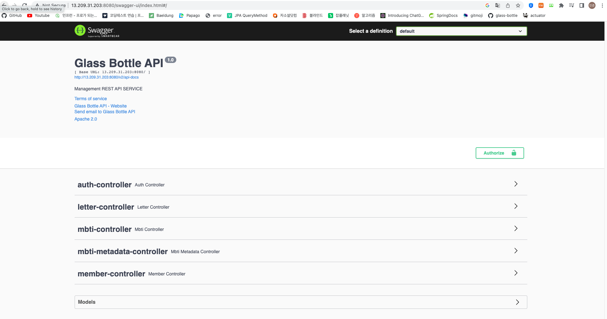

# Swagger

### Swagger 란?

- 백엔드 개발에 있어 Web API를 문서화하기 위한 도구
- 간단한 설정으로 프로젝트의 API 목록을 웹에서 확인 및 테스트 가능하게 하는 라이브러리이며, 특히 RESTful API를 문서화시키고 관리 가능
  - 일반적으로 Rest API 문서화를 위해 사용
- SpringBoot에서는 Swagger를 사용하면 문서 수정을 자동화가 가능
- Spring-fox, Spring-Doc 2가지가 존재하며 현재는 spring fox은 업데이트가 되지 않아 spring-doc이 꾸준히 업데이트 되고 있어 사용한다면 spring-doc을 추천
  - 해당 글을 작성할 때는 Spring-fox를 사용했으나 현재는 spring-doc을 사용
  - 각각 구현체가 다른 라이브러리로 설정과 의존성 부분에서 차이가 있고 문서화를 적용하는 실제 코드 상의 사용법은 동일

<br>

### spring-doc 설정 사용 방법

- 의존성을 추가하고 SwaggerConfig.class 설정을 추가
- OpenAPI 객체를 사용하여 설정 관리

```java
@Configuration
@RequiredArgsConstructor
public class SwaggerConfig {
    @PostConstruct
    public void init() {
        SpringDocUtils.getConfig().addRequestWrapperToIgnore(AuthUser.class);
    }

    @Bean
    public OpenAPI openAPI() {
        return new OpenAPI()
                .components(
                        new Components()
                                .addSecuritySchemes(
                                        READYS_AUTH_HEADER_KEY,
                                        new SecurityScheme()
                                                .type(SecurityScheme.Type.APIKEY)
                                                .in(SecurityScheme.In.HEADER)
                                                .name(READYS_AUTH_HEADER_KEY)
                                                .description("인증이 필요한 경우 ex) X-READYS-AUTH-TOKEN xxxxxxx")
                                )
                )
                .security(List.of(new SecurityRequirement().addList(READYS_AUTH_HEADER_KEY)))
                .info(swaggerInfo());
    }

    // title : 문서화 타이틀
    // description : 설명, html로 작성 가능
    // version : 버전 명시
    //
    private Info swaggerInfo() {
        return new Info().title("Readys API").description("url shortener");
    }

    // 그룹별 문서화 지정 (Controller 별 문서화 지정)
    // pathsToMatch 를 사용하여 특정 패턴에 맞는 요청만 문서화가 가능
    @Bean
	public GroupedOpenApi allApi() {
		return GroupedOpenApi.builder().group("selab-all").pathsToMatch("/**").build();
	}

	@Bean
	public GroupedOpenApi adminApi() {
		return GroupedOpenApi.builder().group("selab-admin").pathsToMatch("/admin/**").build();
	}

	@Bean
	public GroupedOpenApi userApi() {
		return GroupedOpenApi.builder().group("selab-user").pathsToMatch("/user/**").build();
	}

	@Bean
	public GroupedOpenApi fileApi() {
		return GroupedOpenApi.builder().group("selab-file").pathsToMatch("/file/**").build();
	}

}
```

<br>

### Spring-doc 적용

- Swagger 적용될 컨트롤러에는 @Tag 어노테이션을 통해 등록
- 컨트롤러 메서드에 @Operation을 사용하여 메서드에 대한 정보를 문서화로 등록
- 사용되는 DTO, VO, DAO 객체에 @Schema 어노테이션을 통해 해당 클래스나 변수에 대한 정보를 문서화로 등록
- 마찬가지로 문서화 등록 중 html로 등록이 가능

<br>

### Spring-fox 설정 방법

- 다음 방식은 action 프로젝트에서 사용한 방식으로 설정해둔 어노테이션을 사용하여 직접 추가.
- 의존성 추가
  - implementation 'io.springfox:springfox-boot-starter:3.0.0'
- Swagger Config class 생성.

```java
// springfox
@Configuration
public class SwaggerConfig {

    @Bean
    public Docket api() {   // Docket: Swagger 설정의 핵심이 되는 Bean
        return new Docket(DocumentationType.OAS_30)
                .useDefaultResponseMessages(false)  // useDefaultResponseMessages: Swagger 에서 제공해주는 기본 응답 코드 (200, 401, 403, 404). false 로 설정하면 기본 응답 코드를 노출하지 않음
                .select()
                .apis(RequestHandlerSelectors.withMethodAnnotation(ApiOperation.class)) // apis: api 스펙이 작성되어 있는 패키지 (Controller) 를 지정
                .paths(PathSelectors.any())         // paths: apis 에 있는 API 중 특정 path 를 선택
                .build()
                .apiInfo(apiInfo());                // apiInfo:Swagger UI 로 노출할 정보
    }

    private ApiInfo apiInfo() {
        return new ApiInfoBuilder()
                .title("Selab Auction Api")     // 서비스명
                .description("회원이 상품을 등록하고 해당 상품에 대한 경매 진행")       // API 설명
                .version("1.0")             // API 버전
                .build();
    }
}
```

### Spring-fox

- 다음 방식은 glass-bottle에서 지인의 자동화 설정을 통한 구현방식
- 의존성 추가 동일
  - implementation 'io.springfox:springfox-boot-starter:3.0.0'
- 설정 자동화. 해당 방식은 [DongGeon0908](https://github.com/DongGeon0908)님의 방식 참조

```java
@Configuration
@EnableWebMvc
public class SwaggerConfig {
    private static final Set<String> DEFAULT_PRODUCES_AND_CONSUMES = new HashSet<>(
            Arrays.asList("application/json", "application/xml")
    );

    private SecurityContext securityContext() {
        return SecurityContext.builder()
                .securityReferences(defaultAuth()).build();
    }

    private List<SecurityReference> defaultAuth() {
        AuthorizationScope authorizationScope = new AuthorizationScope("global", "accessEverything");
        AuthorizationScope[] authorizationScopes = new AuthorizationScope[1];
        authorizationScopes[0] = authorizationScope;
        return List.of(new SecurityReference("JWT", authorizationScopes));
    }

    private ResolvedType typeResolver(Class<?> clazz) {
        return new TypeResolver().resolve(clazz);
    }

    @Bean
    public Docket api() {
        return new Docket(DocumentationType.SWAGGER_2)
                .enable(true)
                .useDefaultResponseMessages(false)
                .alternateTypeRules(AlternateTypeRules.newRule(typeResolver(Pageable.class), typeResolver(SwaggerPageable.class)))
                .ignoredParameterTypes(
                        WebSession.class,
                        ServerHttpRequest.class,
                        ServerHttpResponse.class,
                        ServerWebExchange.class
                )
                .apiInfo(new ApiInfo(
                        "Glass Bottle API",
                        "Management REST API SERVICE",
                        "1.0",
                        "urn:tos",
                        new Contact(
                                "Glass Bottle API",
                                "https://github.com/selab-hs/glass-bottle",
                                "wrjssmjdhappy@gmail.com"
                        ),
                        "Apache 2.0",
                        "http://www.apache.org/licenses/LICENSE-2.0",
                        new ArrayList<>()
                ))
                .produces(DEFAULT_PRODUCES_AND_CONSUMES)
                .consumes(DEFAULT_PRODUCES_AND_CONSUMES)
                .securitySchemes(List.of(new ApiKey("JWT", "Authorization", "header")))
                .select()
                .paths(PathSelectors.regex("/api/.*"))
                .build();
    }

    public String[] whiteListInSwagger() {
        return new String[]{
                "/swagger",
                "/swagger-ui/springfox.css",
                "/swagger-ui/swagger-ui-bundle.js",
                "/swagger-ui/springfox.js",
                "/swagger-ui/swagger-ui-standalone-preset.js",
                "/swagger-ui/swagger-ui.css",
                "/swagger-resources/configuration/ui",
                "/swagger-ui/favicon-32x32.png",
                "/swagger-resources/configuration/security",
                "/swagger-resources",
                "/v2/api-docs",
                "/swagger-ui/index.html",
                "/favicon.ico"
        };
    }

    @Data
    public static class SwaggerPageable {
        private Integer page;
        private Integer size;
    }
}
```

- 이후 확인은 자신의 url에서 /swagger-ui/index.html을 추가하여 확인 가능

<br>



<br>

### 문서화 적용 방법

- 이후 확인은 자신의 url에서 /swagger-ui/index.html을 추가하여 확인 가능
  - ex) localhost:8080/swagger-ui.html/

<br>

```java
@Slf4j
@RestController
@RequestMapping("/admin")
@Tag(name = "어드민 컨트롤러", description = "회원 목록과 상세보기, 등록, 수정, 삭제등 전반적인 회원 관리를 처리하는 클래스")
public class AdminUserController {

    @Operation(summary = "회원목록", description = "회원의 <big>전체 목록</big>을 반환")
	@ApiResponses(value = { @ApiResponse(responseCode = "200", description = "회원목록 조회 성공"),
			@ApiResponse(responseCode = "404", description = "페이지없음"),
			@ApiResponse(responseCode = "500", description = "서버에러") })
	@GetMapping(value = "/user")
	public ResponseEntity<?> userList() {
		log.debug("userList call");
		try {
			List<MemberDto> list = memberService.listMember(null);
			if (list != null && !list.isEmpty()) {
				HttpHeaders headers = new HttpHeaders();
				headers.setContentType(new MediaType("application", "json", StandardCharsets.UTF_8));
				return ResponseEntity.ok().headers(headers).body(list);
			} else {
				return ResponseEntity.status(HttpStatus.NO_CONTENT).build();
			}
		} catch (Exception e) {
			return exceptionHandling(e);
		}

	}

    // @Hidden 을 통해 모든 인원이 문서화를 보는 것을 방지
	@Operation(summary = "회원등록", description = "회원의 정보를 받아 데이터베이스에 등록.")
    @Hidden
    @PostMapping(value = "/user")
	public ResponseEntity<?> userRegister(
			@RequestBody(description = "등록할 회원정보.", required = true, content = @Content(schema = @Schema(implementation = MemberDto.class))) @RequestBody MemberDto memberDto) {
		log.debug("userRegister memberDto : {}", memberDto);
		try {
			memberService.joinMember(memberDto);
			List<MemberDto> list = memberService.listMember(null);
			HttpHeaders headers = new HttpHeaders();
			headers.setContentType(new MediaType("application", "json", StandardCharsets.UTF_8));
			return ResponseEntity.ok().headers(headers).body(list);
		} catch (Exception e) {
			return exceptionHandling(e);
		}
	}
}

// 사용 DTO 문서화
@Schema(title = "MemberDto (회원정보)", description = "회원의 아이디, 비번, 이름을 가진 Domain Class")
public class MemberDto {

	@Schema(description = "회원아이디", requiredMode = Schema.RequiredMode.REQUIRED, example = "as1234")
	private String userId;
	@Schema(description = "회원이름", example = "홍길동")
	private String userName;
	@Schema(description = "회원비밀번호")
	private String userPwd;
	@Schema(description = "이메일아이디")
	private String emailId;
	@Schema(description = "이메일도메인", defaultValue = "naver.com", example = "google.com")
	private String emailDomain;
	@Schema(description = "가입일", defaultValue = "현재시간")
	private String joinDate;
	@Schema(description = "refreshToken", defaultValue = "")
	private String refreshToken;

    // ... getter 등등
}
```

<br>

### 후기

- swagger 3.0을 사용하였는데 spring-fox에 대해 문제가 많이 발생한다. 업데이트가 이후 거의 진행되지 않아 actuator 사용시에 endpoint 접근 방식에서 문제, 스프링 버전과도 문제 등이 발생

<br>

### 참조링크

- https://lucas-owner.tistory.com/28
- SSAFY SWAGGER HI 강사님 강의
