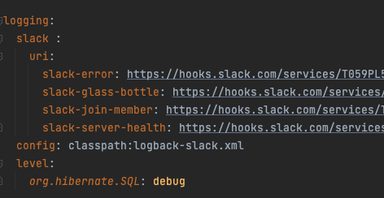
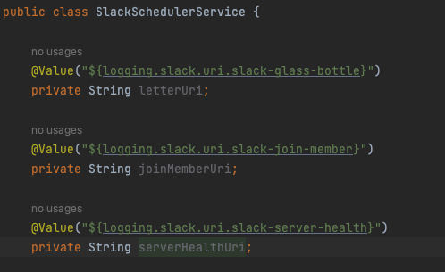

# @Value vs @ConfigurationProperties

### 사용 이유
- *.properties , *.yml 파일에 있는 property를 자바 클래스에 값을 가져와서(바인딩) 사용할 수 있게 해주는 어노테이션
- 스프링의 properties나 yaml에 있는 값들은 애플리케이션이 실행되면서 환경변수로 Environment에 등록이 되고 해당 값들을 꺼내서 애플리케이션에서 활용하기 위한 방법들

 

### @Value
- 단일 값을 주입받기 위해 사용
- @Value를 이용해 값을 가져올 때에는 RelaxedBinding가 적용되지 않음.
    - Relaxed Binding이란 프로퍼티 값의 이름이 조금 달라도 유연하게 바인딩을 시켜주는 규칙

 

### @ConfigurationProperties
- 프로퍼티에 있는 값을 클래스로 바인딩하기 위해 사용되는 어노테이션
- @ConfigurationProperties는 값의 바인딩을 위해 Setter를 필요로 하며 생성자로 바인딩하기 위해서는 @ConstructorBinding을 붙여주어야 한다
- @ConfigurationProperties를 사용하기 위해서는 @EnableConfigurationProperties에 해당 클래스를 지정해주거나 @ConfigurationPropertiesScan를 통해 스캐닝의 대상이 되도록 해주어야 한다
- RelaxedBinding이 적용되는 규칙들로는 다음과 같은 것들이 있다. 이러한 4가지 표기법들은 @ConfigurationProperties로 값이 바인딩될 때 RelaxedBinding에 의해 올바르게 바인딩이 된다
    - logging.slack.uri.slack-error : properties 와 .yml에 권장되는 표기법
    - logging.slack.uri.slackError : 표준 카멜 케이스 문법
    - logging.slack.uri.slack_error : .properties와 .yml 에서 사용가능한 표기법 ( - 표기법이 더 표준임)
    - LOGGING_SLACK_URI_SLACK_ERROR : 시스템 환경 변수를 사용할 때 권장되는 표기법
- glass-bottle 프로젝트에서는 해당 방식을 사용하였음

 

### 사용

- yml에 저장한 값 logging.slack.uri~~

 

#### @Value

 

#### @ConfigurationProperties

- @ConfigurationProperties를 통해 yml 위치 바인딩
- 생성자로 바인딩하기 위해서 @ConstructorBinding 추가

- 해당 SlackProperties를 찾기위한 설정 추가

- record로 SlackProperties를 사용하였기 때문에 slackProperties.{변수명}으로 값을 받아와 사용

 

### 정리

 

### 후기
- glass-bottle 프로젝트를 진행하면서 팀원의 피드백을 통해 @ConfigurationProperties를 알게되었고 slack-webhook-uri를 저장하는데 각 채널에 uri를 가져오는 방법으로는 @ConfigurationProperties가 좋다고 생각해서 @Value -> @ConfigurationProperties로 사용방법을 수정하였음
- [해당 블로그](https://mangkyu.tistory.com/207)에서 정리를 너무 잘해줘서 그대로 적어놓았음

 

### 참조링크
- https://mangkyu.tistory.com/207