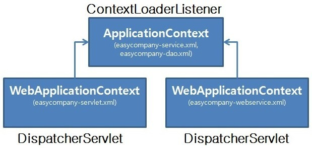

# Spring의 동작 과정

### 동작 과정
1. 클라이언트의 모든 요청은 DispatcherServlet이 받음
2. DispatcherServlet은 HandlerMapping을 통해 해당 URL에 매핑된 Controller를 검색
3. 주입된 @Bean 객체를 가지고 HandlerMapping에 매핑되어 있는 Controller 호출
4. Controller는 적절한 서비스 객체 호출
5. Service는 DB 처리를 위해 DAO를 이용하여 데이터를 요청
6. DAO는 Mapping을 이용한 DB 처리 실행 ( 이전 : MyBatis -> 최근 : JPA 을 주로 이용하여 매핑 ) 
7. 처리한 데이터의 결과가 Mapper -> DAO -> Service -> Controller 로 전달
8. Controller는 전달된 결과를 ViewResolver에서 prefix 경로의 viewName.suffix 형식이 있는지 확인
9. 해당하는 View가 있다면 View에 처리한 데이터의 결과를 전달
10. View는 전달받은 결과를 다시 DispatcherServlet에 전달
11. DispatcherServlet은 전달받은 결과를 클라이언트에게 전달
12. 최종 결과를 클라이언트에서 출력

> #### Controller가 아닌 RestController?
>- 위의 동작과정 7까지는 동일하나 View를 찾을 필요가 없으니 Controller -> ResponseBody(JSON, XML) -> Client 순으로 동작
>- Controller와의 차이는 ViewResolver를 통해 View를 검색하는 부분이 생략되고 단지 데이터를 전달했다는 것
>- RestController(Data 전달 목적) = Controller(화면전달이 목적) + ResponseBody(Obejct<->JSON, XML)

 

### Spring MVC구조에서의 역할
1. Dispatcher Servlet
- Front Controller를 담당
- 애플리케이션으로 들어오는 모든 Request를 받는 부분. Request 를 실제로 처리할 Controller에게 전달하고 그 결과 값을 받아서 View에 전달하여 적절한 응답을 생성할 수 있도록 흐름을 제어
2. HandlerMapping
- Request URI에 따라 각각 어떤 Handler(Controller method)가 실제로 처리할 것인지 찾아주는 역할
3. HandlerAdaptor
- 결정된 Controller의 메소드 중 요청에 맞는 적합한 핸들러 매칭
4. Controller
- Request를 직접 처리한 후 그 결과를 다시 DispatcherServlet에 돌려주는 역할
5. ModelAndView
- Controller가 처리한 결과와 그 결과를 보여줄 View에 관한 정보를 담고 있는 객체
6. ViewResolver
- View 관련 정보를 갖고 실제 View를 찾아주는 역할
7. View
- Controller가 처리한 결과값을 보여줄 View를 생성

 

 

### ApplicationConfig 는 언제 생성?
- web.xml에는 ContextLoaderListener와 DispatcherServlet의 2가지 설정이 있음
- WAS를 처음 동작시, web.xml(컨테이너)를 로딩하여 Servlet Container가 구동되고, Servlet Container는 ContextLoaderListener 객체를 자동으로 메모리에 생성
- ContextLoaderListener 객체는 먼저 \<context-param\>으로 등록된 설정 파일(ex)ApplicationConfig.java)을 읽어서 첫번째 Spring Container(Root Container)를 구동하고 비즈니스 객체 (Service, DAO)을 생성
- 이를 부모 컨테이너라 부르고 부모 컨테이너는 @ComponentScan으로 DAO, Service Bean을 찾고 메모리에 저장
- 이후 요청이 들어오면 Servlet Cotainer가 DispatcherServlet 객체를 생성
- DispatcherServlet이 내부적으로 init()를 호출할 때 \<init-param\>으로 등록된 Spring 설정 파일을 찾아 두번째 Spring Container를 구동
- 이를 자식 컨테이너라고 부르기로 하며 @ComponentScan으로 'Controller'Bean(+'HandlerMapping', 'ViewResolver')을 찾고 메모리에 생성
>- 자식 컨테이너는 부모 컨테이너의 것을 사용할 수 있음 (부모-자식은 상속 개념이 아님)
>- URL-Pattern을 다르게 해서 여러개의 DispathcerServlet이 있을 수 있음 (자주 있는 경우는 아님)
>- DispatcherServlet이 Controller들을 bean으로 등록하고, HandlerMapping 객체에 Controller 내의 메소드마다 붙은 @RequestMapping 정보를 담아줌
>- 원래는 모든 요청은 WAS가 제공하는 DefaultServlet이 처리하나 요청 URL에 해당하는 HandlerMapping 정보를 찾아 Controller가 비즈니스 로직을 처리. 해당 HandlerMapping 정보가 없으면 로직처리를 DefaultServlet에게 맡김. 그래도 없으면 404 Error 발생

 

22-07-02

-------

## Reference
- https://lkhlkh23.tistory.com/94
- https://starkying.tistory.com/entry/Spring-MVC-동작원리-구성요소